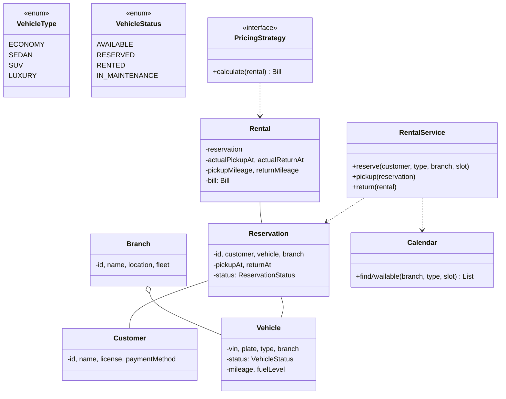
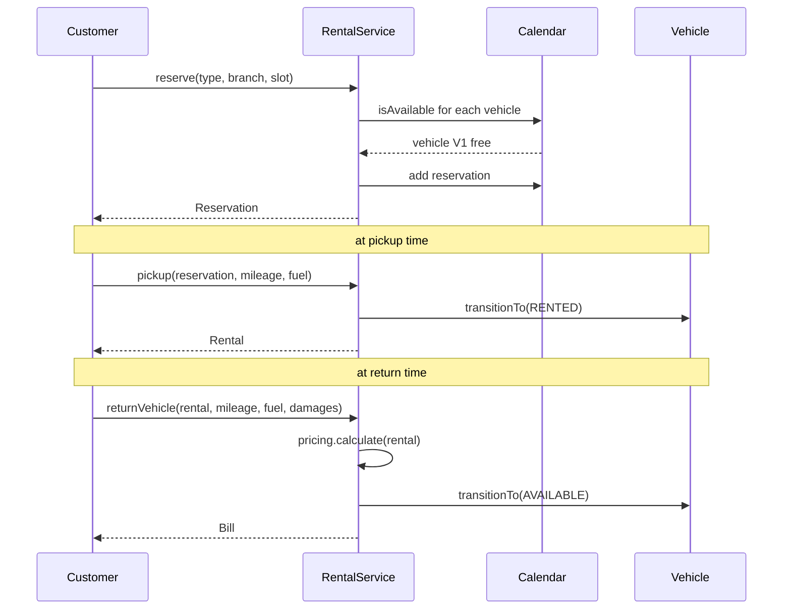

## Problem Statement

Design a car rental system (Hertz / Zoomcar) that:
- Manages a fleet of vehicles across locations
- Lets users search by location, time window, type
- Reserves a car for a specified duration
- Handles pickup and return (with mileage / fuel checks)
- Computes pricing (hourly / daily / mileage)

---

## Requirements

### Functional
- Multiple branches with their own fleet
- Vehicle types: economy, sedan, SUV, luxury
- Reserve a car for `(pickup time, return time, branch)`
- Pickup → return workflow (capture state at both ends)
- Cancellation policy
- Late return fee, damage assessment
- Customer profile with payment method, license

### Non-Functional
- No double-booking
- Concurrent search & reservation
- Audit log of every state change

---

## Class Diagram



---

## Vehicle

```java
public enum VehicleStatus { AVAILABLE, RESERVED, RENTED, IN_MAINTENANCE }

public class Vehicle {
    private final String vin;
    private final String plate;
    private final VehicleType type;
    private Branch branch;
    private VehicleStatus status = VehicleStatus.AVAILABLE;
    private long mileageKm;
    private double fuelLevelPct;

    public synchronized boolean transitionTo(VehicleStatus next) {
        if (!isValidTransition(status, next)) return false;
        status = next;
        return true;
    }

    public VehicleType getType() { return type; }
    public Branch getBranch() { return branch; }
}
```

---

## Reservation Calendar

The hard part is "is this vehicle free during `[pickup, return]`?" Use an interval-friendly data structure.

```java
public class ReservationCalendar {
    // For each vehicle, sorted reservations by start time
    private final Map<String, TreeMap<Instant, Reservation>> byVin = new ConcurrentHashMap<>();

    public synchronized boolean isAvailable(String vin, TimeSlot slot) {
        TreeMap<Instant, Reservation> tm = byVin.get(vin);
        if (tm == null) return true;
        Map.Entry<Instant, Reservation> floor = tm.floorEntry(slot.start);
        if (floor != null && floor.getValue().slot.overlaps(slot)) return false;
        Map.Entry<Instant, Reservation> ceil = tm.ceilingEntry(slot.start);
        if (ceil != null && ceil.getValue().slot.overlaps(slot)) return false;
        return true;
    }

    public synchronized void add(Reservation r) {
        byVin.computeIfAbsent(r.vehicle.getVin(), k -> new TreeMap<>())
             .put(r.slot.start, r);
    }

    public synchronized void remove(Reservation r) {
        TreeMap<Instant, Reservation> tm = byVin.get(r.vehicle.getVin());
        if (tm != null) tm.remove(r.slot.start);
    }
}
```

---

## Reservation & Rental

```java
public enum ReservationStatus { ACTIVE, CANCELLED, PICKED_UP, COMPLETED }

public class Reservation {
    public final String id;
    public final Customer customer;
    public final Vehicle vehicle;
    public final TimeSlot slot;
    private ReservationStatus status = ReservationStatus.ACTIVE;

    public Reservation(Customer c, Vehicle v, TimeSlot slot) {
        this.id = UUID.randomUUID().toString();
        this.customer = c; this.vehicle = v; this.slot = slot;
    }

    public synchronized void cancel()   { status = ReservationStatus.CANCELLED; }
    public synchronized void pickup()   { status = ReservationStatus.PICKED_UP; }
    public synchronized void complete() { status = ReservationStatus.COMPLETED; }
}

public class Rental {
    public final Reservation reservation;
    public final Instant actualPickupAt;
    public final long pickupMileage;
    public final double pickupFuelPct;
    public Instant actualReturnAt;
    public long returnMileage;
    public double returnFuelPct;
    public Bill bill;
    public final List<DamageNote> damages = new ArrayList<>();
}
```

---

## Pricing (Strategy)

```java
public interface PricingStrategy {
    Bill calculate(Rental rental);
}

public class StandardPricing implements PricingStrategy {
    private final Map<VehicleType, Money> dailyRates;
    private final Money pricePerExtraKm;
    private final Money lateFeePerHour;

    @Override
    public Bill calculate(Rental rental) {
        long days = ChronoUnit.DAYS.between(
            rental.reservation.slot.start, rental.actualReturnAt);
        if (days < 1) days = 1;

        Money base = dailyRates.get(rental.reservation.vehicle.getType()).times(days);

        long includedKm = days * 200;   // 200 km/day included
        long actualKm = rental.returnMileage - rental.pickupMileage;
        long extraKm = Math.max(0, actualKm - includedKm);
        Money mileage = pricePerExtraKm.times(extraKm);

        Money late = Money.zero();
        if (rental.actualReturnAt.isAfter(rental.reservation.slot.end)) {
            long hoursLate = ChronoUnit.HOURS.between(
                rental.reservation.slot.end, rental.actualReturnAt);
            late = lateFeePerHour.times(hoursLate);
        }

        // Fuel — charge for refueling if returned below pickup level
        Money fuel = computeFuelCharge(rental.pickupFuelPct, rental.returnFuelPct);

        Money damages = rental.damages.stream()
            .map(d -> d.cost)
            .reduce(Money.zero(), Money::plus);

        Money total = base.plus(mileage).plus(late).plus(fuel).plus(damages);
        return new Bill(base, mileage, late, fuel, damages, total);
    }
}
```

Other strategies: hourly pricing for short rentals, weekly/monthly discounts, surge pricing.

---

## RentalService (Facade)

```java
public class RentalService {
    private final ReservationCalendar calendar;
    private final PricingStrategy pricing;
    private final NotificationService notifier;

    public Reservation reserve(Customer c, VehicleType type, Branch branch, TimeSlot slot) {
        if (!c.hasValidLicense()) throw new IneligibleCustomerException();
        if (slot.start.isBefore(Instant.now())) throw new IllegalArgumentException("past time");

        synchronized (branch) {
            Vehicle v = branch.getFleet().stream()
                .filter(x -> x.getType() == type
                          && x.getStatus() != VehicleStatus.IN_MAINTENANCE
                          && calendar.isAvailable(x.getVin(), slot))
                .findFirst()
                .orElseThrow(() -> new NoVehicleAvailableException());

            Reservation r = new Reservation(c, v, slot);
            calendar.add(r);
            notifier.sendConfirmation(c, r);
            return r;
        }
    }

    public void cancel(Reservation r) {
        synchronized (r.vehicle.getBranch()) {
            r.cancel();
            calendar.remove(r);
            notifier.sendCancellation(r);
        }
    }

    public Rental pickup(Reservation r, long mileage, double fuelPct) {
        if (r.getStatus() != ReservationStatus.ACTIVE) throw new IllegalStateException();
        r.pickup();
        r.vehicle.transitionTo(VehicleStatus.RENTED);
        return new Rental(r, Instant.now(), mileage, fuelPct);
    }

    public Bill returnVehicle(Rental rental, long mileage, double fuelPct,
                              List<DamageNote> damages) {
        rental.actualReturnAt = Instant.now();
        rental.returnMileage = mileage;
        rental.returnFuelPct = fuelPct;
        rental.damages.addAll(damages);

        Bill bill = pricing.calculate(rental);
        rental.bill = bill;
        rental.reservation.complete();
        rental.reservation.vehicle.transitionTo(VehicleStatus.AVAILABLE);
        return bill;
    }
}
```

---

## Sequence: Reservation → Pickup → Return



---

## Edge Cases

| **Case** | **Handling** |
|---------|-------------|
| Customer no-show | Charge no-show fee; release reservation after grace period |
| Late return | Extra hourly fee; auto-extend if vehicle is free |
| Damage on return | Add to bill; insurance claim |
| Vehicle breakdown mid-rental | Provide replacement; refund |
| Concurrent reservations for same slot | Synchronize on branch + check availability |
| One-way rentals (pickup ≠ return branch) | Different fee; vehicle moves between fleets |
| Pickup before reservation start | Allow if free; else wait |

---

## Design Patterns Used

| **Pattern** | **Where** |
|------------|-----------|
| **[State](/lld/patterns/behavioral/state)** | Vehicle status (Available / Reserved / Rented / Maintenance) |
| **[Strategy](/lld/patterns/behavioral/strategy)** | Pricing (standard, hourly, weekly, surge) |
| **[Facade](/lld/patterns/structural/facade)** | `RentalService` |
| **[Observer](/lld/patterns/behavioral/observer)** | Notify customer at confirmation / pickup reminder / late |
| **Repository** | Reservations, vehicles, customers |
| **[Builder](/lld/patterns/creational/builder)** | `Bill` with many components (base, mileage, late, fuel, damage) |

---

## Interview Tips

- Distinguish **Reservation** (intent to rent) from **Rental** (active rental with actual times). Many candidates conflate them.
- Vehicle availability is an **interval problem** — TreeMap or interval tree, not a flat list scan.
- Mention **one-way rentals** as an extension — vehicles change branches and fleet rebalancing is a real ops problem.
- Pricing should be a strategy — interviewers will ask "what about a corporate discount?" and you swap a strategy.
