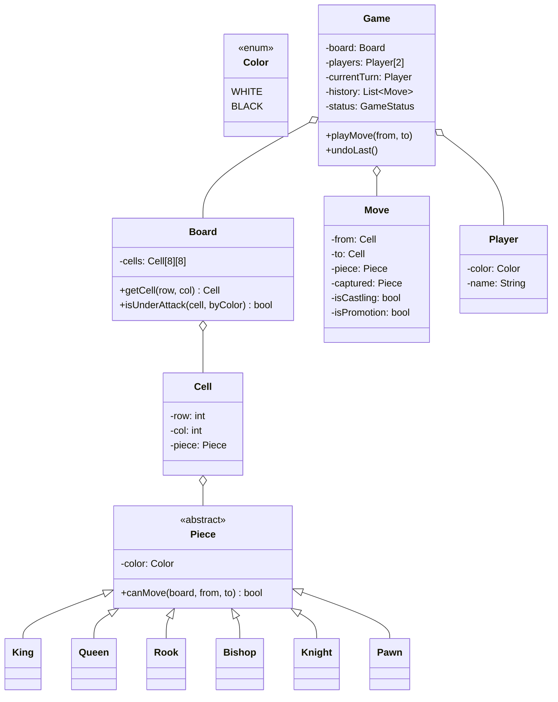
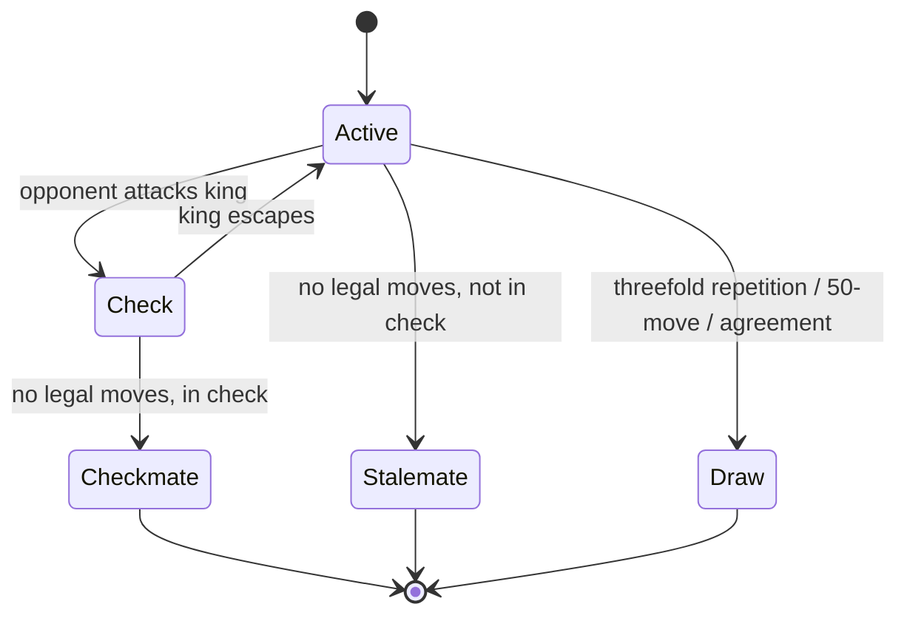

## Problem Statement

Design a 2-player chess engine that:
- Models the 8×8 board, 6 piece types per color
- Validates legal moves per piece
- Detects check, checkmate, stalemate, draw
- Supports turn-based play, pawn promotion, castling, en passant
- Allows undo / move history

---

## Requirements

### Functional
- 8×8 board, 16 pieces per side
- Move validation per piece type
- Special moves: castling, en passant, promotion
- Detect check / checkmate / stalemate
- Move history (for undo, replay, PGN export)

### Non-Functional
- Two-player turn-based (computer player optional)
- Deterministic (no randomness in core engine)
- Extensible (new piece types for variants)

---

## Class Diagram



---

## Pieces (Strategy via Polymorphism)

```java
public abstract class Piece {
    protected final Color color;
    protected boolean hasMoved = false;

    protected Piece(Color color) { this.color = color; }

    public abstract boolean canMove(Board board, Cell from, Cell to);

    public Color getColor() { return color; }
}

public class King extends Piece {
    public King(Color c) { super(c); }

    @Override
    public boolean canMove(Board b, Cell from, Cell to) {
        int dr = Math.abs(from.row - to.row);
        int dc = Math.abs(from.col - to.col);
        if (dr <= 1 && dc <= 1 && (dr + dc > 0)) {
            Piece dest = to.getPiece();
            return dest == null || dest.color != this.color;
        }
        // castling handled elsewhere
        return false;
    }
}

public class Knight extends Piece {
    public Knight(Color c) { super(c); }

    @Override
    public boolean canMove(Board b, Cell from, Cell to) {
        int dr = Math.abs(from.row - to.row);
        int dc = Math.abs(from.col - to.col);
        if ((dr == 2 && dc == 1) || (dr == 1 && dc == 2)) {
            Piece dest = to.getPiece();
            return dest == null || dest.color != this.color;
        }
        return false;
    }
}

public class Rook extends Piece {
    public Rook(Color c) { super(c); }

    @Override
    public boolean canMove(Board b, Cell from, Cell to) {
        if (from.row != to.row && from.col != to.col) return false;
        if (!isPathClear(b, from, to)) return false;
        Piece dest = to.getPiece();
        return dest == null || dest.color != this.color;
    }

    private boolean isPathClear(Board b, Cell from, Cell to) {
        int dr = Integer.signum(to.row - from.row);
        int dc = Integer.signum(to.col - from.col);
        int r = from.row + dr, c = from.col + dc;
        while (r != to.row || c != to.col) {
            if (b.getCell(r, c).getPiece() != null) return false;
            r += dr; c += dc;
        }
        return true;
    }
}

// Bishop, Queen, Pawn similar
```

Each piece encapsulates its own movement rules. Adding a chess variant (e.g., Fairy chess) means adding new `Piece` subclasses.

---

## Board

```java
public class Board {
    private final Cell[][] cells = new Cell[8][8];

    public Board() {
        for (int r = 0; r < 8; r++)
            for (int c = 0; c < 8; c++)
                cells[r][c] = new Cell(r, c);
        setupInitialPieces();
    }

    public Cell getCell(int r, int c) {
        if (r < 0 || r > 7 || c < 0 || c > 7) throw new IndexOutOfBoundsException();
        return cells[r][c];
    }

    public Cell findKing(Color color) {
        for (int r = 0; r < 8; r++)
            for (int c = 0; c < 8; c++) {
                Piece p = cells[r][c].getPiece();
                if (p instanceof King && p.getColor() == color) return cells[r][c];
            }
        throw new IllegalStateException("King not on board");
    }

    public boolean isUnderAttack(Cell target, Color attacker) {
        for (int r = 0; r < 8; r++)
            for (int c = 0; c < 8; c++) {
                Piece p = cells[r][c].getPiece();
                if (p != null && p.getColor() == attacker
                    && p.canMove(this, cells[r][c], target)) {
                    return true;
                }
            }
        return false;
    }

    private void setupInitialPieces() { /* ... */ }
}
```

---

## Game Engine

```java
public enum GameStatus { ACTIVE, CHECK, CHECKMATE, STALEMATE, DRAW }

public class Game {
    private final Board board;
    private final Player white, black;
    private Player currentTurn;
    private final Deque<Move> history = new ArrayDeque<>();
    private GameStatus status = GameStatus.ACTIVE;

    public Game(Player white, Player black) {
        this.board = new Board();
        this.white = white; this.black = black;
        this.currentTurn = white;
    }

    public void playMove(Cell from, Cell to) {
        if (status != GameStatus.ACTIVE && status != GameStatus.CHECK) {
            throw new IllegalStateException("Game over: " + status);
        }
        Piece p = from.getPiece();
        if (p == null || p.getColor() != currentTurn.getColor()) {
            throw new IllegalMoveException("Not your piece");
        }
        if (!p.canMove(board, from, to)) {
            throw new IllegalMoveException("Illegal move");
        }

        Move move = new Move(from, to, p, to.getPiece());
        applyMove(move);

        // Cannot leave own king in check
        Cell kingCell = board.findKing(currentTurn.getColor());
        if (board.isUnderAttack(kingCell, opponentColor())) {
            undo(move);
            throw new IllegalMoveException("Move leaves king in check");
        }

        history.push(move);
        switchTurn();
        updateStatus();
    }

    private void applyMove(Move m) {
        m.to.setPiece(m.piece);
        m.from.setPiece(null);
        m.piece.markMoved();
    }

    private void undo(Move m) {
        m.from.setPiece(m.piece);
        m.to.setPiece(m.captured);
    }

    private void updateStatus() {
        Cell kingCell = board.findKing(currentTurn.getColor());
        boolean inCheck = board.isUnderAttack(kingCell, opponentColor());
        boolean hasLegalMove = anyLegalMoveFor(currentTurn.getColor());

        if (inCheck && !hasLegalMove) status = GameStatus.CHECKMATE;
        else if (!inCheck && !hasLegalMove) status = GameStatus.STALEMATE;
        else if (inCheck) status = GameStatus.CHECK;
        else status = GameStatus.ACTIVE;
    }

    private boolean anyLegalMoveFor(Color color) {
        // try every piece, every cell — if any move is legal, return true
        // (simulate-then-undo to avoid leaving king in check)
        // implementation omitted for brevity
        return true;
    }

    private void switchTurn() {
        currentTurn = (currentTurn == white) ? black : white;
    }

    private Color opponentColor() {
        return currentTurn.getColor() == Color.WHITE ? Color.BLACK : Color.WHITE;
    }
}
```

---

## Special Moves

| **Move** | **Conditions** |
|---------|---------------|
| **Castling** | King and chosen rook haven't moved; no piece between; king not in/through/into check |
| **En passant** | Pawn captures another pawn that just moved 2 squares, on the 5th rank |
| **Promotion** | Pawn reaches the last rank — replace with chosen piece (Queen by default) |

These are usually handled as `Move` subclasses or flags + special application logic.

---

## State Pattern for GameStatus



---

## Move History (Memento + Command)

Every applied move is pushed onto a stack. Undo pops and reverses. This is **command pattern** with memento-like state for undo.

```java
public void undoLast() {
    if (history.isEmpty()) throw new IllegalStateException();
    Move m = history.pop();
    undo(m);
    switchTurn();
    updateStatus();
}
```

---

## Design Patterns Used

| **Pattern** | **Where** |
|------------|-----------|
| **Strategy** (via polymorphism) | Each piece's `canMove` |
| **[State](/lld/patterns/behavioral/state)** | `GameStatus` transitions |
| **[Command](/lld/patterns/behavioral/command)** | Each `Move` is a reversible action |
| **[Memento](/lld/patterns/behavioral/memento)** | `Move` stores captured piece for undo |
| **[Factory](/lld/patterns/creational/factory)** | Construct piece by type during promotion |
| **[Singleton](/lld/patterns/creational/singleton)** | (not really; `Game` is one per match) |

---

## Edge Cases

| **Case** | **Handling** |
|---------|-------------|
| Move that exposes own king | Reject (apply, check, undo) |
| Castling through check | Reject — king can't pass through attacked squares |
| 50-move rule (draw) | Track moves since last capture/pawn move |
| Threefold repetition | Hash positions; track repeats |
| Insufficient material | K vs K, K+B vs K, etc. — automatic draw |
| Pawn promotion choice | Default to Queen; allow override via API |

---

## Interview Tips

- Don't try to implement *all* moves — pick 2–3 (Knight, Rook, King) to show pattern.
- Lead with the **piece hierarchy** + `canMove` — it shows polymorphism cleanly.
- Discuss **check detection** by simulating moves and rolling back.
- Mention move history for undo, PGN export, draw-rule tracking — connects pattern to real engine features.
- Bring up **Zobrist hashing** for repetition detection if time permits — interviewers love it.
