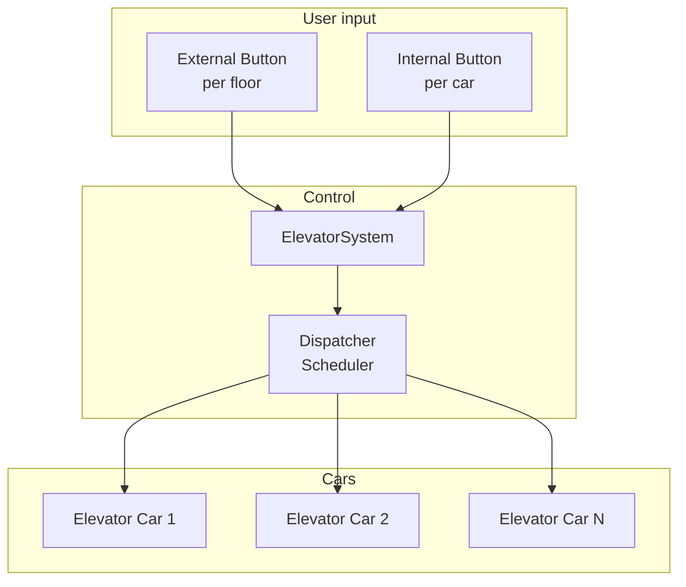
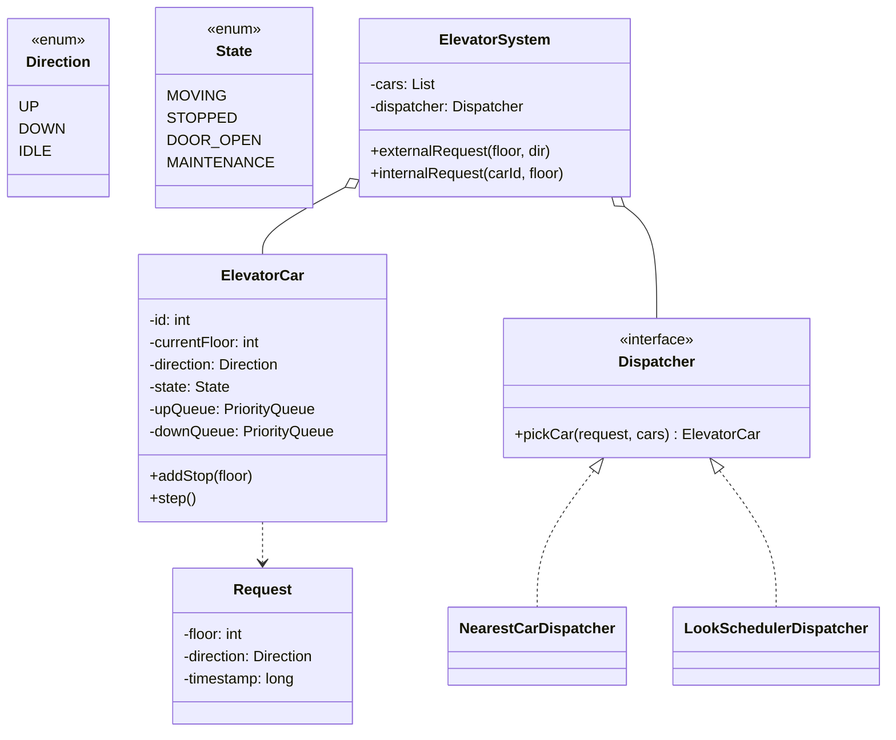
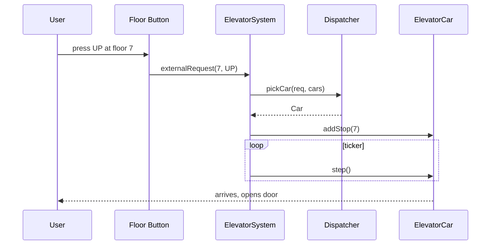

## Problem Statement

Design an elevator system for a building that:
- Has multiple elevator cars and many floors
- Handles internal requests (from inside a car) and external requests (from a floor)
- Schedules cars efficiently (minimize wait + travel time)
- Supports up/down buttons, emergency stop, weight limit

---

## Requirements

### Functional
- N cars × M floors
- External request: `(floor, direction)`
- Internal request: `(car, floor)`
- Pick the best car for each external request
- Open/close doors safely
- Emergency stop & alarm

### Non-Functional
- Concurrent requests from multiple users
- Real-time scheduling
- Fault tolerance — a stuck car shouldn't block the system

---

## High-Level Architecture



---

## Class Diagram



---

## Core Classes

```java
public enum Direction { UP, DOWN, IDLE }
public enum CarState { MOVING, STOPPED, DOOR_OPEN, MAINTENANCE }

public class Request {
    public final int floor;
    public final Direction direction;
    public final long timestamp;

    public Request(int floor, Direction d) {
        this.floor = floor;
        this.direction = d;
        this.timestamp = System.currentTimeMillis();
    }
}
```

### ElevatorCar

```java
public class ElevatorCar {
    private final int id;
    private int currentFloor = 0;
    private Direction direction = Direction.IDLE;
    private CarState state = CarState.STOPPED;

    // SCAN/LOOK algorithm: separate up/down stop queues
    private final TreeSet<Integer> upStops = new TreeSet<>();
    private final TreeSet<Integer> downStops = new TreeSet<>(Comparator.reverseOrder());

    public synchronized void addStop(int floor) {
        if (floor > currentFloor) upStops.add(floor);
        else if (floor < currentFloor) downStops.add(floor);
    }

    public synchronized void step() {
        if (direction == Direction.UP || direction == Direction.IDLE) {
            if (!upStops.isEmpty()) {
                direction = Direction.UP;
                int next = upStops.first();
                if (currentFloor == next) {
                    upStops.pollFirst();
                    openDoor();
                } else {
                    currentFloor++;
                }
                return;
            }
        }
        if (!downStops.isEmpty()) {
            direction = Direction.DOWN;
            int next = downStops.first();
            if (currentFloor == next) {
                downStops.pollFirst();
                openDoor();
            } else {
                currentFloor--;
            }
            return;
        }
        direction = Direction.IDLE;
    }

    private void openDoor() {
        state = CarState.DOOR_OPEN;
        // schedule close after delay
    }

    public int getCurrentFloor() { return currentFloor; }
    public Direction getDirection() { return direction; }
    public int getId() { return id; }

    public ElevatorCar(int id) { this.id = id; }
}
```

---

## Dispatching Strategy (Strategy Pattern)

```java
public interface Dispatcher {
    ElevatorCar pickCar(Request req, List<ElevatorCar> cars);
}

public class NearestCarDispatcher implements Dispatcher {
    @Override
    public ElevatorCar pickCar(Request req, List<ElevatorCar> cars) {
        return cars.stream()
            .filter(c -> isCompatible(c, req))
            .min(Comparator.comparingInt(c -> Math.abs(c.getCurrentFloor() - req.floor)))
            .orElse(cars.get(0));
    }

    private boolean isCompatible(ElevatorCar c, Request r) {
        if (c.getDirection() == Direction.IDLE) return true;
        // Going up, request is above the car, also going up
        if (c.getDirection() == Direction.UP && r.direction == Direction.UP
            && r.floor >= c.getCurrentFloor()) return true;
        if (c.getDirection() == Direction.DOWN && r.direction == Direction.DOWN
            && r.floor <= c.getCurrentFloor()) return true;
        return false;
    }
}
```

Other strategies: LOOK (current direction first, then reverse), SCAN, **fixed-sectoring** (each car serves a floor band).

---

## ElevatorSystem (Singleton or DI'd)

```java
public class ElevatorSystem {
    private final List<ElevatorCar> cars;
    private final Dispatcher dispatcher;
    private final ScheduledExecutorService ticker;

    public ElevatorSystem(int numCars, Dispatcher d) {
        this.cars = IntStream.range(0, numCars)
            .mapToObj(ElevatorCar::new)
            .collect(Collectors.toList());
        this.dispatcher = d;
        this.ticker = Executors.newSingleThreadScheduledExecutor();
        ticker.scheduleAtFixedRate(this::tick, 0, 1, TimeUnit.SECONDS);
    }

    public void externalRequest(int floor, Direction dir) {
        Request req = new Request(floor, dir);
        ElevatorCar car = dispatcher.pickCar(req, cars);
        car.addStop(floor);
    }

    public void internalRequest(int carId, int floor) {
        cars.get(carId).addStop(floor);
    }

    private void tick() {
        cars.forEach(ElevatorCar::step);
    }
}
```

A single ticker thread advances all cars 1 floor per second. Real systems use per-car physical sensors.

---

## Concurrency

| **Shared resource** | **Protection** |
|--------------------|----------------|
| Each car's up/down queues | `synchronized` on `ElevatorCar` |
| The car list | Immutable after construction |
| Dispatcher decisions | Stateless |

For multiple buildings, give each its own `ElevatorSystem` — no shared state.

---

## Sequence: External Request



---

## Edge Cases

| **Case** | **Handling** |
|---------|-------------|
| All cars in maintenance | Reject request, show "out of service" |
| Weight limit exceeded | Don't move; alarm |
| Door obstructed | Re-open, retry |
| Power outage | Move to nearest floor, open doors |
| Emergency stop | Halt, send to ground floor |
| Rapid same-floor presses | Debounce |

---

## Design Patterns Used

| **Pattern** | **Where** |
|------------|-----------|
| Strategy | Dispatching algorithm (NearestCar, LOOK, fixed-sector) |
| State | Car state (Moving, Stopped, DoorOpen, Maintenance) |
| Singleton | `ElevatorSystem` (per building) |
| Observer | Floor display boards subscribe to car positions |
| Command | Each Request as a queueable command |

---

## Interview Tips

- Lead with **clarifying questions**: how many cars, how many floors, peak vs idle, can cars skip floors?
- Sketch the class diagram, then walk through the SCAN/LOOK algorithm — it shows you've thought about real elevator scheduling.
- Discuss tradeoffs of dispatching strategies — fixed-sectoring is simpler but worse during off-peak.
- Mention **morning rush** vs **evening rush** as example workloads requiring different scheduling.
