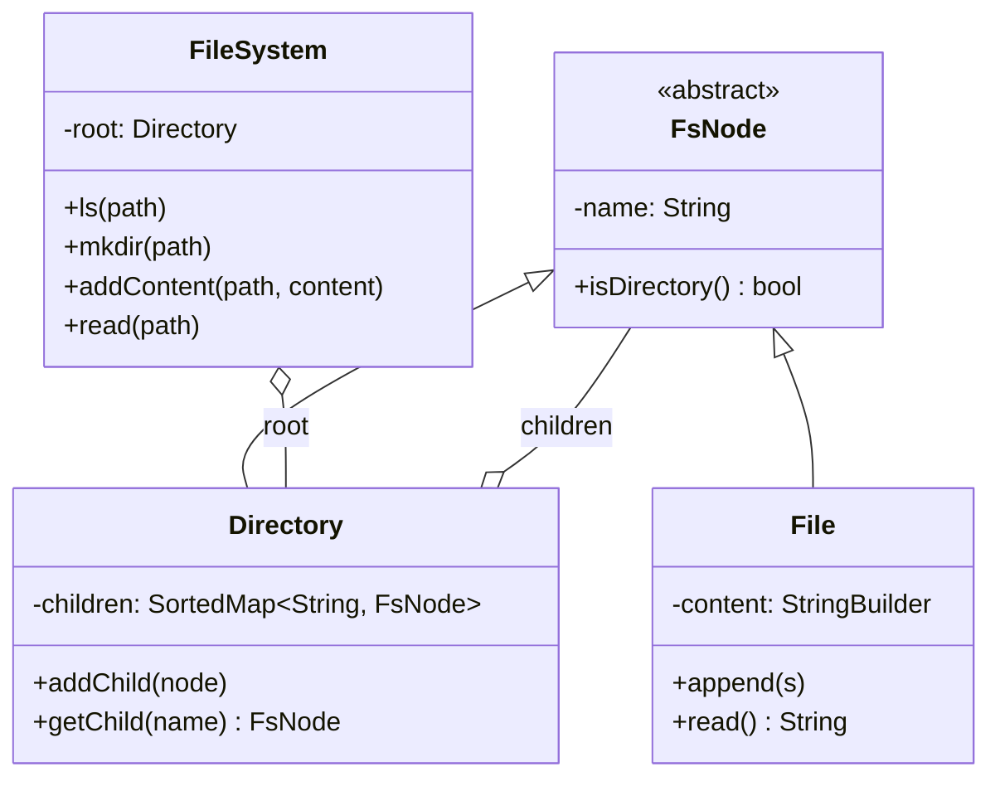
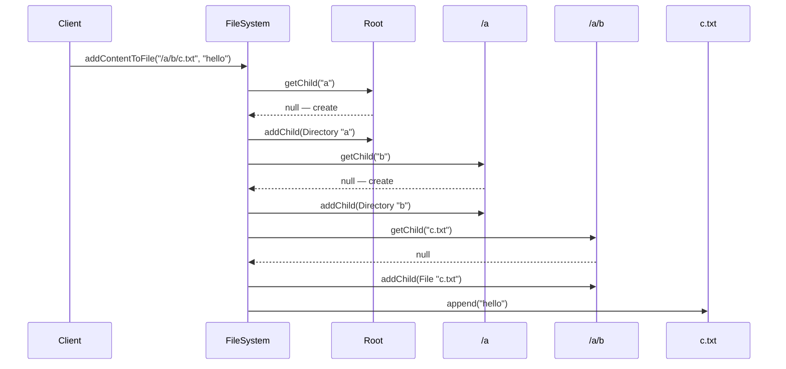

## Problem Statement

Design an in-memory file system supporting:
- `ls(path)` — list directory contents (or a single file)
- `mkdir(path)` — create directories (recursive)
- `addContentToFile(path, content)` — create or append to a file
- `readContentFromFile(path)` — read file contents
- `delete(path)` — remove file or directory (recursive)

LeetCode #588.

---

## Requirements

### Functional
- Tree-structured paths (`/a/b/c.txt`)
- `ls` returns sorted children of a directory or `[filename]` for a file
- `mkdir` creates intermediate directories silently
- `addContentToFile` appends to existing or creates new
- File and directory are distinct types

### Non-Functional
- All ops O(depth × children) at worst
- Thread-safe (read-heavy workload)

---

## Class Diagram



This is the **Composite** pattern — `Directory` and `File` share a base type.

---

## Core Classes

```java
public abstract class FsNode {
    protected final String name;

    protected FsNode(String name) { this.name = name; }

    public abstract boolean isDirectory();
    public String getName() { return name; }
}

public class File extends FsNode {
    private final StringBuilder content = new StringBuilder();

    public File(String name) { super(name); }

    @Override
    public boolean isDirectory() { return false; }

    public synchronized void append(String s) { content.append(s); }
    public synchronized String read() { return content.toString(); }
}

public class Directory extends FsNode {
    private final TreeMap<String, FsNode> children = new TreeMap<>();

    public Directory(String name) { super(name); }

    @Override
    public boolean isDirectory() { return true; }

    public synchronized FsNode getChild(String n) { return children.get(n); }
    public synchronized void addChild(FsNode n) { children.put(n.getName(), n); }
    public synchronized void removeChild(String n) { children.remove(n); }
    public synchronized List<String> listSorted() {
        return new ArrayList<>(children.keySet());
    }
}
```

`TreeMap` keeps children alphabetically — `ls` is naturally sorted.

---

## FileSystem Service

```java
public class FileSystem {
    private final Directory root = new Directory("");

    public List<String> ls(String path) {
        FsNode node = traverse(path, false);
        if (node == null) return Collections.emptyList();
        if (!node.isDirectory()) {
            // ls on a file returns [filename]
            return List.of(node.getName());
        }
        return ((Directory) node).listSorted();
    }

    public void mkdir(String path) {
        traverse(path, true);   // create intermediate dirs
    }

    public void addContentToFile(String path, String content) {
        String[] parts = split(path);
        Directory parent = traverseToParent(parts, true);
        String fileName = parts[parts.length - 1];

        FsNode existing = parent.getChild(fileName);
        File file;
        if (existing == null) {
            file = new File(fileName);
            parent.addChild(file);
        } else if (existing.isDirectory()) {
            throw new IllegalStateException(path + " is a directory");
        } else {
            file = (File) existing;
        }
        file.append(content);
    }

    public String readContentFromFile(String path) {
        FsNode node = traverse(path, false);
        if (node == null || node.isDirectory())
            throw new IllegalArgumentException("not a file: " + path);
        return ((File) node).read();
    }

    public void delete(String path) {
        String[] parts = split(path);
        Directory parent = traverseToParent(parts, false);
        if (parent == null) return;
        parent.removeChild(parts[parts.length - 1]);
    }

    /* ---------- helpers ---------- */

    private String[] split(String path) {
        if (path.equals("/")) return new String[0];
        return Arrays.stream(path.split("/"))
            .filter(s -> !s.isEmpty())
            .toArray(String[]::new);
    }

    private FsNode traverse(String path, boolean createMissing) {
        String[] parts = split(path);
        FsNode node = root;
        for (String p : parts) {
            if (!node.isDirectory()) return null;
            Directory dir = (Directory) node;
            FsNode child = dir.getChild(p);
            if (child == null) {
                if (!createMissing) return null;
                child = new Directory(p);
                dir.addChild(child);
            }
            node = child;
        }
        return node;
    }

    private Directory traverseToParent(String[] parts, boolean createMissing) {
        FsNode node = root;
        for (int i = 0; i < parts.length - 1; i++) {
            Directory dir = (Directory) node;
            FsNode child = dir.getChild(parts[i]);
            if (child == null) {
                if (!createMissing) return null;
                child = new Directory(parts[i]);
                dir.addChild(child);
            }
            node = child;
        }
        return (Directory) node;
    }
}
```

---

## Sequence: `addContentToFile("/a/b/c.txt", "hello")`



---

## Concurrency

- **Per-node synchronization** (above) — simple, locks one node at a time.
- For high concurrency, use a **`ReentrantReadWriteLock`** per directory: many readers can `ls` simultaneously, exclusive on `mkdir`/`addChild`.
- Or copy-on-write the tree on each write. Cheap reads, expensive writes.
- Linearizability across paths is a harder problem (see ZooKeeper).

---

## Edge Cases

| **Case** | **Handling** |
|---------|-------------|
| `ls("/")` on empty tree | `[]` |
| `ls(path)` on a file | `[filename]` (LeetCode #588 spec) |
| `addContentToFile` on existing dir path | Throw |
| `mkdir` on existing path | No-op |
| Trailing slash | Normalize (strip) |
| Path with empty segments (`//a`) | Split skips empties |
| Delete non-existent path | No-op (or throw, by spec) |

---

## Extensions

| **Extension** | **Approach** |
|--------------|-------------|
| File metadata (size, mtime) | Add fields to `FsNode` |
| Symlinks | New `SymlinkNode` storing target path |
| Permissions (Unix mode) | Add `mode` to `FsNode` + check on ops |
| Hard links | Reference-count files; node has multiple parents |
| Persistence | Snapshot the tree to disk; replay on load |

---

## Design Patterns Used

| **Pattern** | **Where** |
|------------|-----------|
| **[Composite](/lld/patterns/structural/composite)** | `Directory` / `File` share `FsNode` |
| **[Singleton](/lld/patterns/creational/singleton)** | One `FileSystem` per app |
| **[Visitor](/lld/patterns/behavioral/visitor)** | Walk the tree for stats, search, du |
| **[Iterator](/lld/patterns/behavioral/iterator)** | Iterate descendants (DFS / BFS) |

---

## Interview Tips

- Identify **composite pattern** out loud — that's the architectural insight.
- Use `TreeMap` for children to get sorted `ls` for free.
- Walk through edge cases: `ls` on a file, `addContentToFile` to existing dir.
- Discuss path normalization (`//a/`, `/a/./b`, `..`) if asked — most interviews don't require it.
- Mention extensibility for symlinks, metadata, permissions.
