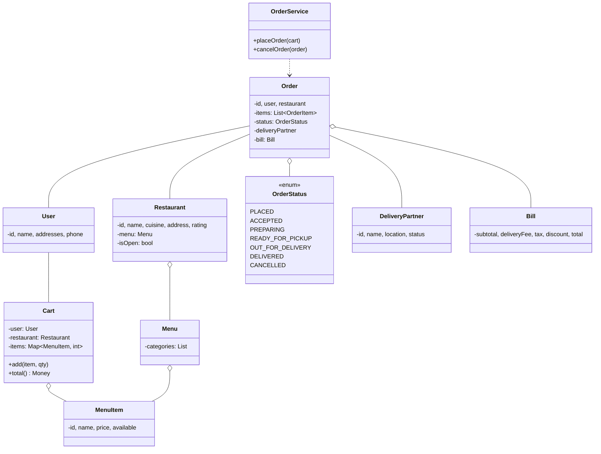
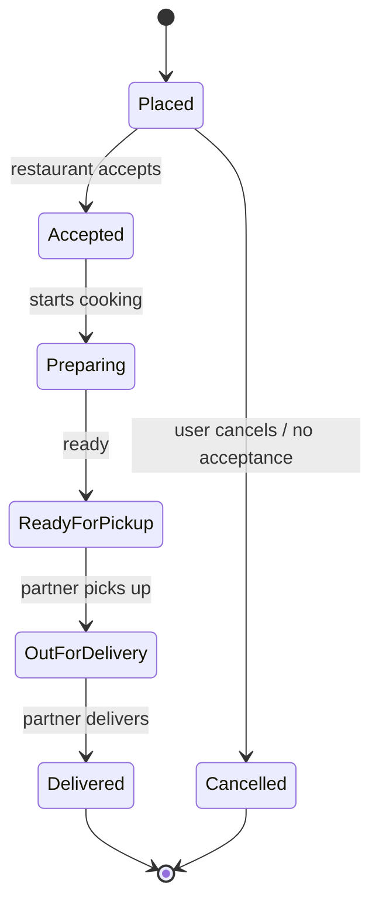
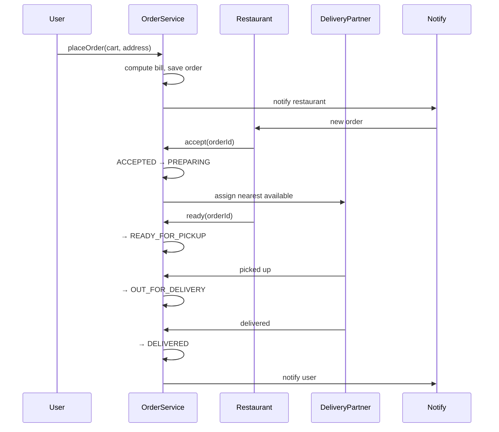

## Problem Statement

Design the object model for a food delivery system (Swiggy / Uber Eats / DoorDash) that:
- Lets users browse restaurants and menus
- Places orders with multiple items
- Computes pricing (with discounts, taxes)
- Assigns a delivery partner
- Tracks order status from placed → delivered

> The HLD case study is at [/sd/case-studies](/sd/case-studies). This page focuses on **classes and state**, not infrastructure.

---

## Requirements

### Functional
- Restaurants with menus (categories, items, prices, availability)
- Cart and order placement
- Order status lifecycle
- Delivery partner assignment
- Pricing: item total + delivery fee + tax + discounts

### Non-Functional
- Order placement is atomic
- Status updates propagate to user, restaurant, and partner
- Audit log of every state change

---

## Class Diagram



---

## Order Lifecycle (State Pattern)



```java
public enum OrderStatus {
    PLACED, ACCEPTED, PREPARING, READY_FOR_PICKUP,
    OUT_FOR_DELIVERY, DELIVERED, CANCELLED;

    public boolean canTransitionTo(OrderStatus next) {
        return switch (this) {
            case PLACED              -> next == ACCEPTED || next == CANCELLED;
            case ACCEPTED            -> next == PREPARING || next == CANCELLED;
            case PREPARING           -> next == READY_FOR_PICKUP;
            case READY_FOR_PICKUP    -> next == OUT_FOR_DELIVERY;
            case OUT_FOR_DELIVERY    -> next == DELIVERED;
            default                  -> false;
        };
    }
}
```

Transitions are validated centrally — illegal status changes are rejected.

---

## Restaurant & Menu

```java
public class Restaurant {
    private final String id;
    private final String name;
    private final Address address;
    private final Menu menu;
    private boolean isOpen = true;

    public boolean isOpen() { return isOpen; }
    public void setOpen(boolean v) { this.isOpen = v; }

    public Menu getMenu() { return menu; }
}

public class Menu {
    private final List<Category> categories = new ArrayList<>();
    public List<Category> getCategories() { return categories; }
}

public class Category {
    private final String name;
    private final List<MenuItem> items = new ArrayList<>();
}

public class MenuItem {
    private final String id;
    private final String name;
    private final Money price;
    private boolean available = true;

    public Money getPrice() { return price; }
    public boolean isAvailable() { return available; }
}
```

---

## Cart

```java
public class Cart {
    private final User user;
    private final Restaurant restaurant;
    private final Map<MenuItem, Integer> lines = new LinkedHashMap<>();

    public Cart(User user, Restaurant restaurant) {
        this.user = user; this.restaurant = restaurant;
    }

    public void add(MenuItem item, int qty) {
        if (!item.isAvailable()) throw new IllegalStateException("not available");
        if (qty <= 0) throw new IllegalArgumentException();
        lines.merge(item, qty, Integer::sum);
    }

    public void remove(MenuItem item) { lines.remove(item); }

    public boolean isEmpty() { return lines.isEmpty(); }

    public Money subtotal() {
        return lines.entrySet().stream()
            .map(e -> e.getKey().getPrice().times(e.getValue()))
            .reduce(Money.zero(), Money::plus);
    }

    public Map<MenuItem, Integer> getLines() { return Map.copyOf(lines); }
}
```

A cart is locked to **one restaurant** — multi-restaurant carts are a separate (much harder) problem.

---

## Pricing (Strategy Pattern)

```java
public interface PricingStrategy {
    Bill compute(Cart cart, DeliveryContext ctx);
}

public class DefaultPricing implements PricingStrategy {
    private final TaxCalculator tax;
    private final DeliveryFeeCalculator delivery;
    private final List<DiscountRule> discounts;

    @Override
    public Bill compute(Cart cart, DeliveryContext ctx) {
        Money subtotal = cart.subtotal();
        Money deliveryFee = delivery.calculate(ctx);
        Money taxAmount = tax.calculate(subtotal, ctx);

        Money discount = Money.zero();
        for (DiscountRule rule : discounts) {
            discount = discount.plus(rule.apply(cart, ctx));
        }
        // Don't let discount exceed subtotal
        discount = discount.min(subtotal);

        Money total = subtotal.plus(deliveryFee).plus(taxAmount).minus(discount);
        return new Bill(subtotal, deliveryFee, taxAmount, discount, total);
    }
}
```

Each `DiscountRule` is its own strategy — `FlatRule`, `PercentRule`, `BogoRule`, `FirstOrderRule`.

---

## Order

```java
public class Order {
    private final String id;
    private final User user;
    private final Restaurant restaurant;
    private final List<OrderItem> items;
    private final Bill bill;
    private OrderStatus status = OrderStatus.PLACED;
    private DeliveryPartner partner;
    private final List<StatusEvent> history = new ArrayList<>();

    public Order(User u, Restaurant r, List<OrderItem> items, Bill bill) {
        this.id = UUID.randomUUID().toString();
        this.user = u; this.restaurant = r;
        this.items = items; this.bill = bill;
        history.add(new StatusEvent(OrderStatus.PLACED, Instant.now()));
    }

    public synchronized void transitionTo(OrderStatus next) {
        if (!status.canTransitionTo(next))
            throw new IllegalStateException("cannot go from " + status + " to " + next);
        this.status = next;
        history.add(new StatusEvent(next, Instant.now()));
    }

    public void assignPartner(DeliveryPartner p) { this.partner = p; }
}
```

History keeps the full audit trail.

---

## Delivery Partner Assignment (Strategy)

```java
public interface PartnerAssignmentStrategy {
    DeliveryPartner pick(Order order, List<DeliveryPartner> available);
}

public class NearestPartnerStrategy implements PartnerAssignmentStrategy {
    @Override
    public DeliveryPartner pick(Order order, List<DeliveryPartner> available) {
        Location restaurantLoc = order.getRestaurant().getAddress().location();
        return available.stream()
            .filter(p -> p.getStatus() == PartnerStatus.AVAILABLE)
            .min(Comparator.comparingDouble(p -> p.getLocation().distanceTo(restaurantLoc)))
            .orElseThrow(() -> new NoPartnerAvailableException());
    }
}
```

Other strategies: shortest queue, batched delivery, surge-aware. Assignment is async — runs after the order is placed.

---

## OrderService (Facade)

```java
public class OrderService {
    private final PricingStrategy pricing;
    private final PartnerAssignmentStrategy assigner;
    private final NotificationService notifier;
    private final OrderRepository repo;

    public Order placeOrder(Cart cart, Address deliveryAddress) {
        if (cart.isEmpty()) throw new IllegalStateException("empty cart");
        if (!cart.getRestaurant().isOpen()) throw new RestaurantClosedException();

        DeliveryContext ctx = new DeliveryContext(cart.getRestaurant(), deliveryAddress);
        Bill bill = pricing.compute(cart, ctx);

        // Reserve / charge payment here (omitted)

        List<OrderItem> items = cart.getLines().entrySet().stream()
            .map(e -> new OrderItem(e.getKey(), e.getValue()))
            .toList();
        Order order = new Order(cart.getUser(), cart.getRestaurant(), items, bill);
        repo.save(order);

        notifier.notifyRestaurant(order);
        notifier.notifyUser(order, "Order placed");
        return order;
    }

    public void cancelOrder(Order order) {
        order.transitionTo(OrderStatus.CANCELLED);
        repo.save(order);
        // refund
        notifier.notifyAll(order, "Order cancelled");
    }

    public void onRestaurantAccept(Order order) {
        order.transitionTo(OrderStatus.ACCEPTED);
        // async: trigger partner assignment
    }
}
```

---

## Sequence: Place Order → Delivery



---

## Edge Cases

| **Case** | **Handling** |
|---------|-------------|
| Restaurant rejects order | Cancel + refund |
| No delivery partner available | Queue or auto-cancel after timeout |
| User cancels after restaurant prepares | Restaurant compensation policy |
| Item out of stock during prep | Restaurant edits order; user confirms / refunds |
| Multiple addresses per user | Address selected at checkout |
| Partner goes offline mid-delivery | Reassign + alert user |

---

## Design Patterns Used

| **Pattern** | **Where** |
|------------|-----------|
| **State** | `OrderStatus` lifecycle |
| **Strategy** | Pricing rules, partner assignment, discount rules |
| **Facade** | `OrderService` orchestrates |
| **Observer** | Notifications to user/restaurant/partner |
| **Builder** | Cart → Order conversion |
| **Repository** | `OrderRepository` for persistence |

---

## Interview Tips

- Lead with the **state diagram** — order lifecycle is the spine of the design.
- Distinguish `Cart` from `Order` — cart is mutable, order is immutable post-placement.
- Pricing is a chain of strategies (subtotal → tax → fees → discounts) — interviewers expect this composability.
- For scaling: order placement is synchronous and atomic; partner assignment is async.
