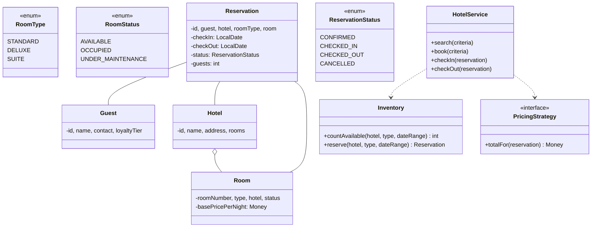
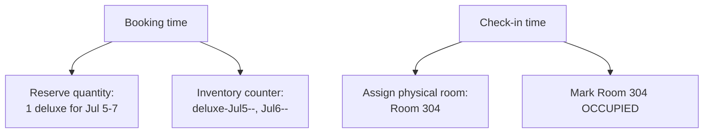
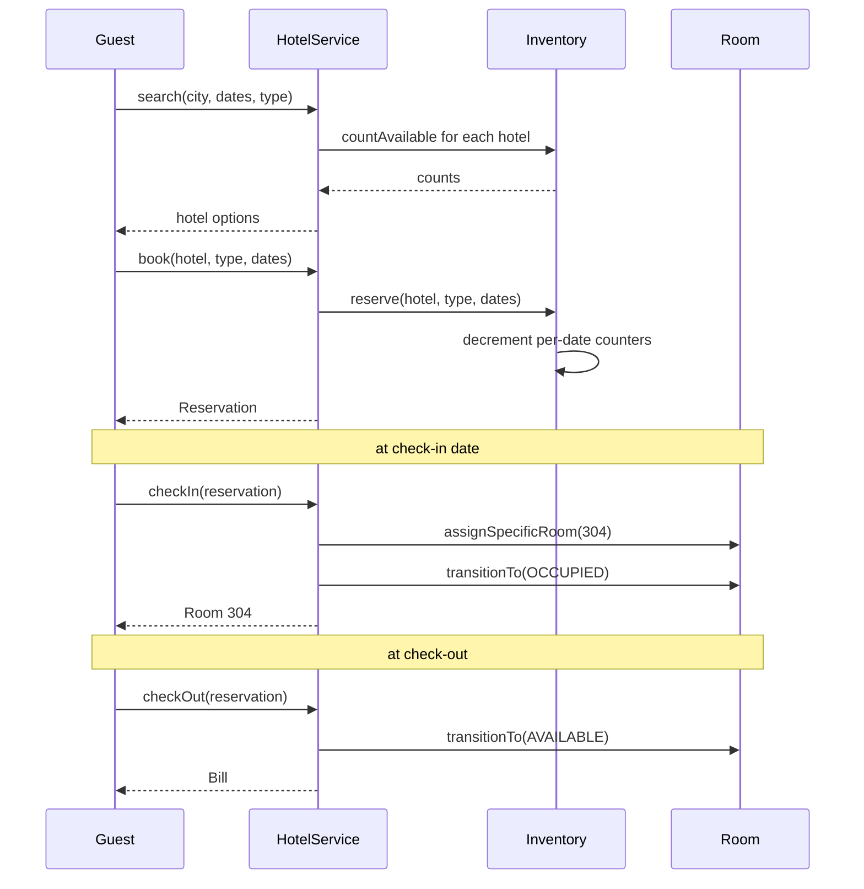

## Problem Statement

Design a hotel booking system that:
- Manages multiple hotels with rooms of various types
- Handles reservations for date ranges
- Avoids double-booking
- Tracks check-in / check-out, computes the bill
- Supports cancellation and modification

---

## Requirements

### Functional
- Hotels with rooms of types: standard, deluxe, suite
- Search rooms by location, dates, capacity, price range
- Reserve room(s) for a date range
- Check-in (assign physical room) and check-out (compute bill)
- Cancel / modify reservation
- Loyalty / corporate rates

### Non-Functional
- No double-booking on any (room, date) pair
- Concurrent searches and reservations
- Audit log

---

## Class Diagram



---

## Inventory: Per-Date Availability

The naive approach — scan all rooms — is slow. Better: maintain an **availability counter per (hotel, type, date)**.

```java
public class Inventory {
    // (hotel, type, date) -> count of available rooms
    private final Map<InventoryKey, Integer> available = new ConcurrentHashMap<>();
    // (hotel, type) -> total inventory
    private final Map<HotelType, Integer> total = new HashMap<>();

    public synchronized int countAvailable(String hotelId, RoomType type,
                                            LocalDate checkIn, LocalDate checkOut) {
        int min = Integer.MAX_VALUE;
        for (LocalDate d = checkIn; d.isBefore(checkOut); d = d.plusDays(1)) {
            int avail = available.getOrDefault(
                new InventoryKey(hotelId, type, d),
                total.getOrDefault(new HotelType(hotelId, type), 0));
            min = Math.min(min, avail);
        }
        return min;
    }

    public synchronized boolean reserve(String hotelId, RoomType type,
                                        LocalDate checkIn, LocalDate checkOut) {
        if (countAvailable(hotelId, type, checkIn, checkOut) < 1) return false;
        for (LocalDate d = checkIn; d.isBefore(checkOut); d = d.plusDays(1)) {
            InventoryKey k = new InventoryKey(hotelId, type, d);
            available.merge(k, -1, Integer::sum);
        }
        return true;
    }

    public synchronized void release(String hotelId, RoomType type,
                                     LocalDate checkIn, LocalDate checkOut) {
        for (LocalDate d = checkIn; d.isBefore(checkOut); d = d.plusDays(1)) {
            available.merge(new InventoryKey(hotelId, type, d), 1, Integer::sum);
        }
    }
}
```

This decouples **booking a room type** from **assigning a specific room**. The physical room is assigned at check-in.



---

## Reservation

```java
public class Reservation {
    public final String id;
    public final Guest guest;
    public final String hotelId;
    public final RoomType roomType;
    public final LocalDate checkIn;
    public final LocalDate checkOut;
    public final int numGuests;
    private ReservationStatus status = ReservationStatus.CONFIRMED;
    private Room assignedRoom;     // null until check-in
    private Bill bill;

    public Reservation(Guest g, String hotelId, RoomType type,
                       LocalDate in, LocalDate out, int guests) {
        if (!out.isAfter(in)) throw new IllegalArgumentException("checkOut must be after checkIn");
        this.id = UUID.randomUUID().toString();
        this.guest = g; this.hotelId = hotelId;
        this.roomType = type;
        this.checkIn = in; this.checkOut = out;
        this.numGuests = guests;
    }

    public long nights() { return ChronoUnit.DAYS.between(checkIn, checkOut); }

    public void assignRoom(Room r) { this.assignedRoom = r; }

    public synchronized void transitionTo(ReservationStatus next) {
        if (!isValidTransition(status, next))
            throw new IllegalStateException();
        status = next;
    }
}
```

---

## Pricing (Strategy)

```java
public interface PricingStrategy {
    Money totalFor(Reservation r);
}

public class StandardPricing implements PricingStrategy {
    private final TaxCalculator tax;

    @Override
    public Money totalFor(Reservation r) {
        Room room = r.getAssignedRoom();
        Money base = room == null
            ? defaultRateFor(r.roomType)
            : room.getBasePricePerNight();
        Money subtotal = base.times(r.nights());
        Money loyalty = applyLoyaltyDiscount(subtotal, r.getGuest());
        Money taxAmount = tax.calculate(subtotal.minus(loyalty), r.hotelId);
        return subtotal.minus(loyalty).plus(taxAmount);
    }
}

public class WeekendPricing implements PricingStrategy {
    private final PricingStrategy weekday;
    private final double weekendMultiplier;

    @Override
    public Money totalFor(Reservation r) {
        long weekendNights = countWeekendNights(r.checkIn, r.checkOut);
        long weekdayNights = r.nights() - weekendNights;
        Money base = defaultRateFor(r.roomType);
        return base.times(weekdayNights)
            .plus(base.times(weekendNights).times((long) weekendMultiplier));
    }
}
```

---

## HotelService (Facade)

```java
public class HotelService {
    private final Inventory inventory;
    private final PricingStrategy pricing;
    private final RoomAssigner roomAssigner;

    public List<HotelOption> search(SearchCriteria c) {
        return hotels.stream()
            .filter(h -> matchesLocation(h, c.location))
            .flatMap(h -> Arrays.stream(RoomType.values())
                .filter(t -> inventory.countAvailable(h.getId(), t, c.checkIn, c.checkOut) >= c.rooms)
                .map(t -> new HotelOption(h, t, pricing.totalFor(stub(h, t, c)))))
            .toList();
    }

    public Reservation book(Guest guest, String hotelId, RoomType type,
                             LocalDate checkIn, LocalDate checkOut, int numGuests) {
        synchronized (this) {
            if (!inventory.reserve(hotelId, type, checkIn, checkOut)) {
                throw new NoAvailabilityException();
            }
        }
        return new Reservation(guest, hotelId, type, checkIn, checkOut, numGuests);
    }

    public void cancel(Reservation r) {
        if (r.getStatus() != ReservationStatus.CONFIRMED) {
            throw new IllegalStateException("can only cancel confirmed");
        }
        r.transitionTo(ReservationStatus.CANCELLED);
        inventory.release(r.hotelId, r.roomType, r.checkIn, r.checkOut);
        // Refund per cancellation policy
    }

    public Room checkIn(Reservation r) {
        if (!r.checkIn.equals(LocalDate.now()))
            throw new IllegalStateException("not check-in date");
        Room room = roomAssigner.assignSpecificRoom(r.hotelId, r.roomType);
        r.assignRoom(room);
        room.transitionTo(RoomStatus.OCCUPIED);
        r.transitionTo(ReservationStatus.CHECKED_IN);
        return room;
    }

    public Bill checkOut(Reservation r) {
        Money total = pricing.totalFor(r);
        Bill bill = new Bill(total, r);
        r.assignedRoom.transitionTo(RoomStatus.AVAILABLE);
        r.transitionTo(ReservationStatus.CHECKED_OUT);
        return bill;
    }
}
```

---

## Sequence: Search → Book → Check-in → Check-out



---

## Edge Cases

| **Case** | **Handling** |
|---------|-------------|
| Walk-in (no reservation) | Direct check-in; create reservation on the fly |
| Early check-out | Charge per cancellation policy; partial refund |
| Late check-out | Extra hourly fee or extend a night |
| Room maintenance during reservation | Reassign at check-in to another room of the same type |
| Overbooking (intentional) | Walk to a sister hotel + comp |
| No-show | Charge first-night fee; cancel reservation |
| Multi-room booking (groups) | Reserve N rooms in one transaction; all-or-nothing |

---

## Design Patterns Used

| **Pattern** | **Where** |
|------------|-----------|
| **State** | Reservation lifecycle, Room status |
| **Strategy** | Pricing (standard, weekend, corporate, dynamic) |
| **Facade** | `HotelService` |
| **Repository** | Hotels, Reservations, Guests |
| **Observer** | Notifications (confirmation, check-in reminder) |
| **Singleton** | One service per app |

---

## Interview Tips

- Distinguish **type-level reservation** (counter) from **room-level assignment** (at check-in). This separation simplifies overbooking and maintenance handling.
- Per-date counter beats per-room interval scan for search and concurrency.
- Mention **overbooking** as a deliberate strategy in real hotels (most hotels overbook by ~5%).
- Pricing strategy should compose: base × nights → loyalty discount → tax.
