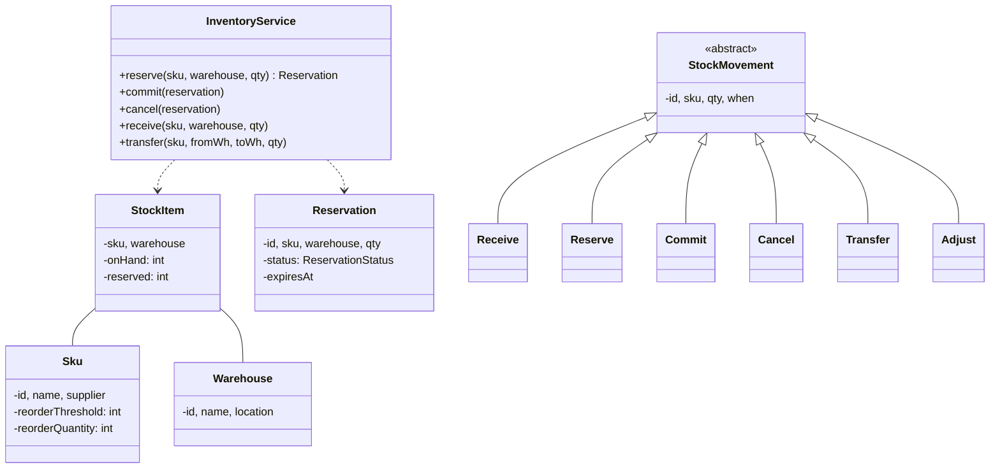
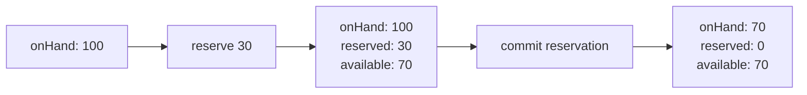
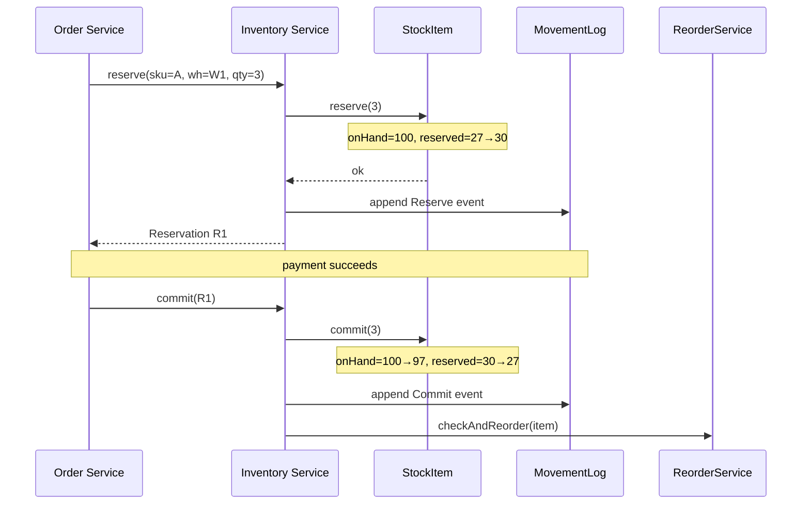

## Problem Statement

Design an inventory system for a retailer with multiple warehouses:
- Track SKUs and quantities per warehouse
- Reserve stock for orders (without overselling)
- Receive new stock from suppliers
- Transfer stock between warehouses
- Trigger reorder when below threshold
- Audit trail of every change

---

## Requirements

### Functional
- Multi-warehouse, per-SKU stock
- Available vs reserved quantities
- Atomic reserve / release / commit
- Receive stock (PO arrival)
- Transfer between warehouses
- Reorder when stock below threshold
- Stock count by SKU, warehouse, total

### Non-Functional
- No oversell under concurrent reserve operations
- Audit log of every transaction
- Eventual consistency across warehouses (reads can be slightly stale)

---

## Class Diagram



---

## StockItem (Per-SKU, Per-Warehouse)

```java
public class StockItem {
    private final String skuId;
    private final String warehouseId;
    private int onHand = 0;       // physical units in warehouse
    private int reserved = 0;     // reserved for unfulfilled orders

    public synchronized int available() { return onHand - reserved; }

    public synchronized boolean reserve(int qty) {
        if (qty <= 0) throw new IllegalArgumentException();
        if (available() < qty) return false;
        reserved += qty;
        return true;
    }

    public synchronized void release(int qty) {
        if (qty <= 0 || qty > reserved) throw new IllegalArgumentException();
        reserved -= qty;
    }

    /** Confirm a reservation: physical removal. */
    public synchronized void commit(int qty) {
        if (qty > reserved) throw new IllegalStateException();
        reserved -= qty;
        onHand -= qty;
    }

    public synchronized void receive(int qty) {
        if (qty <= 0) throw new IllegalArgumentException();
        onHand += qty;
    }

    public synchronized void adjust(int delta, String reason) {
        // Damaged goods, count discrepancies, etc.
        onHand += delta;
        if (onHand < 0) throw new IllegalStateException("negative stock");
    }
}
```

The key insight: stock has **two columns** — `onHand` (physical) and `reserved` (committed but not yet shipped). Available = onHand − reserved. This separation is what prevents overselling.



---

## Reservation

```java
public enum ReservationStatus { ACTIVE, COMMITTED, CANCELLED, EXPIRED }

public class Reservation {
    public final String id;
    public final String skuId;
    public final String warehouseId;
    public final int quantity;
    public final Instant expiresAt;
    private ReservationStatus status = ReservationStatus.ACTIVE;

    public Reservation(String sku, String wh, int qty, Duration ttl) {
        this.id = UUID.randomUUID().toString();
        this.skuId = sku; this.warehouseId = wh; this.quantity = qty;
        this.expiresAt = Instant.now().plus(ttl);
    }

    public boolean isExpired() { return Instant.now().isAfter(expiresAt); }
    public synchronized void commit()  { status = ReservationStatus.COMMITTED; }
    public synchronized void cancel()  { status = ReservationStatus.CANCELLED; }
}
```

Reservations expire automatically — orphans are cleaned up by a sweeper.

---

## Stock Movements (Event Log)

Every change to stock produces an immutable event for audit:

```java
public abstract class StockMovement {
    public final String id;
    public final String skuId;
    public final String warehouseId;
    public final int quantity;
    public final Instant when;
    public final String reason;

    protected StockMovement(String sku, String wh, int qty, String reason) {
        this.id = UUID.randomUUID().toString();
        this.skuId = sku; this.warehouseId = wh; this.quantity = qty;
        this.when = Instant.now();
        this.reason = reason;
    }
}

public class Receive extends StockMovement { /* +qty onHand */ }
public class Commit extends StockMovement { /* -qty onHand, -qty reserved */ }
public class Adjust extends StockMovement { /* delta, can be negative */ }
public class Transfer extends StockMovement {
    public final String toWarehouseId;
    /* -qty from from, +qty to to (two events linked by id) */
}
```

This is the foundation of **event sourcing** for inventory — current state can always be reconstructed by replaying the log.

---

## InventoryService (Facade)

```java
public class InventoryService {
    private static final Duration RESERVATION_TTL = Duration.ofMinutes(15);
    private final Map<StockKey, StockItem> stocks = new ConcurrentHashMap<>();
    private final Map<String, Reservation> reservations = new ConcurrentHashMap<>();
    private final List<StockMovement> log = new CopyOnWriteArrayList<>();
    private final ReorderService reorderService;

    public Reservation reserve(String sku, String warehouse, int qty) {
        StockItem item = getOrCreate(sku, warehouse);
        if (!item.reserve(qty)) throw new OutOfStockException();

        Reservation r = new Reservation(sku, warehouse, qty, RESERVATION_TTL);
        reservations.put(r.id, r);
        log.add(new ReserveMovement(sku, warehouse, qty, r.id));
        return r;
    }

    public void commit(Reservation r) {
        if (r.isExpired()) throw new ReservationExpiredException();
        StockItem item = stocks.get(new StockKey(r.skuId, r.warehouseId));
        item.commit(r.quantity);
        r.commit();
        log.add(new Commit(r.skuId, r.warehouseId, r.quantity, "order " + r.id));
        reorderService.checkAndReorder(item);
    }

    public void cancel(Reservation r) {
        StockItem item = stocks.get(new StockKey(r.skuId, r.warehouseId));
        item.release(r.quantity);
        r.cancel();
        log.add(new Cancel(r.skuId, r.warehouseId, r.quantity, "user cancel"));
    }

    public void receive(String sku, String warehouse, int qty, String poId) {
        StockItem item = getOrCreate(sku, warehouse);
        item.receive(qty);
        log.add(new Receive(sku, warehouse, qty, "PO " + poId));
    }

    public void transfer(String sku, String fromWh, String toWh, int qty) {
        StockItem from = stocks.get(new StockKey(sku, fromWh));
        StockItem to = getOrCreate(sku, toWh);

        // Lock both — order by ID to avoid deadlock
        Object lock1 = fromWh.compareTo(toWh) < 0 ? from : to;
        Object lock2 = fromWh.compareTo(toWh) < 0 ? to : from;
        synchronized (lock1) {
            synchronized (lock2) {
                from.adjust(-qty, "transfer to " + toWh);
                to.adjust(qty, "transfer from " + fromWh);
                log.add(new Transfer(sku, fromWh, toWh, qty));
            }
        }
    }

    /** Periodic sweeper for expired reservations. */
    public void reapExpired() {
        for (Reservation r : reservations.values()) {
            if (r.getStatus() == ReservationStatus.ACTIVE && r.isExpired()) {
                cancel(r);
            }
        }
    }
}
```

---

## Reorder (Strategy + Observer)

```java
public class ReorderService {
    private final SupplierGateway suppliers;

    public void checkAndReorder(StockItem item) {
        Sku sku = ...;
        if (item.available() < sku.getReorderThreshold()) {
            suppliers.placeOrder(sku, sku.getReorderQuantity(), item.warehouseId);
        }
    }
}
```

Reorder logic could be:
- **Threshold-based** (current example)
- **Forecast-based** (project demand for the next N days)
- **Just-in-time** (order arrives same day; minimum buffer)

Strategy interface keeps this swappable.

---

## Sequence: Order Reserve → Commit



---

## Edge Cases

| **Case** | **Handling** |
|---------|-------------|
| Reservation expires mid-checkout | `commit` throws; user retries |
| Partial fulfillment from multiple warehouses | Split reservation per warehouse |
| Negative stock (count error) | Throw on `adjust`; require explicit reason |
| Concurrent transfers between same WHs | Lock-ordering by warehouse ID prevents deadlock |
| Lost movement log (crash) | Replay from persistent event store |
| SKU rename | New SKU; map old in catalog, retain history under old |
| Restocking damaged units | `Adjust` with negative delta + reason |

---

## Design Patterns Used

| **Pattern** | **Where** |
|------------|-----------|
| **Event sourcing** | `StockMovement` log is authoritative |
| **State** | `ReservationStatus` lifecycle |
| **Strategy** | Reorder rules (threshold / forecast / JIT) |
| **Facade** | `InventoryService` orchestrates |
| **Observer** | `ReorderService` reacts to stock-low events |
| **Command** | Each `StockMovement` is a recorded command |
| **Singleton** | One service instance per region |

---

## Interview Tips

- The **onHand vs reserved** split is the key insight — interviewers test for understanding that "available" is a derived quantity.
- Mention **event sourcing**: in a production inventory system, the movement log is the source of truth, and current state is just a materialized view.
- Discuss reservation TTL + sweeper — reservations should never leak.
- For multi-warehouse, mention lock ordering by warehouse ID to avoid deadlocks during transfers.
- Reordering is async — the order service shouldn't block on supplier callouts.
