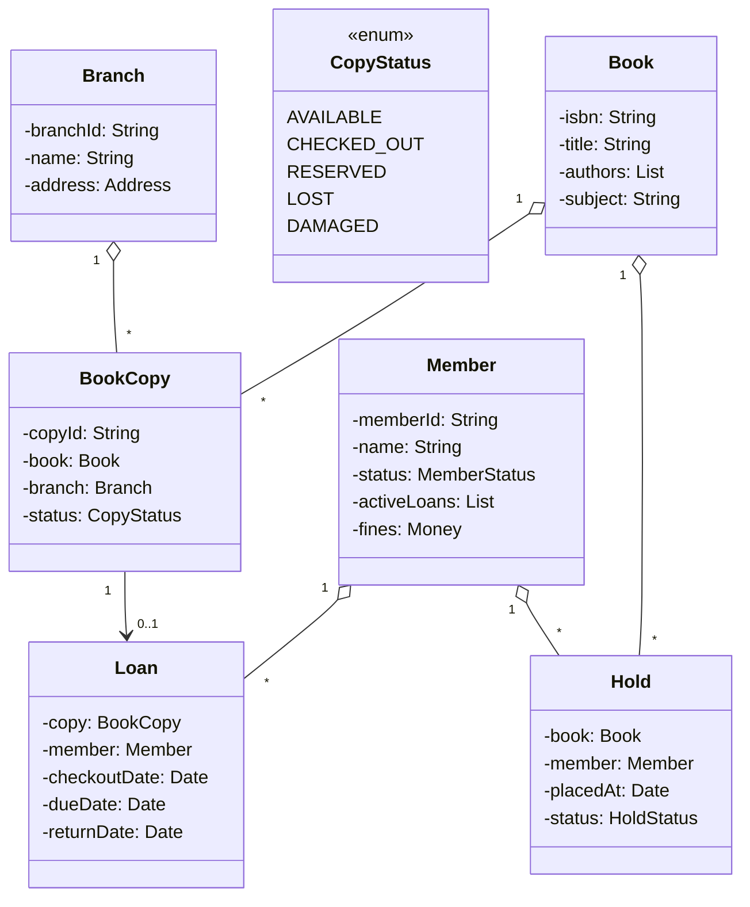
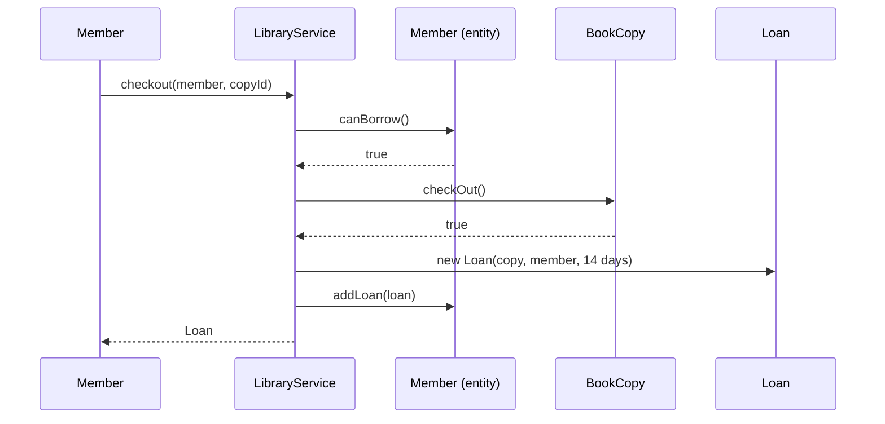

## Problem Statement

Design a library system that:
- Catalogs books (title, author, ISBN, copies)
- Registers members
- Handles checkout / return
- Manages holds / reservations on unavailable copies
- Computes late fees
- Searches catalog by title / author / ISBN

---

## Requirements

### Functional
- Add / remove books and copies
- Register / suspend members
- Check out a copy (only if available, member in good standing)
- Return a copy (compute late fee if overdue)
- Place a hold; notify when copy is available
- Search by title, author, ISBN, subject

### Non-Functional
- Concurrent checkouts from multiple branches
- Audit trail (who borrowed what, when)
- Persistence (DB-backed)

---

## Domain Model



---

## Core Classes

```java
public class Book {
    private final String isbn;
    private final String title;
    private final List<String> authors;
    private final String subject;

    // constructor / getters
}

public enum CopyStatus { AVAILABLE, CHECKED_OUT, RESERVED, LOST, DAMAGED }

public class BookCopy {
    private final String copyId;
    private final Book book;
    private final Branch branch;
    private CopyStatus status = CopyStatus.AVAILABLE;

    public synchronized boolean checkOut() {
        if (status != CopyStatus.AVAILABLE && status != CopyStatus.RESERVED) return false;
        status = CopyStatus.CHECKED_OUT;
        return true;
    }

    public synchronized void returnCopy() {
        status = CopyStatus.AVAILABLE;
    }
}

public enum MemberStatus { ACTIVE, SUSPENDED, EXPIRED }

public class Member {
    private final String memberId;
    private final String name;
    private MemberStatus status = MemberStatus.ACTIVE;
    private final List<Loan> activeLoans = new ArrayList<>();
    private Money fines = Money.ZERO;

    public boolean canBorrow() {
        return status == MemberStatus.ACTIVE
            && activeLoans.size() < MAX_LOANS
            && fines.compareTo(MAX_FINES) < 0;
    }

    public void addLoan(Loan l) { activeLoans.add(l); }
    public void removeLoan(Loan l) { activeLoans.remove(l); }

    private static final int MAX_LOANS = 5;
    private static final Money MAX_FINES = Money.dollars(20);
}

public class Loan {
    public final BookCopy copy;
    public final Member member;
    public final LocalDate checkoutDate;
    public final LocalDate dueDate;
    public LocalDate returnDate;

    public Loan(BookCopy c, Member m, int loanDays) {
        this.copy = c; this.member = m;
        this.checkoutDate = LocalDate.now();
        this.dueDate = checkoutDate.plusDays(loanDays);
    }
}
```

---

## Catalog Search

```java
public class Catalog {
    private final Map<String, Book> byIsbn = new HashMap<>();
    private final Map<String, Set<Book>> byAuthor = new HashMap<>();
    private final Map<String, Set<Book>> byTitleWord = new HashMap<>();   // inverted index

    public void add(Book b) {
        byIsbn.put(b.getIsbn(), b);
        for (String author : b.getAuthors())
            byAuthor.computeIfAbsent(author, k -> new HashSet<>()).add(b);
        for (String word : tokenize(b.getTitle()))
            byTitleWord.computeIfAbsent(word, k -> new HashSet<>()).add(b);
    }

    public Book findByIsbn(String isbn) { return byIsbn.get(isbn); }

    public Set<Book> findByAuthor(String name) {
        return byAuthor.getOrDefault(name, Set.of());
    }

    public Set<Book> findByTitle(String query) {
        Set<Book> result = null;
        for (String word : tokenize(query)) {
            Set<Book> hits = byTitleWord.getOrDefault(word, Set.of());
            result = (result == null) ? new HashSet<>(hits)
                                      : intersect(result, hits);
        }
        return result == null ? Set.of() : result;
    }

    private List<String> tokenize(String s) {
        return Arrays.stream(s.toLowerCase().split("\\s+")).toList();
    }
}
```

---

## Library Service (Facade)

```java
public class LibraryService {
    private static final int LOAN_DAYS = 14;
    private static final Money LATE_FEE_PER_DAY = Money.cents(25);

    private final Catalog catalog;
    private final Map<String, BookCopy> copies = new HashMap<>();
    private final HoldQueue holds = new HoldQueue();
    private final NotificationService notifier;

    public Loan checkout(Member m, String copyId) {
        if (!m.canBorrow()) throw new IneligibleMemberException();

        BookCopy copy = copies.get(copyId);
        if (copy == null) throw new UnknownCopyException();
        if (!copy.checkOut()) throw new CopyUnavailableException();

        Loan loan = new Loan(copy, m, LOAN_DAYS);
        m.addLoan(loan);
        return loan;
    }

    public Money returnCopy(Loan loan) {
        loan.returnDate = LocalDate.now();
        loan.copy.returnCopy();
        loan.member.removeLoan(loan);

        Money fee = computeLateFee(loan);
        if (fee.compareTo(Money.ZERO) > 0) {
            loan.member.addFine(fee);
        }

        // Notify next member in hold queue
        Hold next = holds.dequeueFor(loan.copy.getBook());
        if (next != null) {
            loan.copy.reserveFor(next.member);
            notifier.notify(next.member, "Your hold is ready");
        }

        return fee;
    }

    private Money computeLateFee(Loan loan) {
        long daysLate = ChronoUnit.DAYS.between(loan.dueDate, loan.returnDate);
        if (daysLate <= 0) return Money.ZERO;
        return LATE_FEE_PER_DAY.times(daysLate);
    }

    public Hold placeHold(Member m, Book b) {
        Hold h = new Hold(b, m);
        holds.enqueue(h);
        return h;
    }
}
```

---

## Hold Queue (FIFO per book)

```java
public class HoldQueue {
    private final Map<String, Deque<Hold>> queues = new HashMap<>();   // ISBN -> queue

    public synchronized void enqueue(Hold h) {
        queues.computeIfAbsent(h.book.getIsbn(), k -> new ArrayDeque<>()).addLast(h);
    }

    public synchronized Hold dequeueFor(Book b) {
        Deque<Hold> q = queues.get(b.getIsbn());
        return q == null ? null : q.pollFirst();
    }
}
```

---

## Sequence: Checkout



---

## Edge Cases

| **Case** | **Handling** |
|---------|-------------|
| Member has fines > limit | Reject checkout |
| All copies of a book are out | Allow placing a hold |
| Lost copy | Mark `LOST`, charge replacement cost to member |
| Damaged copy on return | Mark `DAMAGED`, charge fee, set aside |
| Two branches, member borrows from one returns to another | Allow; copy's `branch` updated |
| Hold on book with no copies (yet to acquire) | Queue persists until copy added |
| Member account expires mid-loan | Loan still valid; renewal blocked |

---

## Design Patterns Used

| **Pattern** | **Where** |
|------------|-----------|
| **Facade** | `LibraryService` simplifies multi-step flows |
| **State** | `CopyStatus`, `MemberStatus` |
| **Strategy** | Late-fee calculation (per-day, escalating, capped) |
| **Observer** | Notify members when holds become available |
| **Repository** | `Catalog`, `LoanRepository` for persistence abstraction |
| **Singleton** | `LibraryService` (per app instance) |

---

## Interview Tips

- Distinguish **Book** (the work) from **BookCopy** (the physical item) — interviewers test this. Two members can't borrow the same copy, but can borrow different copies of the same book.
- Catalog search: mention an inverted index for word-level title search.
- For multi-branch, mention each `BookCopy` has a `branch` and you can transfer between branches.
- Late fees and member status are **business rules** — pull them into a Strategy if asked about extension.
