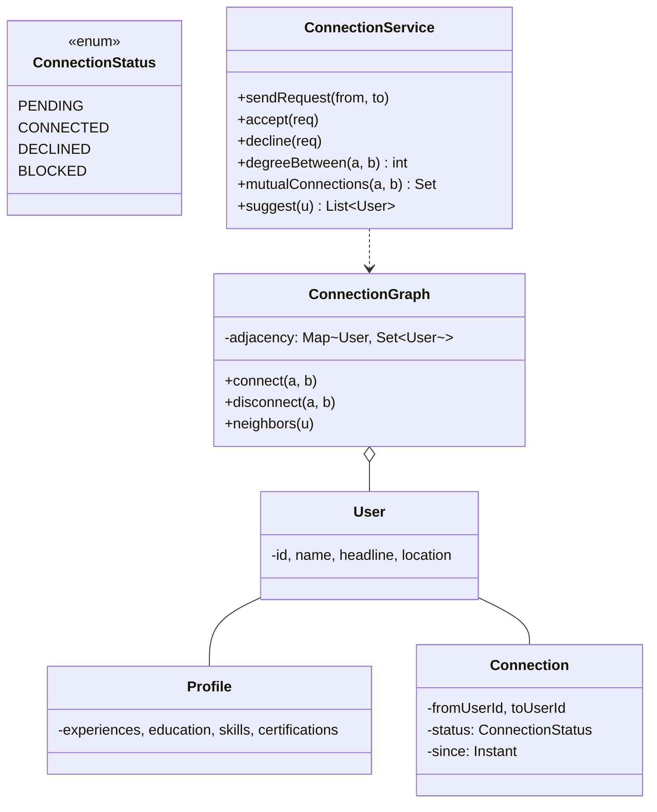
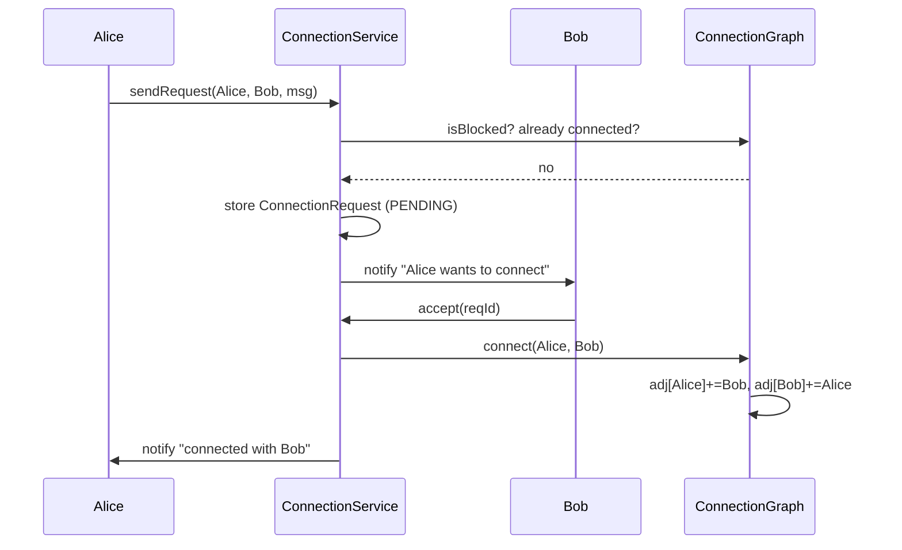

## Problem Statement

Design the connection graph for a professional network like LinkedIn:
- Users can send/accept connection requests
- Connections are bidirectional once accepted
- Compute degree of separation (1st, 2nd, 3rd connections)
- Suggest "people you may know"
- Search a user's network

---

## Requirements

### Functional
- Profile (skills, experience, education)
- Send / accept / reject connection request
- Withdraw a request
- Block / unblock a user (no requests, no visibility)
- Compute degree (1st, 2nd, 3rd, out-of-network)
- Find mutual connections
- Suggest connections (graph-based)

### Non-Functional
- Bidirectional after acceptance
- 100M+ users; queries shouldn't traverse the whole graph
- Reasonable latency for 2nd / 3rd degree

---

## Class Diagram



---

## Connection Request

```java
public enum RequestStatus { PENDING, ACCEPTED, DECLINED, WITHDRAWN }

public class ConnectionRequest {
    public final String id;
    public final User from;
    public final User to;
    public final Instant sentAt;
    private RequestStatus status = RequestStatus.PENDING;
    public final String message;     // optional

    public ConnectionRequest(User from, User to, String message) {
        if (from.equals(to)) throw new IllegalArgumentException("can't connect to self");
        this.id = UUID.randomUUID().toString();
        this.from = from; this.to = to;
        this.message = message;
        this.sentAt = Instant.now();
    }

    public synchronized void accept()   { status = RequestStatus.ACCEPTED; }
    public synchronized void decline()  { status = RequestStatus.DECLINED; }
    public synchronized void withdraw() { status = RequestStatus.WITHDRAWN; }
}
```

---

## Connection Graph

The graph is **undirected** (after acceptance) and **bidirectional**. Adjacency lists are the right representation.

```java
public class ConnectionGraph {
    private final Map<String, Set<String>> adjacency = new ConcurrentHashMap<>();
    private final Map<String, Set<String>> blocks = new ConcurrentHashMap<>();

    public synchronized void connect(String a, String b) {
        if (a.equals(b)) return;
        adjacency.computeIfAbsent(a, k -> ConcurrentHashMap.newKeySet()).add(b);
        adjacency.computeIfAbsent(b, k -> ConcurrentHashMap.newKeySet()).add(a);
    }

    public synchronized void disconnect(String a, String b) {
        adjacency.getOrDefault(a, Set.of()).remove(b);
        adjacency.getOrDefault(b, Set.of()).remove(a);
    }

    public Set<String> neighbors(String user) {
        return Set.copyOf(adjacency.getOrDefault(user, Set.of()));
    }

    public boolean isBlocked(String a, String b) {
        return blocks.getOrDefault(a, Set.of()).contains(b)
            || blocks.getOrDefault(b, Set.of()).contains(a);
    }

    public void block(String blocker, String blocked) {
        blocks.computeIfAbsent(blocker, k -> ConcurrentHashMap.newKeySet()).add(blocked);
        disconnect(blocker, blocked);   // also removes any existing connection
    }
}
```

---

## Connection Service

```java
public class ConnectionService {
    private final ConnectionGraph graph;
    private final Map<String, ConnectionRequest> requests = new ConcurrentHashMap<>();
    // Pending requests indexed by recipient
    private final Map<String, Set<String>> incoming = new ConcurrentHashMap<>();
    private final NotificationService notifier;

    public ConnectionRequest sendRequest(User from, User to, String msg) {
        if (graph.isBlocked(from.getId(), to.getId()))
            throw new IllegalStateException("blocked");
        if (graph.neighbors(from.getId()).contains(to.getId()))
            throw new IllegalStateException("already connected");

        ConnectionRequest req = new ConnectionRequest(from, to, msg);
        requests.put(req.id, req);
        incoming.computeIfAbsent(to.getId(), k -> ConcurrentHashMap.newKeySet()).add(req.id);
        notifier.notify(to, "New connection request from " + from.getName());
        return req;
    }

    public void accept(String requestId) {
        ConnectionRequest req = requests.get(requestId);
        if (req == null) throw new IllegalArgumentException();
        req.accept();
        graph.connect(req.from.getId(), req.to.getId());
        incoming.getOrDefault(req.to.getId(), Set.of()).remove(req.id);
        notifier.notify(req.from, "You're now connected with " + req.to.getName());
    }

    public void decline(String requestId) {
        ConnectionRequest req = requests.get(requestId);
        req.decline();
        incoming.getOrDefault(req.to.getId(), Set.of()).remove(req.id);
    }
}
```

---

## Degree of Separation (BFS)

```java
public int degreeBetween(String a, String b, int maxDegree) {
    if (a.equals(b)) return 0;

    // Bidirectional BFS — much faster than single-source BFS
    Set<String> visitedFromA = new HashSet<>();
    Set<String> visitedFromB = new HashSet<>();
    Queue<String> queueA = new ArrayDeque<>();
    Queue<String> queueB = new ArrayDeque<>();

    visitedFromA.add(a); queueA.add(a);
    visitedFromB.add(b); queueB.add(b);

    int degree = 0;
    while (!queueA.isEmpty() && !queueB.isEmpty() && degree < maxDegree) {
        degree++;
        if (expandLayer(queueA, visitedFromA, visitedFromB)) return degree;
        if (queueB.isEmpty() || degree >= maxDegree) break;
        degree++;
        if (expandLayer(queueB, visitedFromB, visitedFromA)) return degree;
    }
    return -1;   // out of network
}

private boolean expandLayer(Queue<String> q, Set<String> mySide, Set<String> otherSide) {
    int size = q.size();
    for (int i = 0; i < size; i++) {
        String u = q.poll();
        for (String n : graph.neighbors(u)) {
            if (otherSide.contains(n)) return true;
            if (mySide.add(n)) q.add(n);
        }
    }
    return false;
}
```

**Bidirectional BFS** explores from both endpoints, reducing search space from O(b^d) to O(2 × b^(d/2)) — critical when degrees can have millions of neighbors.

---

## Mutual Connections

```java
public Set<String> mutualConnections(String a, String b) {
    Set<String> nA = graph.neighbors(a);
    Set<String> nB = graph.neighbors(b);
    if (nA.size() > nB.size()) {
        Set<String> tmp = nA; nA = nB; nB = tmp;
    }
    return nA.stream().filter(nB::contains).collect(Collectors.toSet());
}
```

Iterate over the smaller set; check membership in the larger.

---

## Suggested Connections (PYMK)

"People You May Know" is essentially **2nd-degree connections, ranked by mutual connection count**:

```java
public List<UserScore> suggest(String userId, int limit) {
    Set<String> direct = graph.neighbors(userId);
    Map<String, Integer> mutualCount = new HashMap<>();

    for (String friend : direct) {
        for (String fof : graph.neighbors(friend)) {
            if (fof.equals(userId) || direct.contains(fof)) continue;
            if (graph.isBlocked(userId, fof)) continue;
            mutualCount.merge(fof, 1, Integer::sum);
        }
    }

    return mutualCount.entrySet().stream()
        .sorted(Map.Entry.<String, Integer>comparingByValue().reversed())
        .limit(limit)
        .map(e -> new UserScore(e.getKey(), e.getValue()))
        .toList();
}
```

For 100M+ users, this is precomputed offline (graph processing — Spark, Pregel) and served from cache.

---

## Sequence: Send → Accept



---

## Edge Cases

| **Case** | **Handling** |
|---------|-------------|
| Self-connect | Reject |
| Connect when already connected | No-op or reject |
| Send request to user who blocked you | Reject silently |
| Withdraw request | Mark `WITHDRAWN`; recipient sees nothing |
| Decline → resend | Allow after cooldown to avoid spam |
| Mutual block | Both can't see each other |
| Account deletion | Remove from all adjacency lists; tombstone for audit |

---

## Scaling Notes

- **Adjacency list per user** is the basic unit. For 1M+ connections per user (LinkedIn celebs), this is fine in memory.
- **2nd-degree** queries can touch billions of edges — precompute and serve from cache.
- **Sharding**: partition by user ID. Cross-shard edges are stored on both sides.
- **Graph databases** (Neo4j, Neptune) for complex graph queries; relational + denormalized lists for hot reads.

---

## Design Patterns Used

| **Pattern** | **Where** |
|------------|-----------|
| **[Facade](/lld/patterns/structural/facade)** | `ConnectionService` |
| **[State](/lld/patterns/behavioral/state)** | `RequestStatus` lifecycle |
| **[Observer](/lld/patterns/behavioral/observer)** | Notifications |
| **[Strategy](/lld/patterns/behavioral/strategy)** | Suggestion ranking (mutual count, similarity) |
| **Repository** | `UserRepo`, `ConnectionRepo` |

---

## Interview Tips

- Lead with the **adjacency list** — it's the natural representation.
- Use **bidirectional BFS** for degree-of-separation; mention it explicitly.
- For PYMK, lead with mutual-connection-count, then mention it's precomputed offline at scale.
- Connections are **symmetric after acceptance** — store on both sides.
- Mention sharding strategy: by user ID, with cross-shard edges duplicated.
