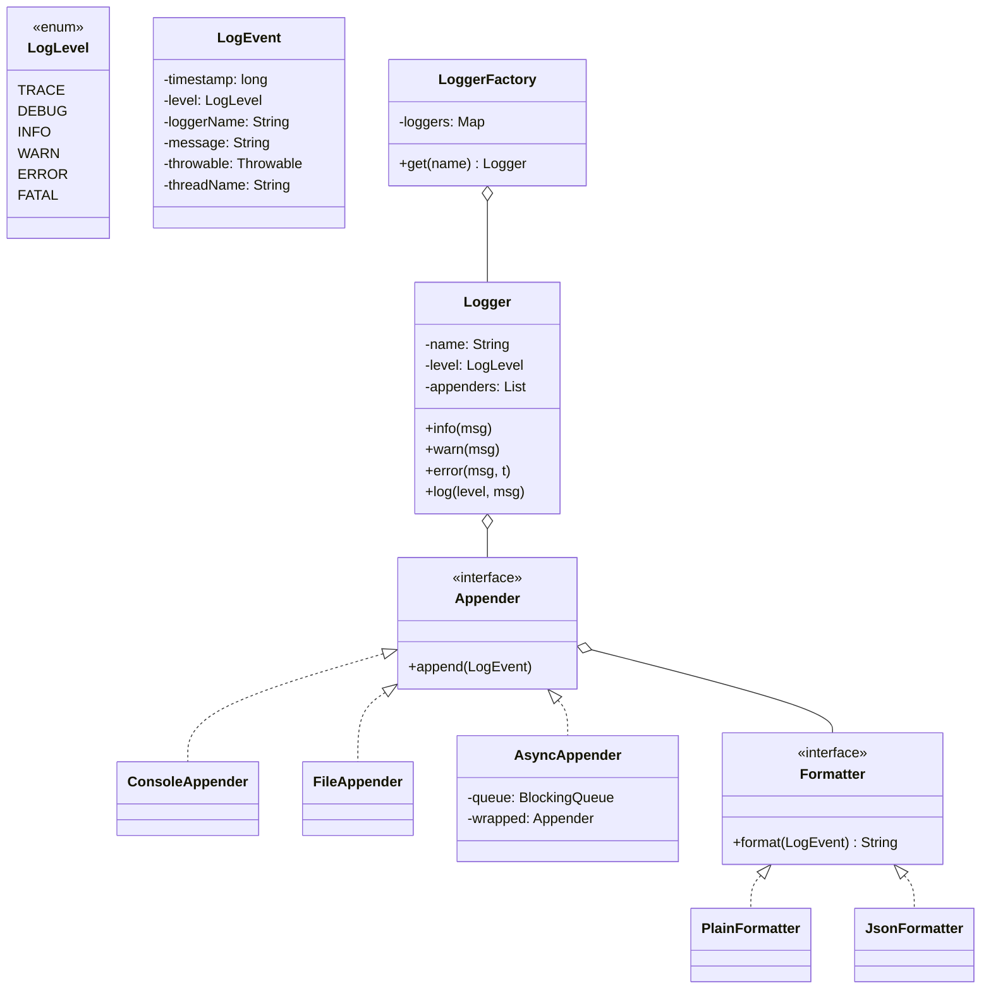
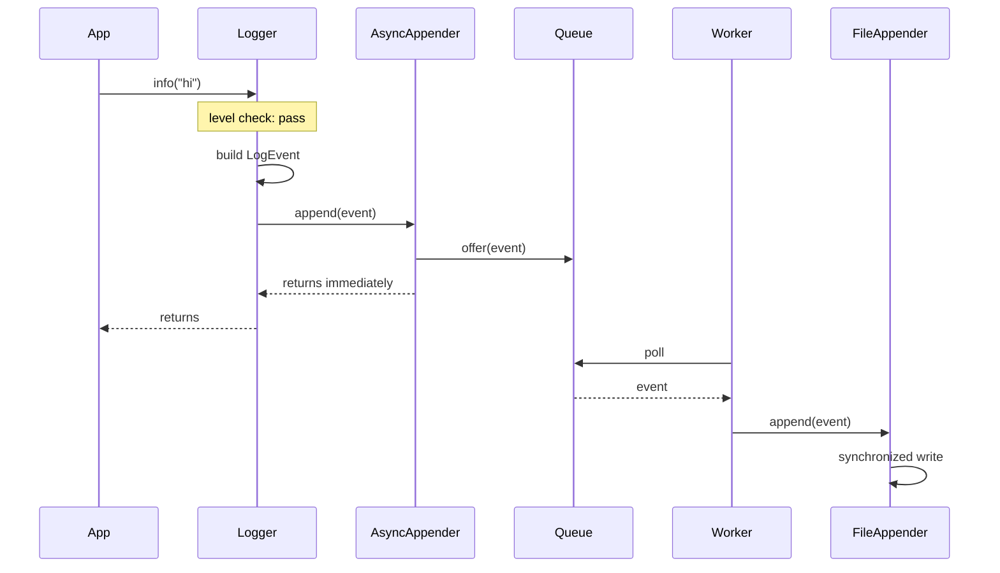

## Problem Statement

Design a logging library that:
- Supports log levels (TRACE, DEBUG, INFO, WARN, ERROR, FATAL)
- Filters logs below a configured level
- Writes to multiple destinations (console, file, network)
- Allows custom formatting
- Handles async logging without blocking the caller
- Is thread-safe

---

## Requirements

### Functional
- Per-logger configurable level
- Multiple appenders (console, rolling file, syslog, kafka)
- Configurable formatter (plain, JSON, key-value)
- Hierarchical loggers (`com.app.module`)
- Runtime config changes (level, add/remove appender)

### Non-Functional
- Lock-free or low-contention hot path
- Async writes for slow appenders (file I/O, network)
- Bounded memory (drop or block on overflow)

---

## Class Diagram



---

## Levels

```java
public enum LogLevel {
    TRACE(0), DEBUG(1), INFO(2), WARN(3), ERROR(4), FATAL(5);

    public final int rank;
    LogLevel(int rank) { this.rank = rank; }

    public boolean isAtLeast(LogLevel other) { return this.rank >= other.rank; }
}
```

A logger with `level=INFO` accepts INFO/WARN/ERROR/FATAL and skips TRACE/DEBUG.

---

## LogEvent

```java
public class LogEvent {
    public final long timestamp;
    public final LogLevel level;
    public final String loggerName;
    public final String message;
    public final Throwable throwable;
    public final String threadName;

    public LogEvent(LogLevel level, String loggerName, String message, Throwable t) {
        this.timestamp = System.currentTimeMillis();
        this.level = level;
        this.loggerName = loggerName;
        this.message = message;
        this.throwable = t;
        this.threadName = Thread.currentThread().getName();
    }
}
```

`LogEvent` is **immutable** — safe to share across threads, queues, etc.

---

## Logger

```java
public class Logger {
    private final String name;
    private volatile LogLevel level;
    private final List<Appender> appenders = new CopyOnWriteArrayList<>();

    public Logger(String name, LogLevel level) {
        this.name = name; this.level = level;
    }

    public void setLevel(LogLevel l) { this.level = l; }
    public void addAppender(Appender a) { appenders.add(a); }

    public void log(LogLevel l, String msg, Throwable t) {
        if (!l.isAtLeast(level)) return;       // fast-path: short-circuit
        LogEvent event = new LogEvent(l, name, msg, t);
        for (Appender a : appenders) {
            try { a.append(event); }
            catch (Throwable err) { System.err.println("Appender failed: " + err); }
        }
    }

    public void trace(String m) { log(LogLevel.TRACE, m, null); }
    public void debug(String m) { log(LogLevel.DEBUG, m, null); }
    public void info(String m)  { log(LogLevel.INFO,  m, null); }
    public void warn(String m)  { log(LogLevel.WARN,  m, null); }
    public void error(String m) { log(LogLevel.ERROR, m, null); }
    public void error(String m, Throwable t) { log(LogLevel.ERROR, m, t); }
    public void fatal(String m) { log(LogLevel.FATAL, m, null); }
}
```

The level check is the **first thing** — disabled logs cost a single comparison.

### String formatting hot-path optimization

```java
// BAD — always builds the string, even if DEBUG is off
log.debug("Processing user " + user + " with " + items.size() + " items");

// GOOD — varargs, only formats if enabled
log.debug("Processing user {} with {} items", user, items.size());

// Inside Logger.log:
public void log(LogLevel l, String pattern, Object... args) {
    if (!l.isAtLeast(level)) return;     // skip formatting entirely
    String msg = MessageFormatter.arrayFormat(pattern, args);
    // ...
}
```

---

## Appenders

```java
public interface Appender {
    void append(LogEvent event);
}

public class ConsoleAppender implements Appender {
    private final Formatter formatter;

    public ConsoleAppender(Formatter f) { this.formatter = f; }

    @Override
    public void append(LogEvent event) {
        PrintStream stream = (event.level.rank >= LogLevel.WARN.rank)
            ? System.err : System.out;
        stream.println(formatter.format(event));
    }
}

public class FileAppender implements Appender {
    private final BufferedWriter writer;
    private final Formatter formatter;
    private final Object lock = new Object();

    public FileAppender(Path path, Formatter f) throws IOException {
        this.writer = Files.newBufferedWriter(path, StandardOpenOption.CREATE, StandardOpenOption.APPEND);
        this.formatter = f;
    }

    @Override
    public void append(LogEvent event) {
        synchronized (lock) {
            try {
                writer.write(formatter.format(event));
                writer.newLine();
                if (event.level.rank >= LogLevel.ERROR.rank) writer.flush();   // immediate flush for errors
            } catch (IOException e) { /* swallow or report */ }
        }
    }
}
```

---

## AsyncAppender (Decorator)

Wrap any appender to make it async:

```java
public class AsyncAppender implements Appender, AutoCloseable {
    private final Appender wrapped;
    private final BlockingQueue<LogEvent> queue;
    private final Thread worker;
    private volatile boolean running = true;

    public AsyncAppender(Appender wrapped, int queueSize) {
        this.wrapped = wrapped;
        this.queue = new ArrayBlockingQueue<>(queueSize);
        this.worker = new Thread(this::drain, "async-log-writer");
        this.worker.setDaemon(true);
        this.worker.start();
    }

    @Override
    public void append(LogEvent event) {
        // Drop on overflow rather than block the caller
        if (!queue.offer(event)) {
            // metric: dropped log count
        }
    }

    private void drain() {
        try {
            while (running || !queue.isEmpty()) {
                LogEvent e = queue.poll(500, TimeUnit.MILLISECONDS);
                if (e != null) wrapped.append(e);
            }
        } catch (InterruptedException ie) {
            Thread.currentThread().interrupt();
        }
    }

    @Override
    public void close() throws InterruptedException {
        running = false;
        worker.join(2_000);
    }
}
```

The hot path becomes: level check → enqueue. The actual I/O happens on a single background thread.

---

## Formatters (Strategy)

```java
public interface Formatter {
    String format(LogEvent event);
}

public class PlainFormatter implements Formatter {
    public String format(LogEvent e) {
        return String.format("[%s] %5s [%s] %s - %s",
            Instant.ofEpochMilli(e.timestamp),
            e.level, e.threadName, e.loggerName, e.message)
            + (e.throwable != null ? "\n" + stackTrace(e.throwable) : "");
    }
}

public class JsonFormatter implements Formatter {
    public String format(LogEvent e) {
        return String.format(
            "{\"ts\":%d,\"level\":\"%s\",\"thread\":\"%s\",\"logger\":\"%s\",\"msg\":\"%s\"}",
            e.timestamp, e.level, escape(e.threadName), e.loggerName, escape(e.message));
    }
}
```

---

## LoggerFactory (Singleton + Factory)

```java
public class LoggerFactory {
    private static final Map<String, Logger> loggers = new ConcurrentHashMap<>();
    private static volatile Config config = Config.defaultConfig();

    public static Logger get(String name) {
        return loggers.computeIfAbsent(name, n -> {
            Logger l = new Logger(n, config.levelFor(n));
            for (Appender a : config.appendersFor(n)) l.addAppender(a);
            return l;
        });
    }

    public static void reconfigure(Config c) {
        config = c;
        for (Logger l : loggers.values()) {
            l.setLevel(config.levelFor(l.name()));
            // reset appenders
        }
    }
}
```

Hierarchical lookup: `Logger("com.app.UserService")` inherits level from `com.app` if `com.app.UserService` isn't explicitly configured.

---

## Sequence



---

## Edge Cases

| **Case** | **Handling** |
|---------|-------------|
| AsyncAppender queue full | Drop with counter, or `put()` if blocking is acceptable |
| File rotation (size or daily) | Decorate `FileAppender` with `RollingFileAppender` |
| App crash before flush | Flush on `ERROR`/`FATAL`; shutdown hook for clean exit |
| Re-entrant logging (logger logs itself) | Skip if already in append; or use a separate "internal" logger |
| Log loops (e.g., logging from `equals()`) | Stack overflow risk; tag thread-local "logging now" guard |
| Configuration change at runtime | Volatile config; readers see fresh values atomically |

---

## Design Patterns Used

| **Pattern** | **Where** |
|------------|-----------|
| **[Singleton](/lld/patterns/creational/singleton)** | `LoggerFactory` |
| **[Factory](/lld/patterns/creational/factory)** | Logger creation by name |
| **[Strategy](/lld/patterns/behavioral/strategy)** | `Formatter` |
| **[Decorator](/lld/patterns/structural/decorator)** | `AsyncAppender` wraps any appender |
| **[Chain of responsibility](/lld/patterns/behavioral/chain-of-responsibility)** | Hierarchical logger lookup |
| **[Observer](/lld/patterns/behavioral/observer)** | Appenders subscribe to logger output |
| **[Producer-consumer](/lld/concurrency/producer-consumer)** | AsyncAppender's queue + worker |

---

## Interview Tips

- Lead with the **level check is the hot path** — must be O(1) and lock-free.
- Pull I/O off the caller thread via `AsyncAppender` — interviewers expect this for a real logger.
- Mention immutable `LogEvent` — safe across threads.
- Bring up parameterized formatting (`{}`-placeholders) to avoid string concat when log is disabled.
- For production, mention slf4j / logback / log4j2 — they're real-world implementations of this design.
