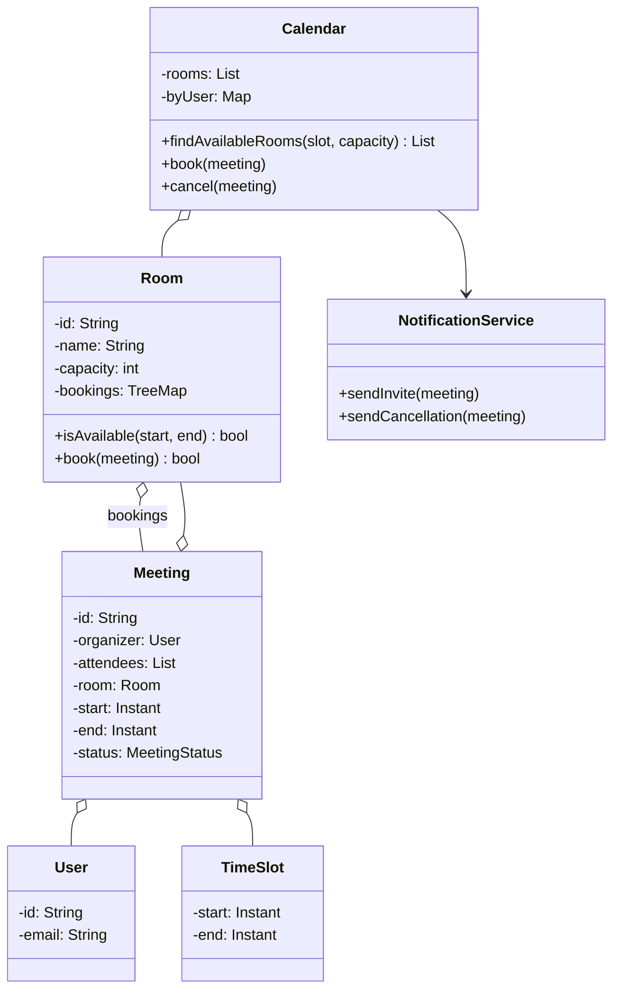
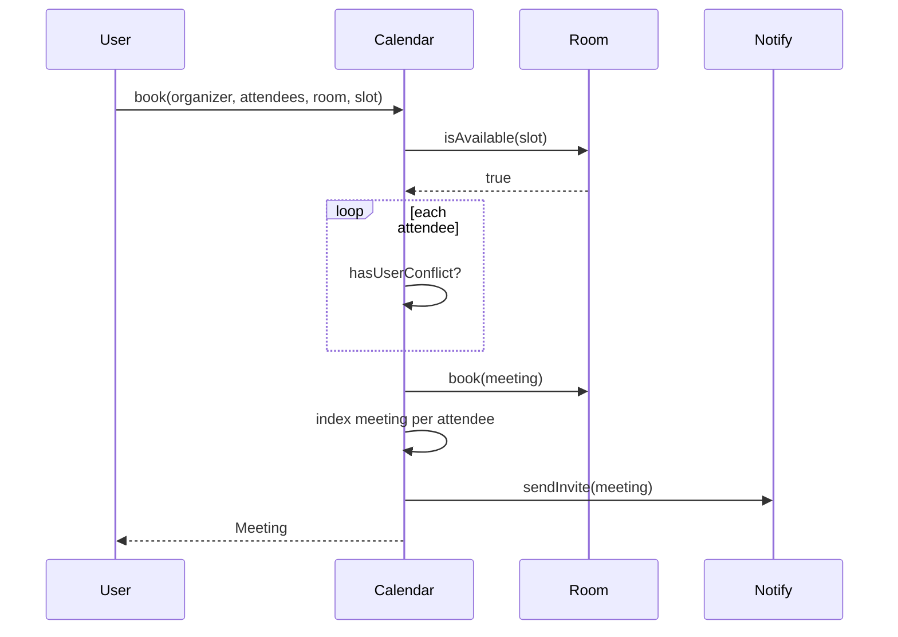

## Problem Statement

Design a meeting scheduler that:
- Manages meeting rooms (with capacity)
- Lets users book rooms for a time slot
- Detects conflicts (no double-booking)
- Finds available rooms by capacity and time
- Sends invites and notifications

---

## Requirements

### Functional
- Add / remove rooms
- Book a meeting (organizer, attendees, room, start, end)
- Cancel / reschedule
- Find rooms by capacity and time window
- Send invites to attendees
- Recurring meetings (optional)

### Non-Functional
- Concurrent bookings (avoid race for same slot)
- Fast availability lookup
- Audit trail

---

## Class Diagram



---

## TimeSlot

```java
public final class TimeSlot {
    public final Instant start, end;

    public TimeSlot(Instant start, Instant end) {
        if (!end.isAfter(start)) throw new IllegalArgumentException("end must be after start");
        this.start = start; this.end = end;
    }

    public boolean overlaps(TimeSlot other) {
        return start.isBefore(other.end) && other.start.isBefore(end);
    }
}
```

The overlap rule: `A.start < B.end && B.start < A.end`. Common bug: using `<=` instead of `<` would forbid back-to-back meetings.

---

## Room

```java
public class Room {
    private final String id;
    private final String name;
    private final int capacity;
    // Sorted by start time for fast conflict checks
    private final TreeMap<Instant, Meeting> bookings = new TreeMap<>();

    public Room(String id, String name, int capacity) {
        this.id = id; this.name = name; this.capacity = capacity;
    }

    public synchronized boolean isAvailable(TimeSlot slot) {
        // Check meetings starting just before or during the slot
        Map.Entry<Instant, Meeting> floor = bookings.floorEntry(slot.start);
        if (floor != null && floor.getValue().getSlot().overlaps(slot)) return false;

        Map.Entry<Instant, Meeting> ceiling = bookings.ceilingEntry(slot.start);
        if (ceiling != null && ceiling.getValue().getSlot().overlaps(slot)) return false;

        return true;
    }

    public synchronized boolean book(Meeting m) {
        if (!isAvailable(m.getSlot())) return false;
        bookings.put(m.getSlot().start, m);
        return true;
    }

    public synchronized void cancel(Meeting m) {
        bookings.remove(m.getSlot().start);
    }

    public int getCapacity() { return capacity; }
    public String getId() { return id; }
}
```

`TreeMap.floorEntry` finds the latest booking starting at-or-before the new slot's start — checking that one (and the next) is enough to detect any overlap.

---

## Meeting

```java
public enum MeetingStatus { SCHEDULED, CANCELLED, COMPLETED }

public class Meeting {
    private final String id;
    private final User organizer;
    private final List<User> attendees;
    private final Room room;
    private final TimeSlot slot;
    private MeetingStatus status = MeetingStatus.SCHEDULED;

    public Meeting(User organizer, List<User> attendees, Room room, TimeSlot slot) {
        this.id = UUID.randomUUID().toString();
        this.organizer = organizer;
        this.attendees = List.copyOf(attendees);
        this.room = room;
        this.slot = slot;
    }

    public TimeSlot getSlot() { return slot; }
    public List<User> getAttendees() { return attendees; }
    public Room getRoom() { return room; }
    public void cancel() { this.status = MeetingStatus.CANCELLED; }
}
```

---

## Calendar (Service Facade)

```java
public class Calendar {
    private final List<Room> rooms;
    private final NotificationService notifier;
    // For checking attendee conflicts across rooms
    private final Map<User, TreeMap<Instant, Meeting>> userBookings = new ConcurrentHashMap<>();

    public Calendar(List<Room> rooms, NotificationService n) {
        this.rooms = rooms; this.notifier = n;
    }

    public synchronized Meeting book(User organizer, List<User> attendees,
                                      Room room, TimeSlot slot) {
        // Room available?
        if (!room.isAvailable(slot)) throw new ConflictException("Room busy");

        // Attendees free?
        for (User u : attendees) {
            if (hasUserConflict(u, slot))
                throw new ConflictException("Attendee " + u + " busy");
        }
        if (attendees.size() > room.getCapacity())
            throw new IllegalArgumentException("Room too small");

        Meeting m = new Meeting(organizer, attendees, room, slot);
        room.book(m);
        for (User u : attendees) {
            userBookings.computeIfAbsent(u, k -> new TreeMap<>())
                        .put(slot.start, m);
        }
        notifier.sendInvite(m);
        return m;
    }

    public synchronized void cancel(Meeting m) {
        m.getRoom().cancel(m);
        for (User u : m.getAttendees()) {
            userBookings.getOrDefault(u, new TreeMap<>()).remove(m.getSlot().start);
        }
        m.cancel();
        notifier.sendCancellation(m);
    }

    public List<Room> findAvailableRooms(TimeSlot slot, int capacity) {
        return rooms.stream()
            .filter(r -> r.getCapacity() >= capacity && r.isAvailable(slot))
            .toList();
    }

    private boolean hasUserConflict(User u, TimeSlot slot) {
        TreeMap<Instant, Meeting> ms = userBookings.get(u);
        if (ms == null) return false;
        Map.Entry<Instant, Meeting> floor = ms.floorEntry(slot.start);
        if (floor != null && floor.getValue().getSlot().overlaps(slot)) return true;
        Map.Entry<Instant, Meeting> ceiling = ms.ceilingEntry(slot.start);
        return ceiling != null && ceiling.getValue().getSlot().overlaps(slot);
    }
}
```

---

## Sequence: Book a Meeting



---

## Concurrency

The shared mutable state:
- Each `Room`'s `bookings` map
- Each user's bookings map

Coarse approach: `synchronized` on `Calendar.book()`. Simple, correct, throughput-limited.

Better:
- Lock per-room and per-user during a booking — order locks by ID to avoid deadlock.
- Or use **optimistic concurrency**: fetch state, build proposed meeting, attempt commit; retry on conflict.

For distributed scenarios, use a database with appropriate isolation.

---

## Recurring Meetings

```java
public class RecurringMeeting {
    private final Meeting prototype;
    private final RecurrenceRule rule;   // daily, weekly, custom
    private final LocalDate until;

    public List<Meeting> expand() {
        // Generate concrete Meeting instances for each occurrence
    }
}
```

Don't store every occurrence as a row — store the rule and **expand on read**. Same as iCal RRULE.

---

## Edge Cases

| **Case** | **Handling** |
|---------|-------------|
| Back-to-back meetings (10:00 ends, 10:00 starts) | Strict `<` comparison — allowed |
| Meeting in the past | Reject (or allow with warning) |
| Capacity exceeded | Reject |
| Organizer not in attendees | Implicit add or explicit list — pick one |
| Cancelled meeting being rescheduled | New meeting; old stays cancelled in audit |
| Time zones | Always store UTC; render in user's TZ |

---

## Design Patterns Used

| **Pattern** | **Where** |
|------------|-----------|
| **[Facade](/lld/patterns/structural/facade)** | `Calendar` service |
| **[Strategy](/lld/patterns/behavioral/strategy)** | `RecurrenceRule` (daily, weekly, monthly, custom) |
| **[Observer](/lld/patterns/behavioral/observer)** | Notify attendees on book / change / cancel |
| **[State](/lld/patterns/behavioral/state)** | `MeetingStatus` lifecycle |
| **[Composite](/lld/patterns/structural/composite)** | Recurring meeting → expanded child meetings |
| **[Singleton](/lld/patterns/creational/singleton)** | One Calendar per workspace |

---

## Interview Tips

- The overlap check is the core algorithm — `TreeMap.floorEntry` makes it O(log n).
- Distinguish **room conflicts** from **attendee conflicts** — both must be checked.
- Mention recurring rules — interviewers probe how you handle them at scale.
- For 10,000+ rooms, mention sharding by room and using indexes (e.g., interval trees) for find-available queries.
