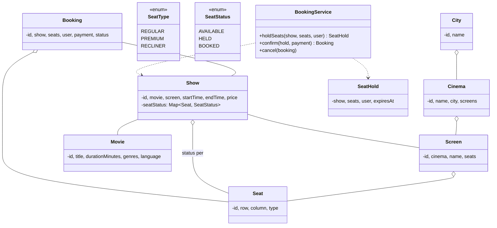
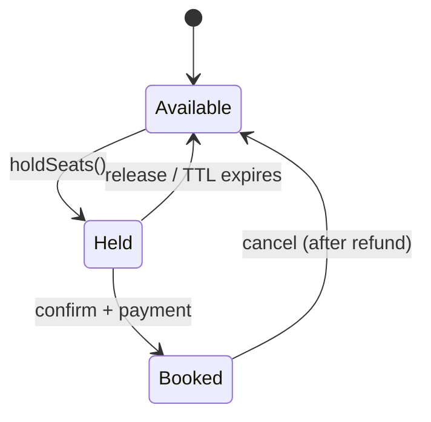
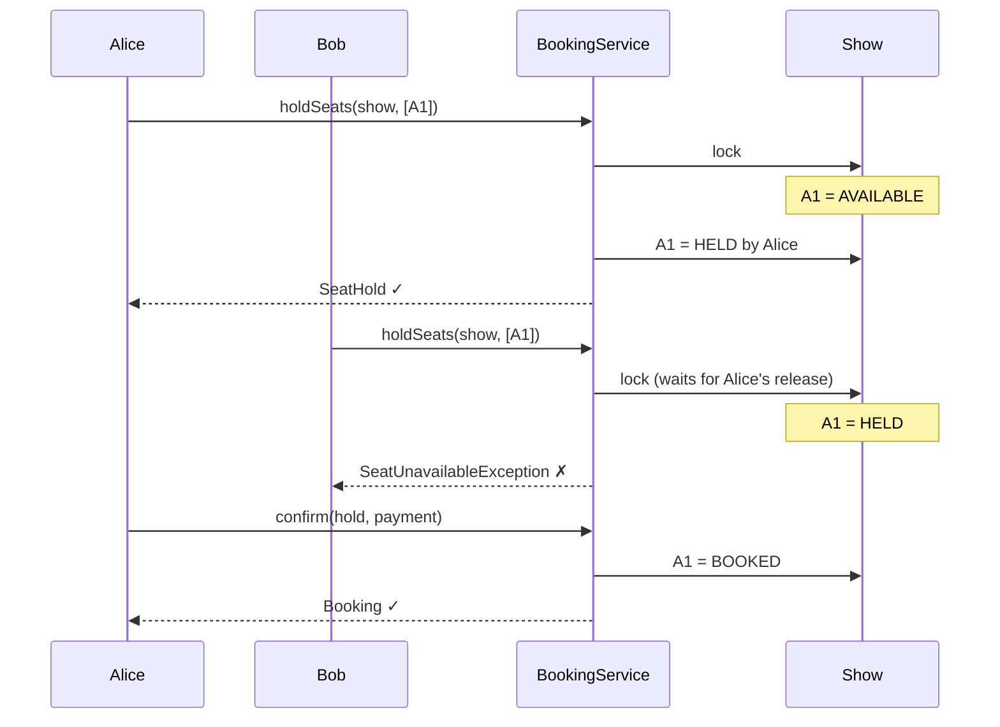

## Problem Statement

Design a movie ticket booking system (BookMyShow / Fandango) that:
- Lists cities → cinemas → screens → shows for a movie
- Lets users select seats from a screen layout
- Holds seats for ~5 minutes during checkout
- Processes payment and confirms booking
- Handles concurrent users selecting the same seat

---

## Requirements

### Functional
- Browse movies by city / language / genre
- Search shows for a movie
- Pick seats (check availability, type)
- Hold and release seats
- Pay & confirm
- Cancel booking (refund per policy)

### Non-Functional
- Two users can't book the same seat
- Hold expires automatically (no manual cleanup)
- High read traffic (everyone browsing); spiky write traffic on popular shows

---

## Class Diagram



---

## Show + Seat Layout

```java
public enum SeatType { REGULAR, PREMIUM, RECLINER }

public class Seat {
    public final String id;
    public final int row;
    public final int column;
    public final SeatType type;
}

public enum SeatStatus { AVAILABLE, HELD, BOOKED }

public class Show {
    private final String id;
    private final Movie movie;
    private final Screen screen;
    private final Instant startTime;
    private final Map<SeatType, Money> pricing;

    // Per-show seat state — important to be per-show not per-seat
    private final ConcurrentMap<String, SeatState> seatStates = new ConcurrentHashMap<>();

    private static class SeatState {
        SeatStatus status = SeatStatus.AVAILABLE;
        String holdId;       // who holds it
        Instant heldUntil;
    }

    public Show(Movie m, Screen s, Instant start, Map<SeatType, Money> pricing) {
        this.movie = m; this.screen = s; this.startTime = start;
        this.pricing = pricing;
        this.id = UUID.randomUUID().toString();
        for (Seat seat : s.getSeats()) {
            seatStates.put(seat.id, new SeatState());
        }
    }

    public Money priceFor(Seat seat) { return pricing.get(seat.type); }

    SeatState getState(String seatId) { return seatStates.get(seatId); }
}
```

Seat status lives on the `Show`, not the `Seat`. The same physical seat is `BOOKED` in show A and `AVAILABLE` in show B simultaneously.

---

## Seat Holds (the Critical Section)

The classic concurrency bug: two users click the same seat at the same time. Solve with **atomic state transition**:

```java
public class SeatHold {
    public final String id;
    public final Show show;
    public final List<String> seatIds;
    public final User user;
    public final Instant expiresAt;

    public SeatHold(Show show, List<String> seatIds, User user, Duration ttl) {
        this.id = UUID.randomUUID().toString();
        this.show = show;
        this.seatIds = List.copyOf(seatIds);
        this.user = user;
        this.expiresAt = Instant.now().plus(ttl);
    }

    public boolean isExpired() { return Instant.now().isAfter(expiresAt); }
}
```

```java
public class BookingService {
    private static final Duration HOLD_TTL = Duration.ofMinutes(5);
    private final Map<String, SeatHold> holds = new ConcurrentHashMap<>();
    private final ScheduledExecutorService cleaner = Executors.newSingleThreadScheduledExecutor();

    public BookingService() {
        cleaner.scheduleAtFixedRate(this::reapExpiredHolds, 30, 30, TimeUnit.SECONDS);
    }

    public SeatHold holdSeats(Show show, List<String> seatIds, User user) {
        // Lock per-show to serialize hold operations on the same show
        synchronized (show) {
            // Check all are AVAILABLE
            for (String sid : seatIds) {
                Show.SeatState s = show.getState(sid);
                if (s == null) throw new UnknownSeatException(sid);
                if (s.status != SeatStatus.AVAILABLE) {
                    if (s.status == SeatStatus.HELD && Instant.now().isAfter(s.heldUntil)) {
                        // Lazy expire
                        s.status = SeatStatus.AVAILABLE;
                    } else {
                        throw new SeatUnavailableException(sid);
                    }
                }
            }
            // Atomically flip to HELD
            SeatHold hold = new SeatHold(show, seatIds, user, HOLD_TTL);
            for (String sid : seatIds) {
                Show.SeatState s = show.getState(sid);
                s.status = SeatStatus.HELD;
                s.holdId = hold.id;
                s.heldUntil = hold.expiresAt;
            }
            holds.put(hold.id, hold);
            return hold;
        }
    }

    public Booking confirm(SeatHold hold, Payment payment) {
        synchronized (hold.show) {
            if (hold.isExpired()) throw new HoldExpiredException();
            // Re-verify seats still belong to this hold
            for (String sid : hold.seatIds) {
                Show.SeatState s = hold.show.getState(sid);
                if (s.status != SeatStatus.HELD || !hold.id.equals(s.holdId))
                    throw new IllegalStateException("hold lost");
            }
            payment.process();   // throws on failure

            for (String sid : hold.seatIds) {
                Show.SeatState s = hold.show.getState(sid);
                s.status = SeatStatus.BOOKED;
                s.holdId = null;
                s.heldUntil = null;
            }
            holds.remove(hold.id);

            Money total = hold.seatIds.stream()
                .map(sid -> hold.show.priceFor(seatFor(sid)))
                .reduce(Money.zero(), Money::plus);

            return new Booking(hold.show, hold.seatIds, hold.user, payment, total);
        }
    }

    public void release(SeatHold hold) {
        synchronized (hold.show) {
            for (String sid : hold.seatIds) {
                Show.SeatState s = hold.show.getState(sid);
                if (hold.id.equals(s.holdId)) {
                    s.status = SeatStatus.AVAILABLE;
                    s.holdId = null;
                    s.heldUntil = null;
                }
            }
            holds.remove(hold.id);
        }
    }

    private void reapExpiredHolds() {
        for (SeatHold h : holds.values()) {
            if (h.isExpired()) release(h);
        }
    }
}
```

---

## Seat Selection Lifecycle



---

## Sequence: Two Concurrent Bookings



---

## Concurrency Strategy

The service uses **per-show synchronization** for holds. This means:
- Different shows don't block each other (high parallelism overall).
- Heavily-booked shows do serialize, but each hold operation is millisecond-level.

Alternative: use a **distributed lock** (Redis `SETNX`) for multi-server deployments.

For DB-backed implementations: row-level locking (`SELECT ... FOR UPDATE`) on the seat row.

---

## Booking & Cancellation

```java
public class Booking {
    public final String id;
    public final Show show;
    public final List<String> seatIds;
    public final User user;
    public final Payment payment;
    public final Money total;
    private BookingStatus status = BookingStatus.CONFIRMED;
    public final Instant createdAt = Instant.now();
}

public enum BookingStatus { CONFIRMED, CANCELLED }
```

Cancellation:
- Compute refund per policy (e.g., full refund if > 24h before show, partial if closer)
- Process refund through payment gateway
- Mark booking `CANCELLED`
- Set seats back to `AVAILABLE`

---

## Edge Cases

| **Case** | **Handling** |
|---------|-------------|
| Hold expires mid-payment | `confirm()` throws; user retries from seat selection |
| Network split during confirm | Idempotency key on payment to avoid double-charge |
| Show starts during browse | Reject hold for past shows |
| Group booking — all-or-nothing | Hold all seats atomically; if any fails, release all |
| Refund after partial show start | Policy decision; usually no refund |
| Payment succeeds but DB write fails | Reconciliation job; refund or replay |

---

## Design Patterns Used

| **Pattern** | **Where** |
|------------|-----------|
| **[State](/lld/patterns/behavioral/state)** | `SeatStatus` lifecycle (Available / Held / Booked) |
| **[Strategy](/lld/patterns/behavioral/strategy)** | Pricing per seat type; cancellation refund policy |
| **[Facade](/lld/patterns/structural/facade)** | `BookingService` |
| **[Observer](/lld/patterns/behavioral/observer)** | Show countdown to hold expiry on user UI |
| **[Singleton](/lld/patterns/creational/singleton)** | One `BookingService` per app |
| **Repository** | Persistence for shows, holds, bookings |

---

## Interview Tips

- The **seat hold** is the central design challenge — interviewers ask about concurrency here.
- Per-show locking is fine; mention scaling via row-level DB locks or distributed locks (Redis).
- Lazy expiration on read + scheduled sweep covers both correctness and cleanup.
- Mention idempotency for payments — the payment must not double-charge if the user retries.
- Distinguish from generic ticket booking: movie has fixed seat layout; some events (concerts) have GA sections that just need a counter.
