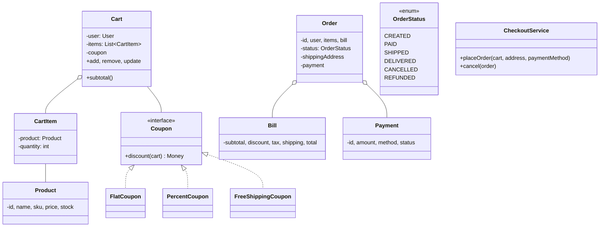
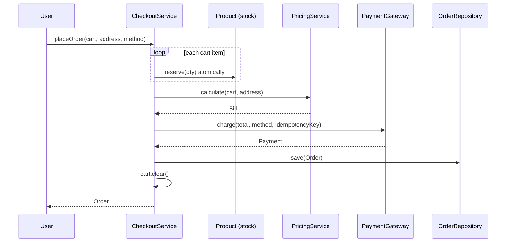

## Problem Statement

Design the LLD for the cart-and-checkout part of an e-commerce app:
- Browse a product catalog
- Add/remove items in a cart
- Apply discount coupons
- Compute taxes and shipping
- Place an order with payment
- Order lifecycle (placed → paid → shipped → delivered)

---

## Requirements

### Functional
- Catalog with products (name, price, stock, variants)
- Cart per user (persistent across sessions)
- Quantity updates, remove, clear
- Discount codes (flat / percent / BOGO / shipping-free)
- Tax calculation per region
- Shipping options
- Place order; charge payment
- Cancel before ship; refund

### Non-Functional
- Don't oversell (atomic stock check at order)
- Idempotent payment
- Cart survives logout

---

## Class Diagram



---

## Catalog & Product

```java
public class Product {
    private final String id;
    private final String sku;
    private final String name;
    private final Money price;
    private final AtomicInteger stock;     // mutable, synchronized
    private boolean isActive = true;

    public boolean reserve(int qty) {
        while (true) {
            int current = stock.get();
            if (current < qty) return false;
            if (stock.compareAndSet(current, current - qty)) return true;
        }
    }

    public void release(int qty) { stock.addAndGet(qty); }
}
```

`AtomicInteger` + CAS gives atomic, lock-free stock checks. (For multi-server deployments, use database row locks instead.)

---

## Cart

```java
public class Cart {
    private final String userId;
    private final Map<String, CartItem> items = new LinkedHashMap<>();
    private Coupon coupon;

    public void add(Product p, int qty) {
        if (qty <= 0) throw new IllegalArgumentException();
        items.merge(p.getId(), new CartItem(p, qty),
            (existing, fresh) -> new CartItem(p, existing.qty + fresh.qty));
    }

    public void update(String productId, int newQty) {
        CartItem item = items.get(productId);
        if (item == null) return;
        if (newQty <= 0) items.remove(productId);
        else items.put(productId, new CartItem(item.product, newQty));
    }

    public void remove(String productId) { items.remove(productId); }
    public void clear() { items.clear(); coupon = null; }
    public void applyCoupon(Coupon c) { this.coupon = c; }

    public Money subtotal() {
        return items.values().stream()
            .map(i -> i.product.getPrice().times(i.qty))
            .reduce(Money.zero(), Money::plus);
    }

    public List<CartItem> getItems() { return new ArrayList<>(items.values()); }
    public Coupon getCoupon() { return coupon; }
}
```

`LinkedHashMap` preserves insertion order — the user sees items in the order they added them.

---

## Coupons (Strategy)

```java
public interface Coupon {
    String code();
    Money apply(Cart cart);
}

public class FlatCoupon implements Coupon {
    private final String code;
    private final Money amount;

    @Override
    public Money apply(Cart cart) {
        return amount.min(cart.subtotal());     // never refund money
    }
}

public class PercentCoupon implements Coupon {
    private final String code;
    private final double percent;
    private final Money maxDiscount;

    @Override
    public Money apply(Cart cart) {
        Money raw = cart.subtotal().times(percent / 100.0);
        return raw.min(maxDiscount).min(cart.subtotal());
    }
}

public class FreeShippingCoupon implements Coupon {
    @Override
    public Money apply(Cart cart) {
        return Money.zero();    // doesn't reduce subtotal; shipping calc handles it separately
    }
}

public class CategoryCoupon implements Coupon {
    private final String category;
    private final double percent;

    @Override
    public Money apply(Cart cart) {
        Money eligible = cart.getItems().stream()
            .filter(i -> i.product.getCategory().equals(category))
            .map(i -> i.product.getPrice().times(i.qty))
            .reduce(Money.zero(), Money::plus);
        return eligible.times(percent / 100.0);
    }
}
```

---

## Pricing Pipeline

```java
public class PricingService {
    private final TaxCalculator tax;
    private final ShippingCalculator shipping;

    public Bill calculate(Cart cart, Address shipTo) {
        Money subtotal = cart.subtotal();

        Money discount = (cart.getCoupon() == null)
            ? Money.zero()
            : cart.getCoupon().apply(cart);

        Money shippingFee = (cart.getCoupon() instanceof FreeShippingCoupon)
            ? Money.zero()
            : shipping.calculate(cart, shipTo);

        Money taxed = subtotal.minus(discount);
        Money taxAmount = tax.calculate(taxed, shipTo);

        Money total = taxed.plus(shippingFee).plus(taxAmount);
        return new Bill(subtotal, discount, shippingFee, taxAmount, total);
    }
}
```

---

## Order

```java
public enum OrderStatus { CREATED, PAID, SHIPPED, DELIVERED, CANCELLED, REFUNDED }

public class Order {
    public final String id;
    public final User user;
    public final List<OrderItem> items;
    public final Address shippingAddress;
    public final Bill bill;
    private OrderStatus status = OrderStatus.CREATED;
    private Payment payment;

    public synchronized void transitionTo(OrderStatus next) {
        if (!isValidTransition(status, next))
            throw new IllegalStateException();
        status = next;
    }

    public void attachPayment(Payment p) { this.payment = p; }
}
```

---

## CheckoutService (Facade)

```java
public class CheckoutService {
    private final PricingService pricing;
    private final PaymentGateway paymentGateway;
    private final OrderRepository orders;
    private final ProductRepository products;

    public Order placeOrder(Cart cart, Address address, PaymentMethod method) {
        if (cart.getItems().isEmpty()) throw new EmptyCartException();

        // Step 1: reserve stock atomically
        List<Product> reserved = new ArrayList<>();
        try {
            for (CartItem item : cart.getItems()) {
                if (!item.product.reserve(item.qty)) {
                    throw new OutOfStockException(item.product.getName());
                }
                reserved.add(item.product);
            }

            // Step 2: compute bill
            Bill bill = pricing.calculate(cart, address);

            // Step 3: charge payment (with idempotency)
            Payment payment = paymentGateway.charge(bill.total(), method, cart.idempotencyKey());

            // Step 4: persist order
            List<OrderItem> orderItems = cart.getItems().stream()
                .map(i -> new OrderItem(i.product, i.qty, i.product.getPrice()))
                .toList();
            Order order = new Order(cart.getUser(), orderItems, address, bill);
            order.attachPayment(payment);
            order.transitionTo(OrderStatus.PAID);
            orders.save(order);

            cart.clear();
            return order;
        } catch (Exception e) {
            // Rollback stock
            for (int i = 0; i < reserved.size(); i++) {
                reserved.get(i).release(cart.getItems().get(i).qty);
            }
            throw e;
        }
    }

    public void cancel(Order order) {
        if (order.getStatus() != OrderStatus.PAID && order.getStatus() != OrderStatus.CREATED) {
            throw new IllegalStateException("can only cancel before ship");
        }
        order.transitionTo(OrderStatus.CANCELLED);

        // Refund
        paymentGateway.refund(order.payment());

        // Release stock
        for (OrderItem item : order.items()) {
            item.product.release(item.qty);
        }
    }
}
```

The order matters: **reserve stock first**, then charge. If stock fails, you didn't charge. If charge fails, you release stock.

---

## Sequence: Place Order



---

## Edge Cases

| **Case** | **Handling** |
|---------|-------------|
| Stock changes between cart and checkout | Reserve at order time; reject if depleted |
| Coupon expired during checkout | Re-validate; ask user to reapply |
| Payment fails | Release reserved stock; show error |
| Duplicate submission (network retry) | Idempotency key on payment |
| Partial fulfillment | Out-of-scope for cart; backorder modeling needed |
| Price changes mid-cart | Confirm with user before paying |
| Tax rules change by region | Strategy per region |

---

## Design Patterns Used

| **Pattern** | **Where** |
|------------|-----------|
| **Strategy** | Coupons, tax, shipping calculators |
| **Facade** | `CheckoutService` |
| **State** | `OrderStatus` lifecycle |
| **Repository** | Cart, Order, Product persistence |
| **Singleton** | One `CheckoutService` per app |
| **Command** | Each order operation as a command (refund, ship) |
| **Builder** | Construct `Order` with many fields |

---

## Interview Tips

- **Reserve stock atomically** with CAS or row-level lock — no oversell.
- Coupons are strategies — interviewers ask "what about a 10% off all electronics?" → `CategoryCoupon`.
- **Idempotency key** for payment — interviewers test this. Network retries should not double-charge.
- Distinguish `Cart` (mutable, transient) from `Order` (immutable, persisted).
- Pricing pipeline: subtotal → discount → tax → shipping. Get the order right.
