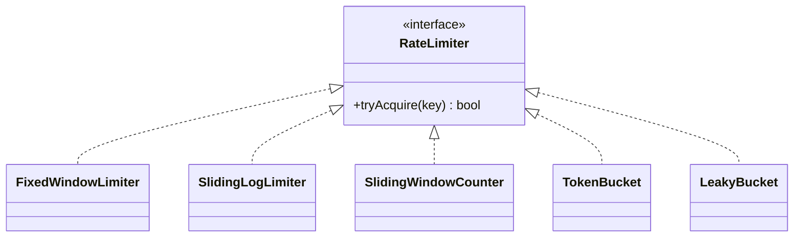
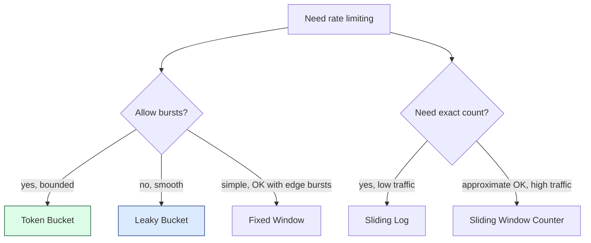

## Problem Statement

Design a rate limiter that limits requests per client (per API key, IP, user). Needs to:
- Allow up to N requests per time window
- Reject (or queue) requests exceeding the limit
- Support multiple algorithms
- Be thread-safe and low-latency

> The HLD case study is at [/hld/rate-limiter](/hld/rate-limiter). This page focuses on the **algorithm** and class design.

---

## Algorithms Compared

| **Algorithm** | **Burst behavior** | **Memory** | **Smoothness** |
|--------------|-------------------|-----------|----------------|
| **Fixed Window** | Allows 2× burst at boundary | O(1) per key | Bursty |
| **Sliding Log** | None | O(N) per key — keeps timestamps | Smooth |
| **Sliding Window Counter** | Limited burst | O(1) per key | Approximately smooth |
| **Token Bucket** | Allows bursts up to bucket size | O(1) per key | Smooth |
| **Leaky Bucket** | No bursts | O(1) per key | Constant rate |

---

## Common Interface

```java
public interface RateLimiter {
    boolean tryAcquire(String clientKey);
}
```

Returns `true` if allowed, `false` if denied.

---

## 1. Fixed Window

Counts requests in the current 1-second (or N-second) window. Resets at boundary.

```java
public class FixedWindowLimiter implements RateLimiter {
    private final int maxRequests;
    private final long windowMs;
    private final Map<String, WindowState> state = new ConcurrentHashMap<>();

    private static class WindowState {
        long windowStart;
        AtomicInteger count;
        WindowState(long start) {
            this.windowStart = start;
            this.count = new AtomicInteger(0);
        }
    }

    public FixedWindowLimiter(int max, long windowMs) {
        this.maxRequests = max;
        this.windowMs = windowMs;
    }

    @Override
    public boolean tryAcquire(String key) {
        long now = System.currentTimeMillis();
        WindowState w = state.computeIfAbsent(key, k -> new WindowState(now));
        synchronized (w) {
            if (now - w.windowStart >= windowMs) {
                w.windowStart = now;
                w.count.set(0);
            }
            return w.count.incrementAndGet() <= maxRequests;
        }
    }
}
```

**Flaw:** at window boundaries, allows 2× burst — N at the end of one window plus N at the start of the next.

---

## 2. Sliding Window Log

Store every request timestamp. On each request, drop expired and check count.

```java
public class SlidingLogLimiter implements RateLimiter {
    private final int maxRequests;
    private final long windowMs;
    private final Map<String, Deque<Long>> log = new ConcurrentHashMap<>();

    public SlidingLogLimiter(int max, long windowMs) {
        this.maxRequests = max; this.windowMs = windowMs;
    }

    @Override
    public boolean tryAcquire(String key) {
        long now = System.currentTimeMillis();
        Deque<Long> q = log.computeIfAbsent(key, k -> new ArrayDeque<>());
        synchronized (q) {
            while (!q.isEmpty() && q.peekFirst() < now - windowMs) q.pollFirst();
            if (q.size() >= maxRequests) return false;
            q.addLast(now);
            return true;
        }
    }
}
```

**Pro:** exact. **Con:** O(N) memory per key (every timestamp in the window).

---

## 3. Sliding Window Counter

Two windows: current and previous. Estimate sliding count by linear interpolation.

```java
public class SlidingWindowCounter implements RateLimiter {
    private final int maxRequests;
    private final long windowMs;
    private final Map<String, State> state = new ConcurrentHashMap<>();

    private static class State {
        long currentWindowStart;
        int currentCount;
        int previousCount;
    }

    @Override
    public synchronized boolean tryAcquire(String key) {
        long now = System.currentTimeMillis();
        State s = state.computeIfAbsent(key, k -> {
            State x = new State();
            x.currentWindowStart = now - (now % windowMs);
            return x;
        });

        long thisWindow = now - (now % windowMs);
        if (thisWindow != s.currentWindowStart) {
            s.previousCount = s.currentCount;
            s.currentCount = 0;
            s.currentWindowStart = thisWindow;
        }

        // Fraction of previous window that's still in the sliding view
        double fraction = 1.0 - ((now - thisWindow) / (double) windowMs);
        double estimate = s.previousCount * fraction + s.currentCount;

        if (estimate >= maxRequests) return false;
        s.currentCount++;
        return true;
    }
}
```

**Pro:** O(1) memory, smooth-ish. **Con:** estimate, not exact.

---

## 4. Token Bucket

A bucket of capacity C, refilled at rate R tokens/second. Each request consumes one token. If empty, request is denied.

```java
public class TokenBucket implements RateLimiter {
    private final long capacity;
    private final double refillPerMs;
    private final Map<String, BucketState> buckets = new ConcurrentHashMap<>();

    private static class BucketState {
        double tokens;
        long lastRefillMs;
    }

    public TokenBucket(long capacity, double refillPerSec) {
        this.capacity = capacity;
        this.refillPerMs = refillPerSec / 1000.0;
    }

    @Override
    public boolean tryAcquire(String key) {
        long now = System.currentTimeMillis();
        BucketState b = buckets.computeIfAbsent(key, k -> {
            BucketState s = new BucketState();
            s.tokens = capacity;
            s.lastRefillMs = now;
            return s;
        });
        synchronized (b) {
            double elapsed = now - b.lastRefillMs;
            b.tokens = Math.min(capacity, b.tokens + elapsed * refillPerMs);
            b.lastRefillMs = now;
            if (b.tokens < 1.0) return false;
            b.tokens -= 1.0;
            return true;
        }
    }
}
```

**Pro:** smooth, allows bounded bursts. **The most common production choice.**

---

## 5. Leaky Bucket

Like token bucket but constant *outflow* — no bursts.

```java
public class LeakyBucket implements RateLimiter {
    private final long capacity;
    private final double leakPerMs;
    private final Map<String, BucketState> buckets = new ConcurrentHashMap<>();

    private static class BucketState {
        double level;
        long lastLeakMs;
    }

    @Override
    public boolean tryAcquire(String key) {
        long now = System.currentTimeMillis();
        BucketState b = buckets.computeIfAbsent(key, k -> new BucketState());
        synchronized (b) {
            double elapsed = now - b.lastLeakMs;
            b.level = Math.max(0, b.level - elapsed * leakPerMs);
            b.lastLeakMs = now;
            if (b.level + 1 > capacity) return false;
            b.level += 1;
            return true;
        }
    }
}
```

Used for **smoothing** (constant downstream rate), not just limiting.

---

## Class Diagram



---

## Choosing an Algorithm



---

## Distributed Rate Limiting

For multiple servers behind a load balancer:

| **Approach** | **Tradeoff** |
|-------------|--------------|
| Per-server local | Easy; user can hit N × servers limit |
| Centralized Redis | Accurate; round-trip latency |
| Sticky sessions to one server | Local accuracy; load imbalance |
| Probabilistic (count-min sketch) | Approximate; very low memory |

Redis-based token bucket using Lua script (atomic):

```lua
-- atomic refill + consume
local tokens = redis.call("HGET", KEYS[1], "tokens")
local last = redis.call("HGET", KEYS[1], "last")
-- refill, consume, update
```

---

## Edge Cases

| **Case** | **Handling** |
|---------|-------------|
| First request from new key | Create state with full bucket / fresh window |
| Clock skew (distributed) | Use single source of truth (Redis time, NTP) |
| Memory leak from inactive keys | TTL on the key; periodic cleanup sweep |
| Thundering herd at window reset | Token bucket avoids; fixed window suffers |
| Limit changes at runtime | Volatile config; new limit applies to subsequent calls |

---

## Design Patterns Used

| **Pattern** | **Where** |
|------------|-----------|
| **[Strategy](/lld/patterns/behavioral/strategy)** | Different rate-limiting algorithms behind one interface |
| **[Singleton](/lld/patterns/creational/singleton)** | One limiter per application instance |
| **[Decorator](/lld/patterns/structural/decorator)** | Wrap a limiter with logging, metrics, multi-tier |
| **[Factory](/lld/patterns/creational/factory)** | Construct limiter from config |

---

## Interview Tips

- Pick **token bucket** by default — it's the right answer 90% of the time.
- Mention sliding-window-counter as an O(1)-memory approximation when interviewers push back on log-based approaches.
- For distributed, lead with Redis + Lua for atomicity.
- Be ready to discuss limit per key vs per user vs per endpoint — usually all three.
