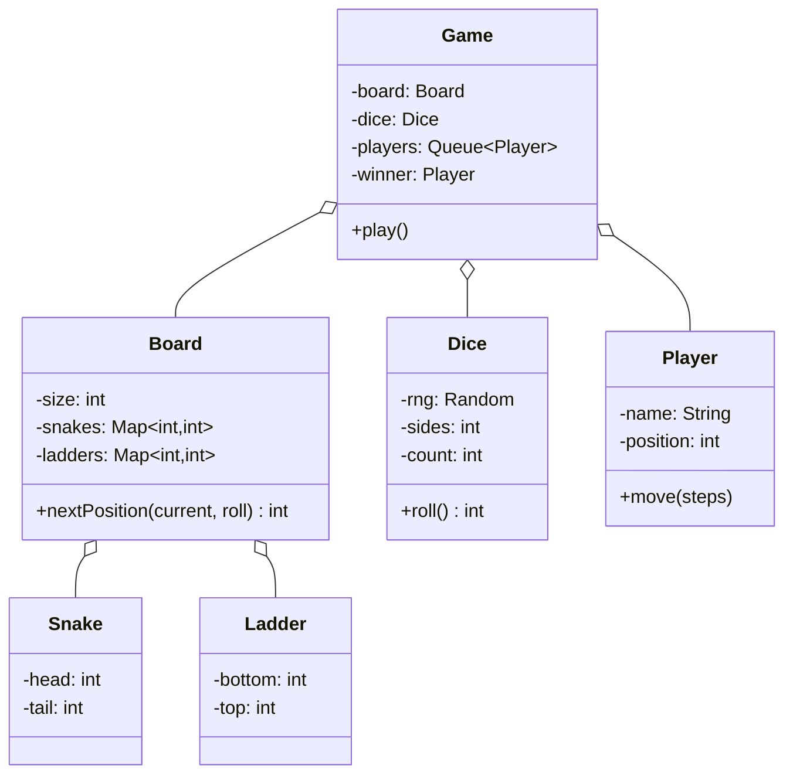
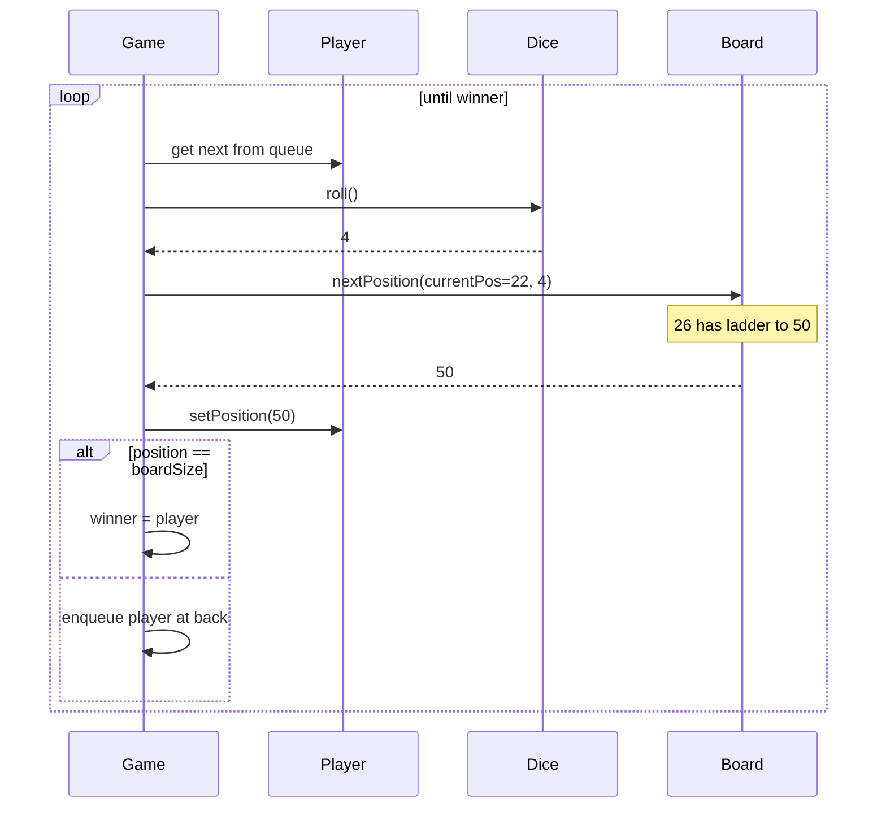

## Problem Statement

Design a Snake and Ladder game where:
- N players take turns
- Each turn rolls a die and moves forward
- Landing on a snake's head moves down to its tail
- Landing on a ladder's bottom moves up to its top
- First player to reach 100 (or last cell) wins

---

## Requirements

### Functional
- Configurable board size (default 100 cells)
- Configurable snakes and ladders
- N players (≥ 2)
- Roll a 6-sided die
- Validate moves (can't go past last cell)
- Detect winner

### Non-Functional
- Deterministic given a seed (for testing/replay)
- Extensible: support multiple dice, custom rules

---

## Class Diagram



---

## Core Classes

```java
public class Player {
    private final String name;
    private int position = 0;

    public Player(String name) { this.name = name; }

    public int getPosition() { return position; }
    public void setPosition(int p) { this.position = p; }
    public String getName() { return name; }
}

public class Snake {
    public final int head, tail;
    public Snake(int head, int tail) {
        if (head <= tail) throw new IllegalArgumentException("head must be > tail");
        this.head = head; this.tail = tail;
    }
}

public class Ladder {
    public final int bottom, top;
    public Ladder(int bottom, int top) {
        if (bottom >= top) throw new IllegalArgumentException("top must be > bottom");
        this.bottom = bottom; this.top = top;
    }
}
```

---

## Board

```java
public class Board {
    private final int size;
    private final Map<Integer, Integer> jumps = new HashMap<>();   // snake heads + ladder bottoms

    public Board(int size, List<Snake> snakes, List<Ladder> ladders) {
        this.size = size;
        for (Snake s : snakes) {
            if (jumps.containsKey(s.head))
                throw new IllegalArgumentException("Cell " + s.head + " has multiple jumps");
            jumps.put(s.head, s.tail);
        }
        for (Ladder l : ladders) {
            if (jumps.containsKey(l.bottom))
                throw new IllegalArgumentException("Cell " + l.bottom + " has multiple jumps");
            jumps.put(l.bottom, l.top);
        }
    }

    public int getSize() { return size; }

    /** Returns the new position after applying snakes/ladders. */
    public int nextPosition(int current, int roll) {
        int target = current + roll;
        if (target > size) return current;   // can't go past, stay put
        return jumps.getOrDefault(target, target);
    }
}
```

A single map for snakes & ladders simplifies lookup. We validate that no cell has both.

---

## Dice (Strategy Pattern)

```java
public interface Dice {
    int roll();
}

public class StandardDice implements Dice {
    private final Random rng;
    private final int sides;
    private final int count;

    public StandardDice(int sides, int count, Random rng) {
        this.sides = sides; this.count = count; this.rng = rng;
    }

    @Override
    public int roll() {
        int total = 0;
        for (int i = 0; i < count; i++) total += rng.nextInt(sides) + 1;
        return total;
    }
}
```

Inject a seeded `Random` for tests.

---

## Game (Round-Robin Loop)

```java
public class Game {
    private final Board board;
    private final Dice dice;
    private final Deque<Player> players;
    private Player winner;

    public Game(Board board, Dice dice, List<Player> players) {
        if (players.size() < 2) throw new IllegalArgumentException("Need ≥2 players");
        this.board = board;
        this.dice = dice;
        this.players = new ArrayDeque<>(players);
    }

    public Player play() {
        while (winner == null) {
            playTurn();
        }
        return winner;
    }

    private void playTurn() {
        Player p = players.pollFirst();
        int roll = dice.roll();
        int newPos = board.nextPosition(p.getPosition(), roll);
        p.setPosition(newPos);

        log(p, roll, newPos);

        if (newPos == board.getSize()) {
            winner = p;
        } else {
            players.offerLast(p);   // back of queue
        }
    }

    private void log(Player p, int roll, int pos) {
        System.out.printf("%s rolled %d -> %d%n", p.getName(), roll, pos);
    }
}
```

A `Deque` rotates players naturally: poll front, push back unless they win.

---

## Sequence



---

## Variants & Extensibility

| **Variant** | **How to add** |
|------------|----------------|
| Multiple dice (sum) | Already supported via `count` in `StandardDice` |
| Roll again on 6 | Override `playTurn` — don't push back if `roll == 6` |
| Must land *exactly* on 100 | Already enforced (`target > size` returns current) |
| Snake bites you back to 1 | Strategy on landing — chain of `LandingEffect` objects |
| 2D variants (Chutes & Ladders) | Same logic; visualization changes |

---

## Edge Cases

| **Case** | **Handling** |
|---------|-------------|
| Roll exceeds last cell | Player stays put (must roll exact) |
| Cell has both snake & ladder | Forbidden by `Board` constructor validation |
| Player on snake tail / ladder top initially | Disallowed at config time |
| Single player game | Throw at construction (`players.size() < 2`) |
| All players stuck (rare) | Add iteration cap, declare draw or rotate |

---

## Design Patterns Used

| **Pattern** | **Where** |
|------------|-----------|
| **[Strategy](/lld/patterns/behavioral/strategy)** | Dice (standard, weighted, multi-dice) |
| **[Builder](/lld/patterns/creational/builder)** | Board configuration with snakes/ladders lists |
| **[Observer](/lld/patterns/behavioral/observer)** | Game broadcasts moves to UI listeners |
| **[Template method](/lld/patterns/behavioral/template-method)** | `Game.play()` skeleton, subclass overrides for variants |

---

## Interview Tips

- Clarify rules: roll-again-on-6? Exact landing? Multiple dice?
- The state is small — board + queue of players + dice. Don't over-design.
- Validate snake/ladder configurations at construction (no overlap, valid directions).
- Mention testability: inject a seeded RNG and you can replay any game.
