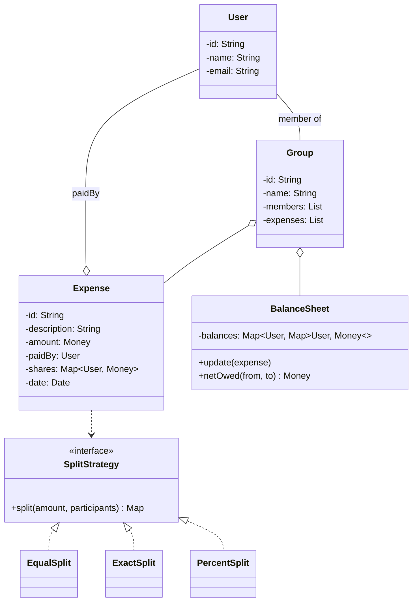

## Problem Statement

Design an app that:
- Tracks expenses paid by one or more users for a group
- Splits each expense (equally, by share, by exact amount, by percentage)
- Maintains pairwise balances (who owes whom)
- Settles up debts
- Supports groups, friends, and personal expenses

---

## Requirements

### Functional
- Add user, friend, group
- Add expense: payer, amount, participants, split type
- Compute net balances per user
- Settle debt between two users
- View transaction history

### Non-Functional
- Concurrent expense additions
- Currency support (one currency per group)
- Audit log of every expense

---

## Domain Model



---

## Money

Always use **integer cents** for money. `double` is wrong for finance — `0.1 + 0.2 != 0.3`.

```java
public final class Money implements Comparable<Money> {
    private final long cents;
    private final Currency currency;

    public Money(long cents, Currency c) { this.cents = cents; this.currency = c; }

    public Money plus(Money other) {
        check(other);
        return new Money(cents + other.cents, currency);
    }
    public Money minus(Money other) {
        check(other);
        return new Money(cents - other.cents, currency);
    }

    private void check(Money m) {
        if (!currency.equals(m.currency)) throw new IllegalArgumentException();
    }

    public long cents() { return cents; }
    // hashCode, equals, compareTo, toString
}
```

---

## Split Strategies

```java
public interface SplitStrategy {
    Map<User, Money> split(Money total, List<Participant> participants);
}

public class EqualSplit implements SplitStrategy {
    public Map<User, Money> split(Money total, List<Participant> ps) {
        long perHead = total.cents() / ps.size();
        long remainder = total.cents() % ps.size();
        Map<User, Money> result = new HashMap<>();
        for (int i = 0; i < ps.size(); i++) {
            // First `remainder` people pay an extra cent to absorb rounding
            long share = perHead + (i < remainder ? 1 : 0);
            result.put(ps.get(i).user, new Money(share, total.currency()));
        }
        return result;
    }
}

public class ExactSplit implements SplitStrategy {
    public Map<User, Money> split(Money total, List<Participant> ps) {
        long sum = ps.stream().mapToLong(p -> p.exactAmount.cents()).sum();
        if (sum != total.cents()) throw new IllegalArgumentException("Shares must sum to total");
        return ps.stream().collect(Collectors.toMap(p -> p.user, p -> p.exactAmount));
    }
}

public class PercentSplit implements SplitStrategy {
    public Map<User, Money> split(Money total, List<Participant> ps) {
        double sum = ps.stream().mapToDouble(p -> p.percent).sum();
        if (Math.abs(sum - 100.0) > 0.001) throw new IllegalArgumentException("Percents must sum to 100");

        Map<User, Money> result = new HashMap<>();
        long allocated = 0;
        for (int i = 0; i < ps.size() - 1; i++) {
            long share = Math.round(total.cents() * ps.get(i).percent / 100.0);
            result.put(ps.get(i).user, new Money(share, total.currency()));
            allocated += share;
        }
        // Last person absorbs rounding
        result.put(ps.get(ps.size() - 1).user, new Money(total.cents() - allocated, total.currency()));
        return result;
    }
}
```

The rounding policy matters — never lose or gain a cent across splits.

---

## Expense

```java
public class Expense {
    private final String id;
    private final String description;
    private final Money amount;
    private final User paidBy;
    private final Map<User, Money> shares;
    private final LocalDateTime date;

    public Expense(String desc, Money amount, User paidBy,
                   List<Participant> participants, SplitStrategy strategy) {
        this.id = UUID.randomUUID().toString();
        this.description = desc;
        this.amount = amount;
        this.paidBy = paidBy;
        this.shares = strategy.split(amount, participants);
        this.date = LocalDateTime.now();
    }
}
```

---

## Balance Sheet

The core data structure: a directed graph of who-owes-whom.

```java
public class BalanceSheet {
    // balances[A][B] = amount A owes B (negative = B owes A)
    private final Map<User, Map<User, Money>> balances = new ConcurrentHashMap<>();

    public synchronized void apply(Expense e) {
        User payer = e.getPaidBy();
        for (Map.Entry<User, Money> entry : e.getShares().entrySet()) {
            User u = entry.getKey();
            Money owed = entry.getValue();
            if (u.equals(payer)) continue;   // payer doesn't owe themselves

            adjust(u, payer, owed);
        }
    }

    private void adjust(User from, User to, Money delta) {
        Money current = get(from, to);
        Money updated = current.plus(delta);
        balances.computeIfAbsent(from, k -> new HashMap<>()).put(to, updated);

        // Mirror: to -> from is the negation
        Money mirror = get(to, from).minus(delta);
        balances.computeIfAbsent(to, k -> new HashMap<>()).put(from, mirror);
    }

    public Money get(User from, User to) {
        return balances.getOrDefault(from, Map.of())
                       .getOrDefault(to, Money.zero(USD));
    }

    /** Net amount user owes everyone else (positive = owes, negative = is owed). */
    public Money netOwed(User user) {
        return balances.getOrDefault(user, Map.of()).values().stream()
            .reduce(Money.zero(USD), Money::plus);
    }
}
```

Two-way bookkeeping prevents bugs: every adjustment writes the mirror, so `balances[A][B] = -balances[B][A]` always.

---

## Settlement: Minimum Cash Flow

To minimize transactions when settling a group, use a greedy algorithm:

```java
public List<Transaction> settle(BalanceSheet sheet, List<User> users) {
    Map<User, Long> net = new HashMap<>();
    for (User u : users) net.put(u, sheet.netOwed(u).cents());

    List<Transaction> result = new ArrayList<>();
    PriorityQueue<Map.Entry<User, Long>> debtors = new PriorityQueue<>(
        Map.Entry.<User, Long>comparingByValue());        // most negative first
    PriorityQueue<Map.Entry<User, Long>> creditors = new PriorityQueue<>(
        Map.Entry.<User, Long>comparingByValue().reversed());   // most positive first

    for (var entry : net.entrySet()) {
        if (entry.getValue() < 0) creditors.add(entry);
        else if (entry.getValue() > 0) debtors.add(entry);
    }

    while (!debtors.isEmpty() && !creditors.isEmpty()) {
        var debtor = debtors.poll();
        var creditor = creditors.poll();
        long pay = Math.min(debtor.getValue(), -creditor.getValue());
        result.add(new Transaction(debtor.getKey(), creditor.getKey(),
                                   new Money(pay, USD)));
        if (debtor.getValue() - pay > 0) debtors.add(Map.entry(debtor.getKey(), debtor.getValue() - pay));
        if (creditor.getValue() + pay < 0) creditors.add(Map.entry(creditor.getKey(), creditor.getValue() + pay));
    }
    return result;
}
```

Result: at most N − 1 transactions for N users, far fewer than naive pairwise.

---

## Service (Facade)

```java
public class SplitwiseService {
    private final Map<String, Group> groups = new ConcurrentHashMap<>();

    public Expense addExpense(String groupId, String desc, Money amount,
                              User payer, List<Participant> participants,
                              SplitStrategy strategy) {
        Group g = groups.get(groupId);
        Expense e = new Expense(desc, amount, payer, participants, strategy);
        synchronized (g) {
            g.addExpense(e);
            g.getBalanceSheet().apply(e);
        }
        return e;
    }

    public List<Transaction> settleGroup(String groupId) {
        Group g = groups.get(groupId);
        synchronized (g) {
            return MinCashFlow.compute(g.getBalanceSheet(), g.getMembers());
        }
    }
}
```

---

## Edge Cases

| **Case** | **Handling** |
|---------|-------------|
| Splitting `$10` among 3 people | `3.34, 3.33, 3.33` — extra cent to first member |
| Different currencies in one group | Reject; one currency per group |
| User leaves group with non-zero balance | Settlement before leave |
| Adding self to participants twice | Deduplicate, sum if exact |
| Expense modification | Reverse old expense, apply new |
| Concurrent expense add | Synchronize per-group |

---

## Design Patterns Used

| **Pattern** | **Where** |
|------------|-----------|
| **Strategy** | `SplitStrategy` (Equal / Exact / Percent) |
| **Facade** | `SplitwiseService` |
| **Observer** | Notify users when added to expense |
| **Memento** | Reverse expense for edits/undo |
| **Repository** | `BalanceRepository`, `ExpenseRepository` |
| **Builder** | Build complex `Expense` (many participants) |

---

## Interview Tips

- Use **integer cents** — never `double` for money. Mention this proactively.
- Talk about rounding policy explicitly: "first N participants get an extra cent."
- The balance sheet is bidirectional — explain why the mirror keeps invariants.
- Bring up min-cash-flow settlement — interviewers love seeing the optimization.
- For large groups (events, trips), partition expenses by sub-group to bound balance graph size.
