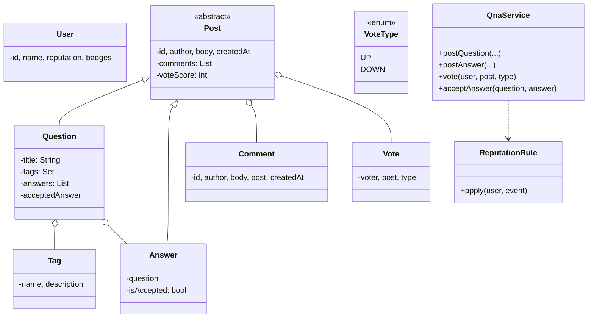
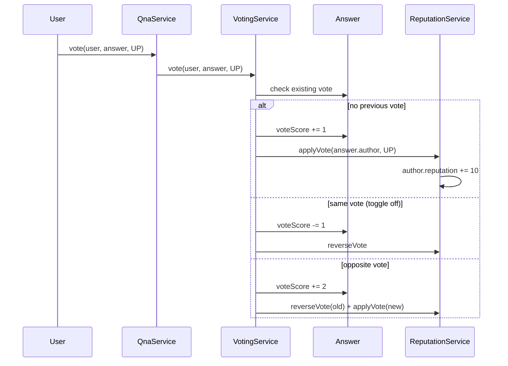

## Problem Statement

Design the LLD for a Q&A platform like Stack Overflow:
- Users ask questions and post answers
- Anyone can vote (up/down) on questions and answers
- Asker can mark one answer as accepted
- Comments on questions and answers
- Tags categorize questions
- Reputation rewards/punishes based on votes

---

## Requirements

### Functional
- Post a question (title, body, tags)
- Post an answer to a question
- Up/down vote questions and answers
- Comment on questions or answers
- Accept one answer (only the question's owner)
- Tag-based search and filtering
- Reputation accrues from votes

### Non-Functional
- One vote per user per post (toggle on second vote)
- Concurrent voting / answering
- Read-heavy: questions and answers fetched far more than posted

---

## Class Diagram



---

## Posts (Inheritance)

`Question` and `Answer` share most fields — author, body, votes, comments. Use a base class:

```java
public abstract class Post {
    public final String id;
    public final User author;
    public final String body;
    public final Instant createdAt;
    protected final List<Comment> comments = new CopyOnWriteArrayList<>();
    protected final Map<String, Vote> votesByUser = new ConcurrentHashMap<>();
    protected final AtomicInteger voteScore = new AtomicInteger();

    protected Post(User author, String body) {
        this.id = UUID.randomUUID().toString();
        this.author = author;
        this.body = body;
        this.createdAt = Instant.now();
    }

    public int score() { return voteScore.get(); }
    public List<Comment> comments() { return List.copyOf(comments); }

    public void addComment(Comment c) { comments.add(c); }
}

public class Question extends Post {
    public final String title;
    public final Set<Tag> tags;
    private final List<Answer> answers = new CopyOnWriteArrayList<>();
    private Answer acceptedAnswer;

    public Question(User author, String title, String body, Set<Tag> tags) {
        super(author, body);
        this.title = title;
        this.tags = Set.copyOf(tags);
    }

    public void addAnswer(Answer a) { answers.add(a); }

    public synchronized void acceptAnswer(Answer a, User actor) {
        if (!actor.equals(this.author))
            throw new IllegalStateException("only asker can accept");
        if (!answers.contains(a))
            throw new IllegalArgumentException("answer not on this question");
        if (this.acceptedAnswer != null) {
            this.acceptedAnswer.unaccept();
        }
        a.accept();
        this.acceptedAnswer = a;
    }
}

public class Answer extends Post {
    public final Question question;
    private boolean isAccepted = false;

    public Answer(User author, String body, Question q) {
        super(author, body);
        this.question = q;
    }

    void accept() { this.isAccepted = true; }
    void unaccept() { this.isAccepted = false; }
    public boolean isAccepted() { return isAccepted; }
}
```

---

## Voting (Idempotent + Toggle)

The interesting bit is: a user voting twice should **toggle**, not double-count.

```java
public enum VoteType { UP(1), DOWN(-1); public final int delta; VoteType(int d) { this.delta = d; } }

public class Vote {
    public final User voter;
    public final Post post;
    public final VoteType type;
    public final Instant at;

    public Vote(User v, Post p, VoteType t) {
        this.voter = v; this.post = p; this.type = t;
        this.at = Instant.now();
    }
}
```

```java
public class VotingService {
    private final ReputationService reputation;

    public synchronized void vote(User voter, Post post, VoteType type) {
        if (voter.equals(post.author))
            throw new IllegalStateException("can't vote on own post");

        Vote previous = post.votesByUser.get(voter.getId());

        if (previous != null && previous.type == type) {
            // Same vote again — toggle off
            post.voteScore.addAndGet(-type.delta);
            post.votesByUser.remove(voter.getId());
            reputation.reverseVote(post.author, type);
        } else if (previous != null) {
            // Switching direction — undo old, apply new
            post.voteScore.addAndGet(-previous.type.delta + type.delta);
            post.votesByUser.put(voter.getId(), new Vote(voter, post, type));
            reputation.reverseVote(post.author, previous.type);
            reputation.applyVote(post.author, type);
        } else {
            // First vote
            post.voteScore.addAndGet(type.delta);
            post.votesByUser.put(voter.getId(), new Vote(voter, post, type));
            reputation.applyVote(post.author, type);
        }
    }
}
```

The voting service is the single place that mutates `voteScore` and `votesByUser` — keeps the invariant that the score equals the sum of vote deltas.

---

## Reputation (Strategy)

```java
public class ReputationService {
    // Stack Overflow's actual rules
    private static final Map<String, Integer> RULES = Map.of(
        "QUESTION_UP", 5,
        "QUESTION_DOWN", -2,
        "ANSWER_UP", 10,
        "ANSWER_DOWN", -2,
        "ANSWER_ACCEPTED", 15,
        "ACCEPTED_BY_OWNER", 2);

    public void applyVote(User author, VoteType type) {
        int delta = type == VoteType.UP ? 10 : -2;
        author.adjustReputation(delta);
    }

    public void reverseVote(User author, VoteType type) {
        int delta = type == VoteType.UP ? -10 : 2;
        author.adjustReputation(delta);
    }

    public void onAccept(User asker, User answerer) {
        answerer.adjustReputation(15);
        asker.adjustReputation(2);
    }
}
```

---

## Tags (Inverted Index)

```java
public class TagIndex {
    private final Map<String, Set<Question>> byTag = new ConcurrentHashMap<>();

    public void index(Question q) {
        for (Tag t : q.tags) {
            byTag.computeIfAbsent(t.name(), k -> ConcurrentHashMap.newKeySet()).add(q);
        }
    }

    public Set<Question> findByTag(String tagName) {
        return Set.copyOf(byTag.getOrDefault(tagName, Set.of()));
    }

    public Set<Question> findByTags(Set<String> tags) {
        Set<Question> result = null;
        for (String tag : tags) {
            Set<Question> hits = findByTag(tag);
            result = (result == null) ? new HashSet<>(hits) : intersect(result, hits);
        }
        return result == null ? Set.of() : result;
    }
}
```

---

## QnaService (Facade)

```java
public class QnaService {
    private final TagIndex tags;
    private final VotingService voting;
    private final ReputationService reputation;
    private final QuestionRepo questions;

    public Question postQuestion(User author, String title, String body, Set<String> tagNames) {
        Set<Tag> tags = resolveTags(tagNames);
        Question q = new Question(author, title, body, tags);
        questions.save(q);
        tags.values().forEach(this.tags::index);
        return q;
    }

    public Answer postAnswer(User author, Question q, String body) {
        if (author.equals(q.author)) {
            // Allowed but not the typical flow
        }
        Answer a = new Answer(author, body, q);
        q.addAnswer(a);
        return a;
    }

    public void vote(User voter, Post post, VoteType type) {
        voting.vote(voter, post, type);
    }

    public void acceptAnswer(Question q, Answer a, User actor) {
        q.acceptAnswer(a, actor);
        reputation.onAccept(q.author, a.author);
    }

    public Comment postComment(User author, Post post, String body) {
        Comment c = new Comment(author, body, post);
        post.addComment(c);
        return c;
    }
}
```

---

## Sequence: Vote on Answer



---

## Edge Cases

| **Case** | **Handling** |
|---------|-------------|
| Vote on own post | Reject |
| Accept already-accepted answer | Unaccept previous, accept new |
| Post deleted with votes | Reverse reputation, remove votes |
| Comment on deleted post | Reject |
| User deletes account | Anonymize posts, keep them (per SO policy) |
| Tag rename | Update mapping; re-index questions |
| Bot voting | Rate limit per user; flag for review |

---

## Design Patterns Used

| **Pattern** | **Where** |
|------------|-----------|
| **Strategy** | Reputation rules (per event type) |
| **Facade** | `QnaService` |
| **Observer** | Notify question owner of new answers/comments |
| **Composite** | Posts contain comments (small composite) |
| **State** | Answer accepted / not |
| **Repository** | Persistence abstractions |

---

## Interview Tips

- Use **inheritance** for `Post` → `Question` / `Answer` — it's a natural is-a relationship.
- Voting logic must handle **toggle** and **switch** — interviewers test for this.
- Mention **reputation events** as a strategy or rules engine — easy to extend (e.g., add bounty bonus).
- For search, mention an **inverted index** on tags + full-text on title/body (Elasticsearch in production).
- Concurrency: per-post locking is sufficient; vote count uses `AtomicInteger` for non-blocking increments.
