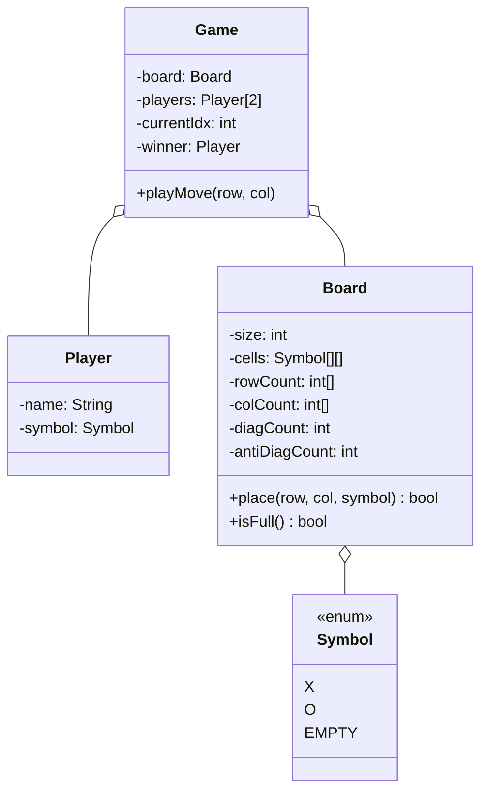
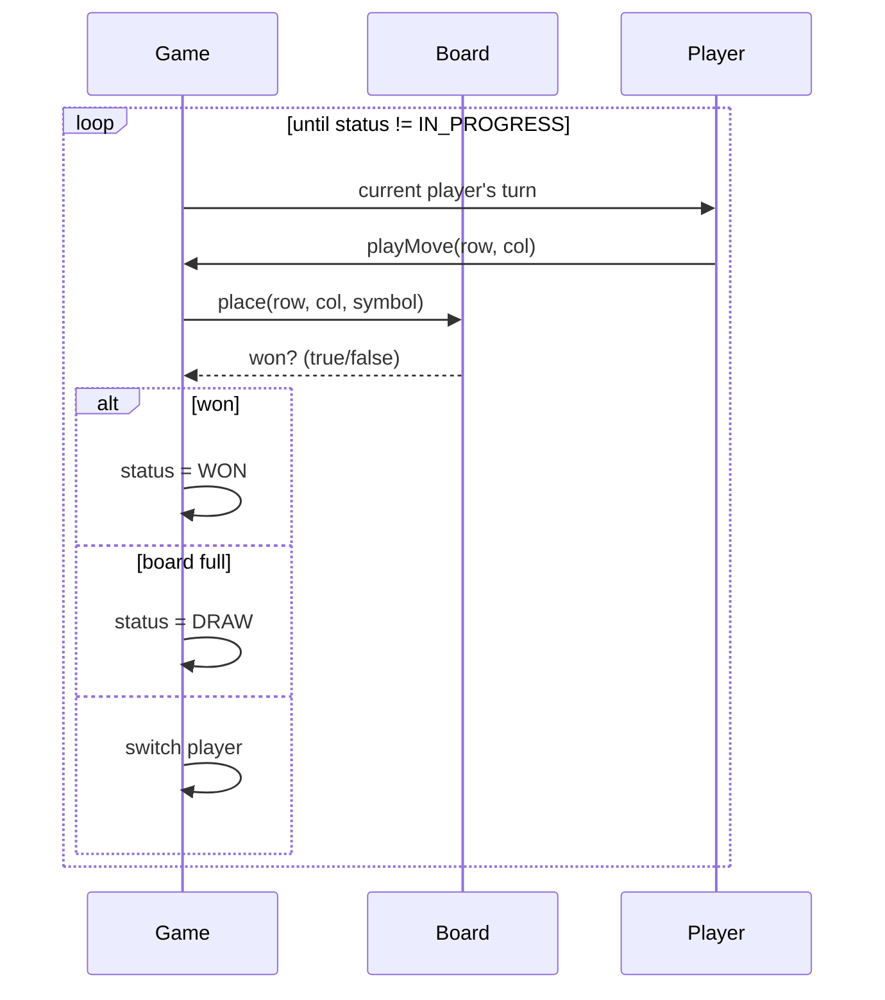

## Problem Statement

Design a 2-player tic-tac-toe game on an N×N board (default 3×3):
- Players alternate placing their symbol
- Win = N in a row (horizontal, vertical, or diagonal)
- Draw = board full, no winner
- Support replay / undo

---

## Requirements

### Functional
- N×N board (default 3×3, configurable)
- 2 players with distinct symbols
- Validate moves (cell must be empty, in bounds, on player's turn)
- Detect win condition after each move
- Detect draw

### Non-Functional
- Win check in O(N) per move (not O(N²))
- Extensible to N×N variants (e.g., Connect-Four–style needs gravity)

---

## Class Diagram



---

## Board with O(1) Win Check

The naive approach scans the whole board after every move — O(N²). A smarter implementation uses **counters per row, column, and diagonal**, updated incrementally for O(N) construction and O(1) per move.

```java
public class Board {
    private final int size;
    private final Symbol[][] cells;
    private final int[] rowSum;     // +1 for X, -1 for O
    private final int[] colSum;
    private int diagSum, antiDiagSum;

    public Board(int size) {
        this.size = size;
        this.cells = new Symbol[size][size];
        for (Symbol[] row : cells) Arrays.fill(row, Symbol.EMPTY);
        this.rowSum = new int[size];
        this.colSum = new int[size];
    }

    /** Returns true if this move wins. */
    public boolean place(int row, int col, Symbol sym) {
        if (row < 0 || row >= size || col < 0 || col >= size)
            throw new IndexOutOfBoundsException();
        if (cells[row][col] != Symbol.EMPTY)
            throw new IllegalStateException("Cell occupied");

        cells[row][col] = sym;

        int delta = (sym == Symbol.X) ? 1 : -1;
        rowSum[row] += delta;
        colSum[col] += delta;
        if (row == col) diagSum += delta;
        if (row + col == size - 1) antiDiagSum += delta;

        int target = sym == Symbol.X ? size : -size;
        return rowSum[row] == target
            || colSum[col] == target
            || diagSum == target
            || antiDiagSum == target;
    }

    public boolean isFull() {
        for (Symbol[] row : cells)
            for (Symbol s : row)
                if (s == Symbol.EMPTY) return false;
        return true;
    }

    public Symbol getCell(int r, int c) { return cells[r][c]; }
    public int getSize() { return size; }
}
```

The trick: each X adds +1, each O adds −1. A row of all X sums to +N. A row of all O sums to −N. Mixed rows can never reach ±N.

For N = 3, we check `±3`. For N = 5, we check `±5`.

---

## Game

```java
public enum GameStatus { IN_PROGRESS, WON, DRAW }

public class Game {
    private final Board board;
    private final Player[] players = new Player[2];
    private int currentIdx = 0;
    private Player winner;
    private GameStatus status = GameStatus.IN_PROGRESS;

    public Game(Player p1, Player p2, int boardSize) {
        if (p1.getSymbol() == p2.getSymbol())
            throw new IllegalArgumentException("Players must have different symbols");
        this.players[0] = p1;
        this.players[1] = p2;
        this.board = new Board(boardSize);
    }

    public void playMove(int row, int col) {
        if (status != GameStatus.IN_PROGRESS)
            throw new IllegalStateException("Game over: " + status);

        Player p = players[currentIdx];
        boolean won = board.place(row, col, p.getSymbol());

        if (won) {
            winner = p;
            status = GameStatus.WON;
        } else if (board.isFull()) {
            status = GameStatus.DRAW;
        } else {
            currentIdx = 1 - currentIdx;
        }
    }

    public GameStatus getStatus() { return status; }
    public Player getWinner() { return winner; }
}
```

---

## Sequence



---

## Variants & Extension Points

| **Variant** | **Change** |
|------------|-----------|
| Configurable board size | Pass `size` to constructor (already done) |
| Multi-player (3+) | Replace `Symbol` enum with arbitrary tokens; per-player counters |
| Connect-Four (with gravity) | `place(col)` finds lowest empty row in that column |
| Misère (loser-wins) | Same logic; flip `WON` to `LOST` |
| 3D tic-tac-toe (4×4×4) | Add a depth dimension; more diagonals |

---

## Edge Cases

| **Case** | **Handling** |
|---------|-------------|
| Move out of bounds | Throw |
| Cell already occupied | Throw |
| Move after game over | Throw |
| Same symbol for both players | Reject at construction |
| Board size < 3 | Reject (no win possible on 1×1, trivial on 2×2) |

---

## Design Patterns Used

| **Pattern** | **Where** |
|------------|-----------|
| **Strategy** | Win condition (could swap for Connect-Four etc.) |
| **State** | `GameStatus` enum |
| **Observer** | UI can subscribe to game events (move played, game over) |
| **Memento** | Snapshot board for undo |
| **Command** | Each move as a reversible command |

---

## Interview Tips

- Lead with the **counter-based win detection** — interviewers expect O(N²) and you give them O(1).
- Mention the X = +1, O = −1 trick — it's clean and memorable.
- Discuss extensibility: how would you support N×N? Connect-Four? Misère?
- Distinguish from chess: tic-tac-toe is shallow (small state, simple rules); chess is deep (many rules, more patterns needed).
