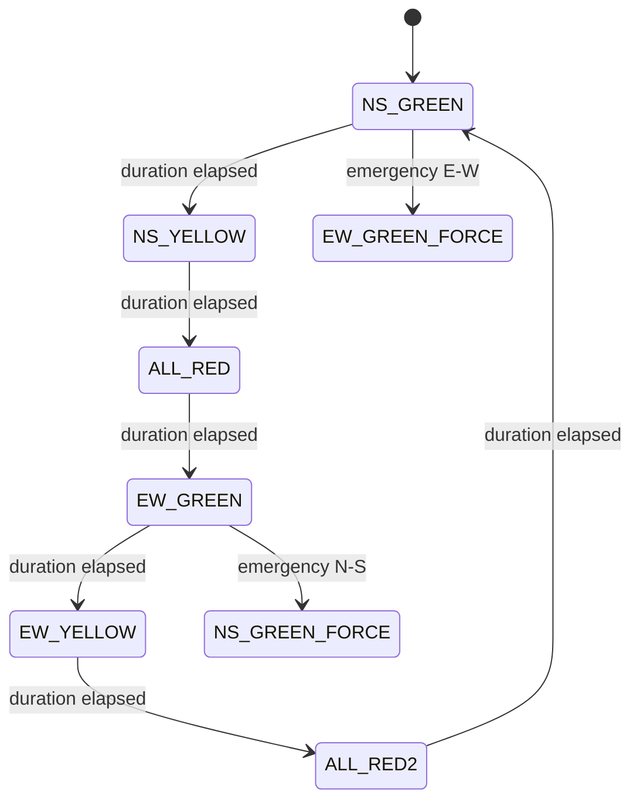
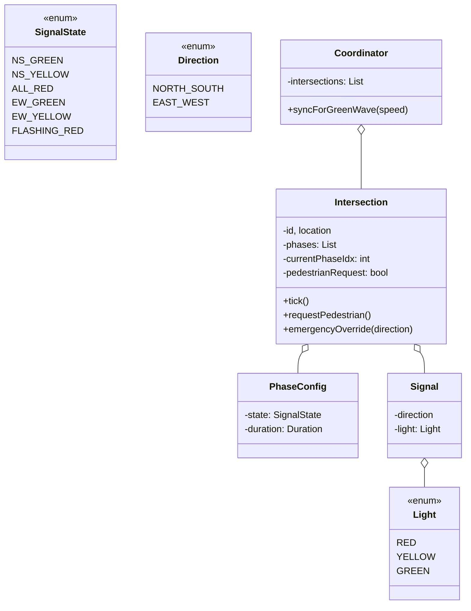
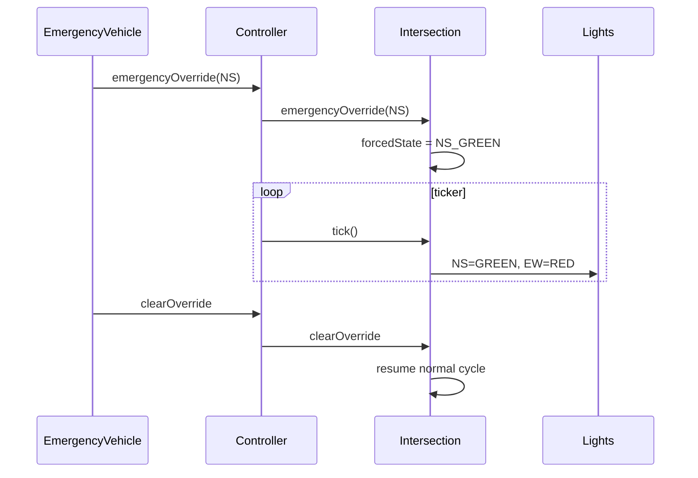

## Problem Statement

Design a traffic signal control system for an intersection:
- Cycles through phases (N-S green, all red, E-W green, ...)
- Configurable phase durations
- Pedestrian crossing requests
- Emergency vehicle override
- Multi-intersection coordination ("green wave")

---

## Requirements

### Functional
- Phases per intersection: `NS_GREEN`, `NS_YELLOW`, `EW_GREEN`, `EW_YELLOW`, all-red transition
- Configurable durations
- Pedestrian button
- Emergency override (turn target direction green immediately)
- Multi-intersection coordination

### Non-Functional
- Real-time predictable cycles
- Fail-safe: on controller failure, fall back to flashing red
- Auditable timing log

---

## State Machine (single intersection)

This is a textbook **State** pattern.



---

## Class Diagram



---

## Phase Configuration (Builder)

```java
public class PhaseConfig {
    public final SignalState state;
    public final Duration duration;

    public PhaseConfig(SignalState s, Duration d) {
        this.state = s; this.duration = d;
    }

    public static List<PhaseConfig> defaultCycle() {
        return List.of(
            new PhaseConfig(SignalState.NS_GREEN,  Duration.ofSeconds(30)),
            new PhaseConfig(SignalState.NS_YELLOW, Duration.ofSeconds(4)),
            new PhaseConfig(SignalState.ALL_RED,   Duration.ofSeconds(2)),
            new PhaseConfig(SignalState.EW_GREEN,  Duration.ofSeconds(30)),
            new PhaseConfig(SignalState.EW_YELLOW, Duration.ofSeconds(4)),
            new PhaseConfig(SignalState.ALL_RED,   Duration.ofSeconds(2))
        );
    }
}
```

---

## Intersection (Core Class)

```java
public class Intersection {
    private final String id;
    private final List<PhaseConfig> phases;
    private int currentPhaseIdx = 0;
    private Instant phaseStartedAt = Instant.now();

    private boolean pedestrianRequested = false;
    private SignalState forcedState = null;     // emergency override

    private final List<TimingEvent> auditLog = new CopyOnWriteArrayList<>();
    private final ReentrantLock lock = new ReentrantLock();

    public Intersection(String id, List<PhaseConfig> phases) {
        this.id = id;
        this.phases = List.copyOf(phases);
    }

    /** Called every second by the controller's ticker. */
    public void tick() {
        lock.lock();
        try {
            if (forcedState != null) {
                // Emergency: hold the forced state
                return;
            }

            PhaseConfig current = phases.get(currentPhaseIdx);
            Instant now = Instant.now();
            if (Duration.between(phaseStartedAt, now).compareTo(current.duration) >= 0) {
                advancePhase();
            }
        } finally {
            lock.unlock();
        }
    }

    private void advancePhase() {
        // If pedestrian requested and we're entering ALL_RED, extend it
        currentPhaseIdx = (currentPhaseIdx + 1) % phases.size();
        phaseStartedAt = Instant.now();

        PhaseConfig p = phases.get(currentPhaseIdx);
        auditLog.add(new TimingEvent(p.state, phaseStartedAt));

        if (p.state == SignalState.ALL_RED && pedestrianRequested) {
            // Extend by an extra few seconds — handled by adjusting effective duration
            pedestrianRequested = false;
            // (in real impl, swap in a longer ALL_RED variant)
        }
    }

    public void requestPedestrian() {
        lock.lock();
        try { pedestrianRequested = true; }
        finally { lock.unlock(); }
    }

    public void emergencyOverride(Direction dir) {
        lock.lock();
        try {
            forcedState = (dir == Direction.NORTH_SOUTH)
                ? SignalState.NS_GREEN
                : SignalState.EW_GREEN;
            auditLog.add(new TimingEvent(forcedState, Instant.now(), "EMERGENCY"));
        } finally { lock.unlock(); }
    }

    public void clearOverride() {
        lock.lock();
        try {
            forcedState = null;
            phaseStartedAt = Instant.now();
        } finally { lock.unlock(); }
    }

    public SignalState currentState() {
        lock.lock();
        try {
            if (forcedState != null) return forcedState;
            return phases.get(currentPhaseIdx).state;
        } finally { lock.unlock(); }
    }
}
```

---

## Signal Lights (Mapping State → Lights)

```java
public class IntersectionLights {
    public Map<Direction, Light> lightsFor(SignalState s) {
        return switch (s) {
            case NS_GREEN     -> Map.of(NS, GREEN, EW, RED);
            case NS_YELLOW    -> Map.of(NS, YELLOW, EW, RED);
            case ALL_RED      -> Map.of(NS, RED, EW, RED);
            case EW_GREEN     -> Map.of(NS, RED, EW, GREEN);
            case EW_YELLOW    -> Map.of(NS, RED, EW, YELLOW);
            case FLASHING_RED -> Map.of(NS, RED, EW, RED);
        };
    }
}
```

---

## Controller (Ticker)

```java
public class TrafficController {
    private final Intersection intersection;
    private final ScheduledExecutorService ticker = Executors.newSingleThreadScheduledExecutor();

    public TrafficController(Intersection intersection) {
        this.intersection = intersection;
    }

    public void start() {
        ticker.scheduleAtFixedRate(intersection::tick, 0, 1, TimeUnit.SECONDS);
    }

    public void stop() {
        ticker.shutdown();
    }
}
```

A 1-second tick is the controller's heartbeat. State transitions happen on tick.

---

## Multi-Intersection Coordination ("Green Wave")

```java
public class IntersectionCoordinator {
    private final List<Intersection> intersections;
    // Distance between consecutive intersections
    private final List<Duration> travelTimes;

    public IntersectionCoordinator(List<Intersection> intersections, List<Duration> travelTimes) {
        if (travelTimes.size() != intersections.size() - 1) throw new IllegalArgumentException();
        this.intersections = intersections;
        this.travelTimes = travelTimes;
    }

    /** Stagger NS_GREEN starts so a car at speed limit hits all greens. */
    public void scheduleGreenWave() {
        Instant now = Instant.now();
        for (int i = 0; i < intersections.size(); i++) {
            Duration cumulative = Duration.ZERO;
            for (int j = 0; j < i; j++) cumulative = cumulative.plus(travelTimes.get(j));
            // Configure intersection to start NS_GREEN at now + cumulative
            // (omitted: requires intersection to expose a "scheduledStart" field)
        }
    }
}
```

---

## Sequence: Emergency Vehicle



---

## Edge Cases

| **Case** | **Handling** |
|---------|-------------|
| Controller fails | Hardware fallback to FLASHING_RED |
| Pedestrian button held | Debounce; one request per cycle |
| Emergency in opposite direction during transition | Forced state interrupts current phase |
| Power outage | Battery backup; flash red on resume |
| Phase duration 0 | Validate at config time |
| Concurrent emergency + pedestrian | Emergency wins |

---

## Design Patterns Used

| **Pattern** | **Where** |
|------------|-----------|
| **State** | `SignalState` machine |
| **Strategy** | Phase timings (default / rush-hour / off-peak) |
| **Observer** | Lights subscribe to state changes |
| **Command** | Emergency override as command |
| **Mediator** | Coordinator orchestrates multiple intersections |
| **Singleton** | One controller per intersection |

---

## Interview Tips

- The state machine is the spine — sketch it first.
- Don't forget the **all-red transition** between green-yellow and the next green — it's a real safety requirement, not a bug.
- Bring up **emergency override** and **pedestrian request** — they're the "edge" interviewers expect.
- For multi-intersection, mention green-wave timing: stagger starts by `distance / speed`.
- Mention fail-safe behavior (flashing red on power loss) — shows real-world awareness.
