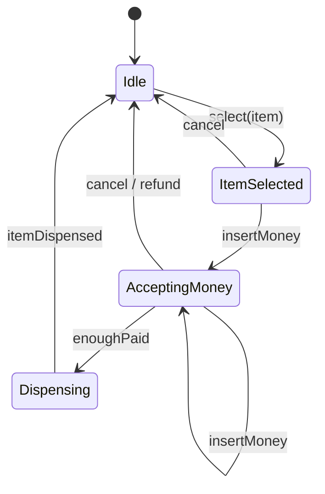
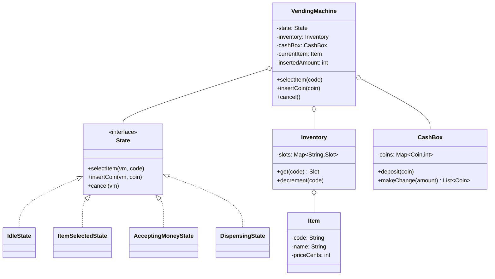

## Problem Statement

Design a vending machine that:
- Holds inventory of products at fixed slots
- Accepts coins and bills
- Dispenses the selected product if paid enough
- Returns change in optimal denominations
- Supports refunds and out-of-stock handling

---

## Requirements

### Functional
- Display items with prices
- User selects an item
- User inserts money
- Machine dispenses item + change
- Cancel transaction (refund)
- Restock by operator

### Non-Functional
- Single-threaded (one user at a time on the physical machine)
- Atomic transaction (all or nothing)
- Auditability (log every transaction)

---

## State Machine

The whole problem is a state machine — perfect fit for the **State** pattern.



---

## Class Diagram



---

## Domain Classes

```java
public enum Coin {
    PENNY(1), NICKEL(5), DIME(10), QUARTER(25),
    DOLLAR(100), FIVE(500);

    public final int cents;
    Coin(int c) { this.cents = c; }
}

public class Item {
    public final String code;
    public final String name;
    public final int priceCents;

    public Item(String code, String name, int priceCents) {
        this.code = code; this.name = name; this.priceCents = priceCents;
    }
}

public class Slot {
    public final Item item;
    private int count;

    public Slot(Item item, int count) { this.item = item; this.count = count; }
    public boolean isAvailable() { return count > 0; }
    public void decrement() { count--; }
}
```

---

## Inventory

```java
public class Inventory {
    private final Map<String, Slot> slots = new HashMap<>();

    public void addSlot(String code, Item item, int count) {
        slots.put(code, new Slot(item, count));
    }

    public Slot get(String code) {
        Slot s = slots.get(code);
        if (s == null) throw new InvalidSelectionException(code);
        return s;
    }
}
```

---

## CashBox with Change-Making

```java
public class CashBox {
    private final TreeMap<Integer, Integer> coinCounts = new TreeMap<>(Comparator.reverseOrder());

    public CashBox() {
        for (Coin c : Coin.values()) coinCounts.put(c.cents, 0);
    }

    public void deposit(Coin c) {
        coinCounts.merge(c.cents, 1, Integer::sum);
    }

    /** Greedy change-making (works for standard US coins). */
    public List<Coin> makeChange(int amount) {
        List<Coin> change = new ArrayList<>();
        for (Map.Entry<Integer, Integer> e : coinCounts.entrySet()) {
            int denom = e.getKey();
            int avail = e.getValue();
            int needed = Math.min(amount / denom, avail);
            for (int i = 0; i < needed; i++) {
                change.add(coinFor(denom));
                amount -= denom;
            }
            coinCounts.put(denom, avail - needed);
        }
        if (amount != 0) throw new InsufficientChangeException();
        return change;
    }

    private Coin coinFor(int cents) {
        for (Coin c : Coin.values()) if (c.cents == cents) return c;
        throw new IllegalStateException();
    }
}
```

> **Note:** Greedy works for US/EU coin sets. For arbitrary denominations, use dynamic programming (see [coin change DP problem](https://en.wikipedia.org/wiki/Change-making_problem)).

---

## State Pattern Implementation

```java
public interface VmState {
    void selectItem(VendingMachine vm, String code);
    void insertCoin(VendingMachine vm, Coin c);
    void cancel(VendingMachine vm);
}

public class IdleState implements VmState {
    public void selectItem(VendingMachine vm, String code) {
        Slot s = vm.inventory.get(code);
        if (!s.isAvailable()) throw new OutOfStockException(code);
        vm.currentItem = s.item;
        vm.setState(new ItemSelectedState());
    }
    public void insertCoin(VendingMachine vm, Coin c) {
        // Allow inserting coins before selection — bank them
        vm.cashBox.deposit(c);
        vm.insertedAmount += c.cents;
    }
    public void cancel(VendingMachine vm) {
        vm.refund();
    }
}

public class ItemSelectedState implements VmState {
    public void selectItem(VendingMachine vm, String code) {
        // Allow re-selecting before paying
        Slot s = vm.inventory.get(code);
        if (!s.isAvailable()) throw new OutOfStockException(code);
        vm.currentItem = s.item;
    }
    public void insertCoin(VendingMachine vm, Coin c) {
        vm.cashBox.deposit(c);
        vm.insertedAmount += c.cents;
        if (vm.insertedAmount >= vm.currentItem.priceCents) {
            vm.setState(new DispensingState());
            vm.dispense();
        }
    }
    public void cancel(VendingMachine vm) { vm.refund(); }
}

public class DispensingState implements VmState {
    public void selectItem(VendingMachine vm, String code) {
        throw new IllegalStateException("Currently dispensing");
    }
    public void insertCoin(VendingMachine vm, Coin c) {
        vm.cashBox.deposit(c);   // keep change banked
        vm.insertedAmount += c.cents;
    }
    public void cancel(VendingMachine vm) {
        throw new IllegalStateException("Cannot cancel during dispense");
    }
}
```

---

## VendingMachine

```java
public class VendingMachine {
    final Inventory inventory;
    final CashBox cashBox;
    private VmState state = new IdleState();
    Item currentItem;
    int insertedAmount = 0;

    public VendingMachine(Inventory inv, CashBox box) {
        this.inventory = inv; this.cashBox = box;
    }

    public void selectItem(String code) { state.selectItem(this, code); }
    public void insertCoin(Coin c)      { state.insertCoin(this, c); }
    public void cancel()                { state.cancel(this); }

    void setState(VmState s) { this.state = s; }

    void dispense() {
        Slot s = inventory.get(currentItem.code);
        s.decrement();
        int change = insertedAmount - currentItem.priceCents;
        List<Coin> changeCoins = cashBox.makeChange(change);
        emit(new TransactionLog(currentItem, insertedAmount, changeCoins));
        reset();
    }

    void refund() {
        List<Coin> refund = cashBox.makeChange(insertedAmount);
        reset();
    }

    private void reset() {
        currentItem = null;
        insertedAmount = 0;
        setState(new IdleState());
    }

    private void emit(TransactionLog log) { /* persist for audit */ }
}
```

---

## Edge Cases

| **Case** | **Handling** |
|---------|-------------|
| Out of stock | Reject selection; let user pick another |
| Insufficient change in cashbox | Refuse purchase, refund |
| User inserts foreign coin | Reject, return |
| Power loss mid-dispense | Persist state to durable storage; resume |
| Concurrent selections | Hardware: single user at a time |
| Restock during transaction | Operator mode is a separate state |

---

## Design Patterns Used

| **Pattern** | **Usage** |
|------------|-----------|
| **[State](/lld/patterns/behavioral/state)** | Idle / ItemSelected / Dispensing transitions |
| **[Strategy](/lld/patterns/behavioral/strategy)** | Change-making algorithm (greedy vs DP) |
| **[Singleton](/lld/patterns/creational/singleton)** | `VendingMachine` per physical unit |
| **[Command](/lld/patterns/behavioral/command)** | Each user action as a command (for replay/audit) |
| **[Observer](/lld/patterns/behavioral/observer)** | Display board updates from machine events |

---

## Interview Tips

- Identify the state machine immediately — that's the core insight.
- Discuss the change-making algorithm: greedy is fine for normal coins; mention DP for arbitrary denominations.
- Talk about durability — what happens on power failure mid-dispense? Persist transaction log.
- Mention audit log: vending operators reconcile cash vs sales daily.
