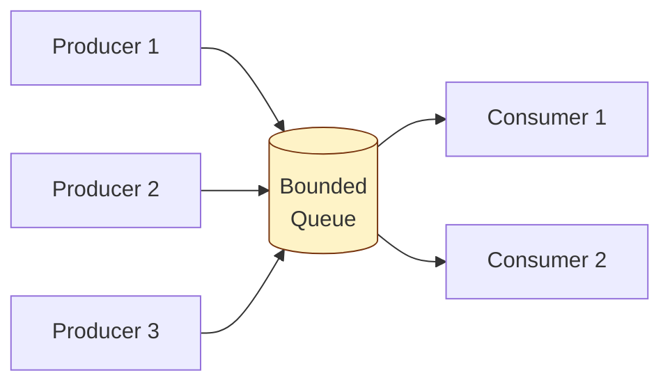

## Intent

> Producers create work items at one rate. Consumers process them at another. A shared **bounded queue** absorbs the rate mismatch and decouples the two sides.

Use when:
- Work generation and processing happen on different threads.
- Speeds don't match — need backpressure.
- You want producers and consumers to scale independently.

---

## Structure



---

## The Three Concerns

| **Concern** | **What it does** |
|------------|------------------|
| **Mutual exclusion** | Only one thread mutates the queue at a time |
| **Block when empty** | Consumer waits if no items |
| **Block when full** | Producer waits if queue is at capacity (backpressure) |

Doing this manually with `synchronized` + `wait/notify` is error-prone. **Use `BlockingQueue`.**

---

## Java Implementation

```java
import java.util.concurrent.*;

public class WorkSystem {
    private final BlockingQueue<Task> queue = new LinkedBlockingQueue<>(1000);

    // Producer
    void submit(Task t) throws InterruptedException {
        queue.put(t);    // blocks if full
    }

    // Consumer
    Task take() throws InterruptedException {
        return queue.take();   // blocks if empty
    }
}

// Producer thread
new Thread(() -> {
    while (running) {
        Task t = generateTask();
        try { system.submit(t); } catch (InterruptedException e) { Thread.currentThread().interrupt(); break; }
    }
}).start();

// Consumer thread
new Thread(() -> {
    while (running) {
        try {
            Task t = system.take();
            process(t);
        } catch (InterruptedException e) { Thread.currentThread().interrupt(); break; }
    }
}).start();
```

That's it. `BlockingQueue` handles all three concerns.

---

## BlockingQueue Variants

| **Implementation** | **Bounded?** | **Best for** |
|-------------------|--------------|-------------|
| `ArrayBlockingQueue` | Yes (fixed) | Predictable bounds, fast |
| `LinkedBlockingQueue` | Optional | Most general purpose |
| `SynchronousQueue` | Capacity 0 | Direct hand-off (no buffering) |
| `PriorityBlockingQueue` | Unbounded | Items with priority |
| `DelayQueue` | Unbounded | Items become available after a delay |
| `LinkedTransferQueue` | Unbounded | High-throughput, low-latency |

---

## Manual Implementation (for the interviewer who insists)

```java
public class BoundedBuffer<T> {
    private final Object[] buf;
    private int head = 0, tail = 0, count = 0;
    private final Object lock = new Object();

    public BoundedBuffer(int capacity) { buf = new Object[capacity]; }

    public void put(T item) throws InterruptedException {
        synchronized (lock) {
            while (count == buf.length) lock.wait();   // wait if full
            buf[tail] = item;
            tail = (tail + 1) % buf.length;
            count++;
            lock.notifyAll();   // wake any consumers
        }
    }

    @SuppressWarnings("unchecked")
    public T take() throws InterruptedException {
        synchronized (lock) {
            while (count == 0) lock.wait();   // wait if empty
            T item = (T) buf[head];
            buf[head] = null;
            head = (head + 1) % buf.length;
            count--;
            lock.notifyAll();
            return item;
        }
    }
}
```

### Why `while`, not `if`?

```java
while (count == 0) lock.wait();
```

`wait()` can return spuriously (without `notify`). Re-check the condition. **Always wait in a loop.**

### Why `notifyAll`, not `notify`?

If you only call `notify`, you might wake a producer when only consumers care, or vice versa. `notifyAll` is safe but slightly slower. Use separate `Condition`s for surgical wakeups:

```java
private final ReentrantLock lock = new ReentrantLock();
private final Condition notFull = lock.newCondition();
private final Condition notEmpty = lock.newCondition();

void put(T item) throws InterruptedException {
    lock.lock();
    try {
        while (count == buf.length) notFull.await();
        // ... add to buffer
        notEmpty.signal();   // wake one consumer specifically
    } finally { lock.unlock(); }
}
```

---

## Multiple Producers / Consumers

`BlockingQueue` handles this natively — internal locks make it safe under any number of producers and consumers.

```java
// Multiple producers
for (int i = 0; i < 4; i++) executor.submit(new Producer(queue));

// Multiple consumers
for (int i = 0; i < 8; i++) executor.submit(new Consumer(queue));
```

Common ratio: more consumers than producers when processing is the bottleneck.

---

## Graceful Shutdown

Two common idioms:

### 1. Poison pill

Producer puts a sentinel item; consumer checks for it:

```java
private static final Task SHUTDOWN = new Task();   // sentinel

// Shutdown
queue.put(SHUTDOWN);

// In consumer
while (true) {
    Task t = queue.take();
    if (t == SHUTDOWN) {
        queue.put(SHUTDOWN);   // pass it on for other consumers
        break;
    }
    process(t);
}
```

### 2. Interrupt + drain

```java
// Shutdown
executor.shutdownNow();   // interrupts threads
// Each consumer's catch (InterruptedException) breaks the loop
```

---

## When to Reach for ExecutorService Instead

If you'd write this:

```java
BlockingQueue<Runnable> q = new ArrayBlockingQueue<>(100);
// + 4 worker threads pulling from q
```

You should write this:

```java
ExecutorService exec = new ThreadPoolExecutor(4, 4, 0, TimeUnit.MILLISECONDS,
    new ArrayBlockingQueue<>(100));
exec.submit(task);
```

`ExecutorService` *is* producer-consumer with a thread pool of consumers. Don't reinvent it.

---

## Real-world Examples

| **Use case** | **Producer / Consumer** |
|-------------|------------------------|
| Web server | HTTP threads / worker pool |
| Logging | Application code / async log writer |
| Image upload | Receiver / thumbnail generator |
| Message queues (in-process) | Module A / Module B |
| Build systems | File watchers / compilers |

---

## Trade-offs

✅ **Pros:**
- Decouples production from consumption
- Backpressure through bounded queue
- Producers and consumers scale independently

❌ **Cons:**
- Latency: items wait in queue
- Memory: queue holds in-flight items (bounded helps)
- Shutdown complexity: need to drain or signal

---

## Interview Tips

- Default to `BlockingQueue` — don't write `wait/notify` from scratch unless asked.
- Mention bounded vs unbounded — unbounded queues hide leaks.
- Bring up backpressure: a full bounded queue blocks producers, naturally regulating throughput.
- Mention `ExecutorService` as the "real-world" producer-consumer.
