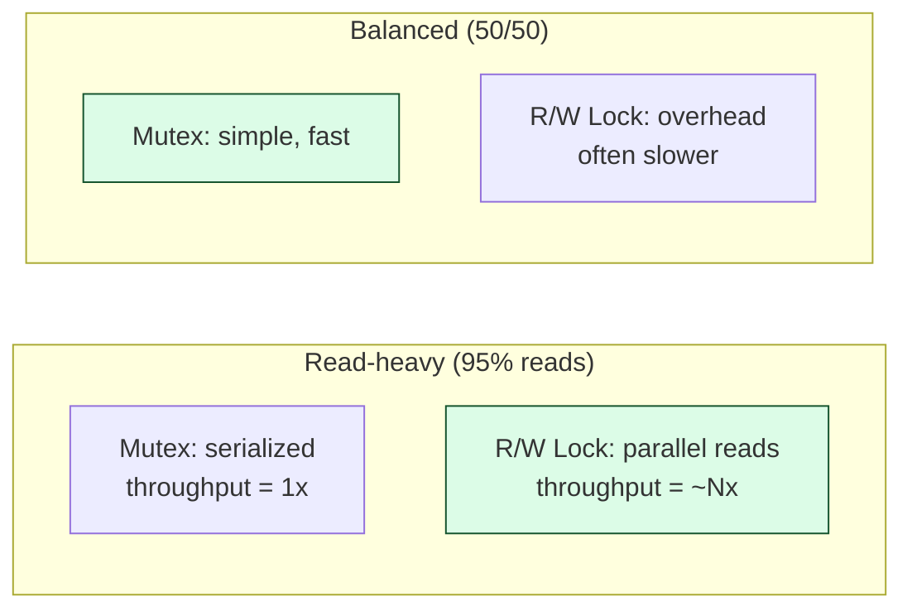

## Intent

> When reads vastly outnumber writes, a plain mutex is wasteful — readers don't conflict with each other. A **read-write lock** lets multiple readers proceed in parallel while ensuring writes are exclusive.

Use when:
- The workload is read-heavy (caches, configuration, metadata).
- Reads don't modify state.
- Writes must see consistent state.

---

## Semantics

| **Acquired** | **Other readers can acquire?** | **Other writers can acquire?** |
|-------------|-------------------------------|------------------------------|
| Read lock | ✅ yes | ❌ no |
| Write lock | ❌ no | ❌ no |
| Nothing | ✅ yes | ✅ yes |

In short: **N readers OR 1 writer**.

---

## Java's `ReentrantReadWriteLock`

```java
import java.util.concurrent.locks.ReentrantReadWriteLock;
import java.util.concurrent.locks.Lock;

public class Cache<K, V> {
    private final Map<K, V> data = new HashMap<>();
    private final ReentrantReadWriteLock rw = new ReentrantReadWriteLock();
    private final Lock readLock = rw.readLock();
    private final Lock writeLock = rw.writeLock();

    public V get(K key) {
        readLock.lock();
        try {
            return data.get(key);
        } finally {
            readLock.unlock();
        }
    }

    public void put(K key, V value) {
        writeLock.lock();
        try {
            data.put(key, value);
        } finally {
            writeLock.unlock();
        }
    }

    public void clear() {
        writeLock.lock();
        try {
            data.clear();
        } finally {
            writeLock.unlock();
        }
    }
}
```

Multiple threads can `get()` simultaneously. `put()` and `clear()` block all readers and other writers until they're done.

---

## When R/W Locks Pay Off



R/W locks have higher overhead than plain mutex. They only win when reads dominate (>80%).

---

## Fair vs Non-fair Mode

```java
new ReentrantReadWriteLock(true);   // fair — FIFO ordering
new ReentrantReadWriteLock(false);  // unfair — better throughput, default
```

| **Mode** | **Behavior** |
|---------|--------------|
| **Fair** | Threads queue in arrival order. Prevents starvation but slower. |
| **Non-fair** | Whoever wins the race gets the lock. Faster but readers can starve writers. |

In non-fair mode, an unbroken stream of readers can prevent writers from ever acquiring the lock. The Java implementation has heuristics to avoid this in most cases, but it's a real risk.

---

## Lock Downgrading (read after write)

```java
// LEGAL: write -> read
writeLock.lock();
try {
    update();
    readLock.lock();    // acquire read while still holding write
} finally {
    writeLock.unlock();    // releases write, you still hold read
}
try {
    return readData();
} finally {
    readLock.unlock();
}
```

Useful when you want to do a write-then-read while preventing another writer from sneaking in.

---

## Lock Upgrading (read to write) — NOT Allowed

```java
readLock.lock();
// ... want to write now
writeLock.lock();   // DEADLOCK: read lock blocks the write lock
```

Two readers both trying to upgrade deadlock — each holds a read, each waits for a write. Java's `ReentrantReadWriteLock` does **not** support upgrading. Workaround:

```java
readLock.lock();
boolean needWrite;
try {
    needWrite = checkSomething();
} finally {
    readLock.unlock();
}

if (needWrite) {
    writeLock.lock();
    try {
        // re-check; another thread might have done it
        if (checkSomething()) update();
    } finally {
        writeLock.unlock();
    }
}
```

Pattern: read → unlock read → acquire write → re-validate → write.

---

## `StampedLock` — Newer, Faster

Java 8 introduced `StampedLock` with three modes: read, write, and **optimistic read**:

```java
StampedLock lock = new StampedLock();

// Optimistic read — no actual locking, just a version stamp
long stamp = lock.tryOptimisticRead();
double currentX = x, currentY = y;

if (!lock.validate(stamp)) {       // someone wrote in the meantime?
    stamp = lock.readLock();        // fall back to real read lock
    try {
        currentX = x;
        currentY = y;
    } finally {
        lock.unlockRead(stamp);
    }
}
```

Optimistic reads are **lock-free** when there are no concurrent writes. Massive speedup for read-mostly hot paths.

| | **ReentrantReadWriteLock** | **StampedLock** |
|---|---------------------------|-----------------|
| Optimistic read | No | Yes |
| Reentrancy | Yes | No |
| Conditions | Yes | No |
| Performance | Good | Better |

`StampedLock` is faster but trickier. Use `ReentrantReadWriteLock` unless profiling says otherwise.

---

## Real-world Examples

| **Use case** | **Why R/W lock** |
|-------------|------------------|
| In-memory cache | Reads dominant; rare invalidation |
| Configuration registry | Reads frequent; updates infrequent |
| Routing table | Lookups frequent; topology changes rare |
| Game world state | Many readers (rendering); one writer (sim tick) |
| Symbol table in compiler | Many lookups; few additions |

---

## When to *Not* Use R/W Lock

- **Reads are short and fast.** The R/W lock overhead may exceed the work.
- **Writes are frequent.** R/W lock degenerates to a slower mutex.
- **You can use immutable snapshots.** `volatile` reference + atomic swap is often faster:

```java
private volatile Map<K,V> map = Map.of();

V get(K key) { return map.get(key); }    // lock-free read

synchronized void put(K key, V value) {
    Map<K,V> updated = new HashMap<>(map);
    updated.put(key, value);
    this.map = Map.copyOf(updated);       // single atomic publish
}
```

This is **copy-on-write**. Reads are completely lock-free. Writes pay the cost of copying.

---

## Trade-offs

✅ **Pros:**
- Parallel reads
- Better throughput for read-heavy workloads

❌ **Cons:**
- Higher overhead than plain mutex
- Writer starvation in non-fair mode
- No upgrade path; downgrade only
- More complex than alternatives

---

## Interview Tips

- Mention R/W lock when the interviewer says **"read-heavy"** or **"95% reads, 5% writes"**.
- Discuss starvation and fair mode — interviewers test for awareness.
- Mention `StampedLock` and copy-on-write as faster alternatives when applicable.
