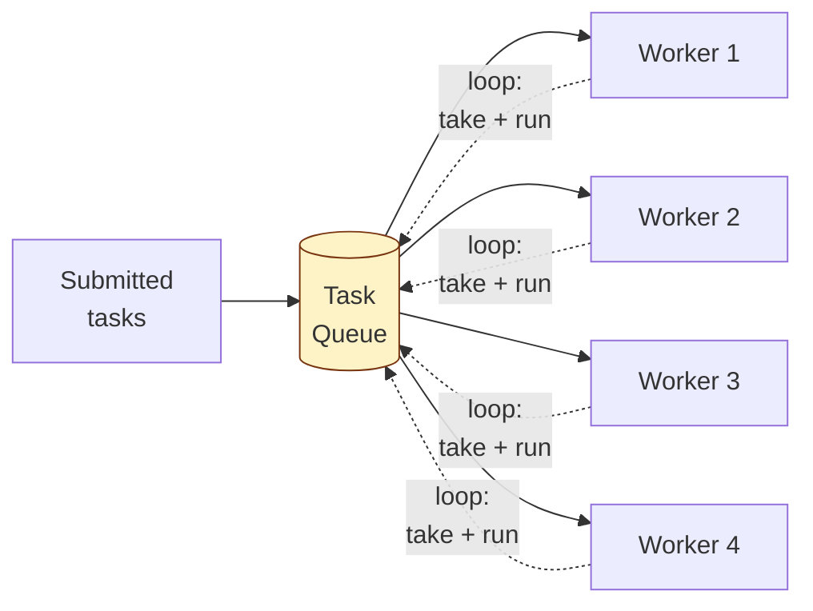
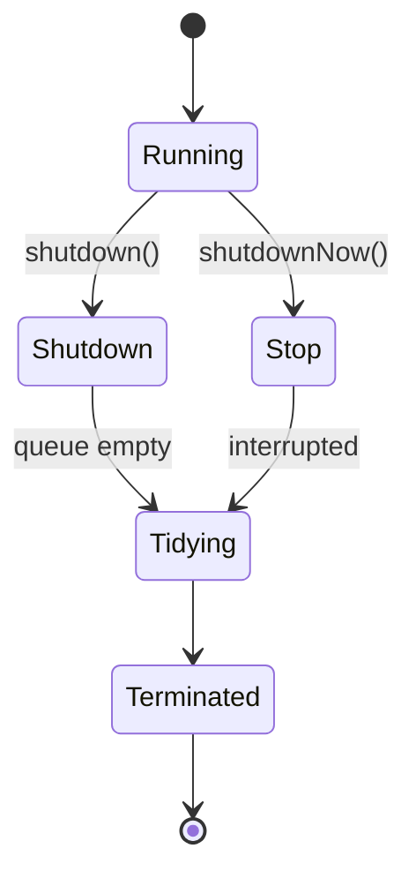

## Why Pool?

Creating a new thread per task is expensive:
- ~100µs per thread on Linux
- ~1MB stack per thread
- Context-switch overhead grows with thread count

**Thread pool**: spawn a fixed set of threads up front, hand them tasks from a queue.

---

## Structure



A worker is a thread running:

```java
while (!shutdown) {
    Runnable task = queue.take();
    task.run();
}
```

---

## Java's `ExecutorService`

Don't write your own pool — use `Executors`:

```java
ExecutorService exec = Executors.newFixedThreadPool(8);

exec.submit(() -> doWork(item1));
exec.submit(() -> doWork(item2));

Future<Integer> result = exec.submit(() -> compute(x));
int answer = result.get();   // blocks until done

exec.shutdown();
```

---

## Pool Types in `Executors`

| **Factory** | **Thread count** | **Queue** | **Best for** |
|------------|-----------------|-----------|-------------|
| `newFixedThreadPool(n)` | n always | unbounded `LinkedBlockingQueue` | Steady CPU-bound work |
| `newCachedThreadPool()` | 0 to MAX_VALUE | `SynchronousQueue` (no buffering) | Bursty, short-lived tasks |
| `newSingleThreadExecutor()` | 1 | unbounded | Sequential execution |
| `newScheduledThreadPool(n)` | n | delayed | Cron-like scheduled tasks |
| `newWorkStealingPool()` | parallelism | per-thread deques | CPU-bound divide-and-conquer |

**Caution:** `newCachedThreadPool` is unbounded — under load it can spawn unlimited threads and OOM. `newFixedThreadPool` has an unbounded queue — slow consumer = unbounded memory growth.

For production, configure `ThreadPoolExecutor` directly:

```java
ThreadPoolExecutor pool = new ThreadPoolExecutor(
    8,                                       // core threads
    16,                                      // max threads
    60, TimeUnit.SECONDS,                    // keep-alive for extra threads
    new ArrayBlockingQueue<>(1000),          // BOUNDED queue
    new ThreadFactoryBuilder().setNameFormat("worker-%d").build(),
    new ThreadPoolExecutor.CallerRunsPolicy()  // backpressure
);
```

---

## Sizing the Pool

### CPU-bound tasks

```
threads ≈ number of cores
```

More threads than cores just creates context-switch overhead.

### I/O-bound tasks

```
threads ≈ cores × (1 + wait_time / cpu_time)
```

If each task waits 90% of the time on I/O, you can have ~10× cores worth of threads. The threads will mostly be sleeping anyway.

### Mixed

Profile. Start with `cores × 2` and tune.

---

## Submission Modes

```java
// Fire and forget
exec.execute(runnable);

// Get a Future for later
Future<Integer> f = exec.submit(callable);

// Get a CompletableFuture (richer API)
CompletableFuture<Integer> cf = CompletableFuture.supplyAsync(() -> compute(), exec);

// Wait for all
List<Future<Result>> futures = exec.invokeAll(tasks);

// First to complete wins
Result first = exec.invokeAny(tasks);
```

---

## Rejection Policies

When the queue is full and the pool is at max threads, what happens to the next `submit()`?

| **Policy** | **Behavior** |
|-----------|--------------|
| `AbortPolicy` (default) | Throws `RejectedExecutionException` |
| `CallerRunsPolicy` | Runs the task on the calling thread (natural backpressure) |
| `DiscardPolicy` | Silently drops the task |
| `DiscardOldestPolicy` | Drops oldest queued task, accepts new |

`CallerRunsPolicy` is often best for production: producers slow down naturally when the pool is saturated.

---

## Lifecycle



```java
exec.shutdown();    // no new tasks, finish queued ones
exec.shutdownNow(); // interrupt running tasks, drop queued
exec.awaitTermination(30, TimeUnit.SECONDS);
```

Always shut down pools on app exit — non-daemon threads keep the JVM alive.

---

## Common Pitfalls

### 1. Unbounded queue

```java
// DANGEROUS — slow consumers cause OOM
new ThreadPoolExecutor(2, 2, 0, MS, new LinkedBlockingQueue<>());
```

Always bound the queue. Add explicit backpressure (rejection policy).

### 2. Tasks that block on each other

If task A waits for task B's result, and B is queued behind A in the same pool, you deadlock.

**Fix:** separate pools for tasks at different "levels", or use `CompletableFuture` chaining instead of blocking.

### 3. Uncaught exceptions

```java
exec.submit(() -> { throw new RuntimeException(); });
// Exception is caught and stored in the Future — silently swallowed if no one calls future.get()
```

Always either call `future.get()` or wrap submitted tasks:

```java
exec.submit(() -> {
    try { doWork(); }
    catch (Throwable t) { log.error("task failed", t); }
});
```

### 4. ThreadLocal leaks

`ThreadLocal` values stick to threads. With pooled threads, they outlive the task. Always `remove()`:

```java
try {
    threadLocal.set(value);
    doWork();
} finally {
    threadLocal.remove();
}
```

---

## Fork/Join Pool

For divide-and-conquer parallel work, `ForkJoinPool` is specialized:

```java
ForkJoinPool pool = ForkJoinPool.commonPool();
pool.invoke(new RecursiveTask<>() {
    protected Integer compute() {
        if (small enough) return base case;
        var left = new SubTask(leftHalf).fork();
        var right = new SubTask(rightHalf).compute();
        return left.join() + right;
    }
});
```

Used internally by `parallelStream()`.

---

## Virtual Threads (Java 21+)

Project Loom introduces lightweight threads — millions per JVM:

```java
ExecutorService exec = Executors.newVirtualThreadPerTaskExecutor();
```

Each task gets its own (cheap) virtual thread. **No need to size the pool.** Best for I/O-bound work; CPU-bound still benefits from a normal fixed pool.

---

## Real-world Examples

| **Use case** | **Pool** |
|-------------|----------|
| Web server request handling | Fixed pool (Tomcat, Jetty) |
| HTTP client connection pool | Async I/O + thread pool |
| Background jobs | Scheduled pool |
| Image processing pipeline | Fixed pool, CPU-bound sized |
| Database query execution | Per-connection or per-pool thread |

---

## Trade-offs

✅ **Pros:**
- Eliminates per-task thread creation cost
- Bounds resource use
- Centralizes lifecycle and exception handling

❌ **Cons:**
- Pool sizing is workload-dependent
- Wrong defaults cause OOM or starvation
- Tasks blocking on each other → deadlock
- ThreadLocal leaks across tasks

---

## Interview Tips

- Reach for thread pool whenever the interviewer mentions "many tasks" or "background work."
- Always size with the CPU vs I/O reasoning.
- Mention bounded queue + rejection policy — shows production awareness.
- For Java 21+, mention virtual threads as the modern direction.
