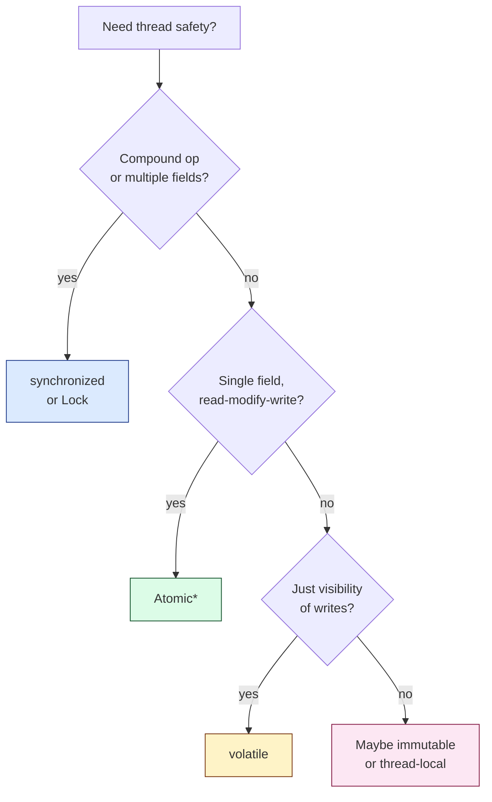

## What "Thread Safe" Means

A class is **thread-safe** when accessing it from multiple threads — concurrently, in any order, without external synchronization — produces correct results.

Three concerns:

| **Concern** | **Question** |
|------------|-------------|
| **Atomicity** | Does an operation happen all-or-nothing? |
| **Visibility** | Will thread B see thread A's writes? |
| **Ordering** | Will operations execute in the order I wrote them? |

If any one is broken, you have a **race condition**.

---

## Race Condition Example

```java
class Counter {
    private int count = 0;

    public void increment() {
        count++;   // NOT atomic: read, add, write
    }
}
```

Two threads each calling `increment()` 1,000,000 times. Final value? Anywhere from ~1 million to ~2 million. The `count++` decomposes into:

1. Read `count` into register
2. Add 1
3. Write back

Two threads can interleave at any of these steps and lose updates.

---

## Fix 1: `synchronized`

```java
class Counter {
    private int count = 0;

    public synchronized void increment() { count++; }
    public synchronized int get() { return count; }
}
```

`synchronized`:
- **Atomicity:** only one thread holds the lock at a time
- **Visibility:** acquiring/releasing the lock flushes/refreshes thread-local caches
- **Ordering:** prevents reordering across the lock boundary

---

## Fix 2: `AtomicInteger` (lock-free)

```java
class Counter {
    private final AtomicInteger count = new AtomicInteger(0);

    public void increment() { count.incrementAndGet(); }
    public int get() { return count.get(); }
}
```

Backed by hardware **compare-and-swap (CAS)**. Faster under low contention, no thread parking.

| **Method** | **Use** |
|-----------|---------|
| `synchronized` | Compound operations, multi-field invariants |
| `Atomic*` | Single-field counters, flags |

---

## Fix 3: `volatile` (visibility only)

```java
class Flag {
    private volatile boolean stop = false;

    public void stop() { stop = true; }

    public void run() {
        while (!stop) { /* work */ }
    }
}
```

`volatile` guarantees:
- **Visibility:** writes are seen by other threads immediately
- **Ordering:** no reordering across volatile reads/writes

`volatile` does **NOT** give atomicity. `volatile int x; x++;` is still racy — read and write are separate volatile ops.

---

## When to Use Which



---

## Strategies for Thread Safety

### 1. Immutability — the gold standard

```java
public final class Money {
    private final long amountCents;
    private final Currency currency;

    public Money(long c, Currency cur) { this.amountCents = c; this.currency = cur; }
    public Money add(Money other) {
        if (!currency.equals(other.currency)) throw new IllegalArgumentException();
        return new Money(amountCents + other.amountCents, currency);   // new instance
    }
}
```

Immutable objects need **no synchronization** — they can't change. Make all fields `final`, don't expose mutable internals.

### 2. Thread confinement

Keep state inside a single thread. `ThreadLocal<T>` is the explicit form:

```java
private static final ThreadLocal<DateFormat> FORMAT =
    ThreadLocal.withInitial(() -> new SimpleDateFormat("yyyy-MM-dd"));
```

`SimpleDateFormat` is famously not thread-safe. ThreadLocal gives each thread its own.

### 3. Synchronization (locks)

Already covered. Reach for it when state is shared and mutable.

### 4. Concurrent collections

Don't use `Collections.synchronizedMap(new HashMap<>())` for high-concurrency code. Use `ConcurrentHashMap` — it locks per bucket, not globally.

```java
ConcurrentHashMap<String, AtomicLong> counts = new ConcurrentHashMap<>();
counts.computeIfAbsent("foo", k -> new AtomicLong()).incrementAndGet();
```

---

## Visibility Without Locks: Happens-Before

The Java Memory Model defines **happens-before** edges that guarantee visibility:

| **Action A happens-before B if...** |
|------------------------------------|
| A and B in the same thread, A is earlier in program order |
| A unlocks a monitor, B locks the same monitor |
| A writes a `volatile`, B reads the same `volatile` |
| A starts thread T, B is the first action in T |
| A is the last action in T, B is `t.join()` returning |

If there's no happens-before, thread B may see stale values for arbitrarily long.

---

## Common Bugs

### 1. Lost update

Two threads read, modify, write — last writer wins:

```java
balance = balance + 100;     // racy
```

Fix: synchronize, atomic, or compare-and-set loop.

### 2. Inconsistent state across fields

```java
synchronized void setName(String first, String last) {
    this.firstName = first;
    this.lastName = last;
}

// But the getters aren't synchronized!
String firstName() { return firstName; }    // can see updated first, old last
```

Fix: synchronize getters too, or make fields immutable.

### 3. Double-checked locking without `volatile`

See [Singleton](/lld/patterns/creational/singleton) — `volatile` is mandatory.

### 4. Mutable static state

`public static List<X> items = new ArrayList<>()` — anyone, anywhere, mutating from any thread. Avoid mutable statics; use a properly-encapsulated singleton or DI.

---

## Verification

- **Stress tests:** run with many threads for many iterations.
- **JCStress** (Java Concurrency Stress test harness) — built for spotting JMM bugs.
- **Static analysis:** `Lint`, IntelliJ inspections, Error Prone.
- **Code review:** look for shared mutable state, lock scope, and field visibility.

---

## Trade-offs

✅ **Pros:**
- Correct concurrent behavior
- Predictable invariants

❌ **Cons:**
- Locks → contention → throughput drops
- Wrong granularity → deadlocks
- Hard to test (heisenbugs)

---

## Interview Tips

- When asked "is this thread-safe?" answer in terms of atomicity, visibility, ordering — not just "yes/no."
- Lead with **immutability** when designing — it's the cheapest thread safety.
- Mention `ConcurrentHashMap`, `Atomic*`, and the JMM happens-before to demonstrate depth.
