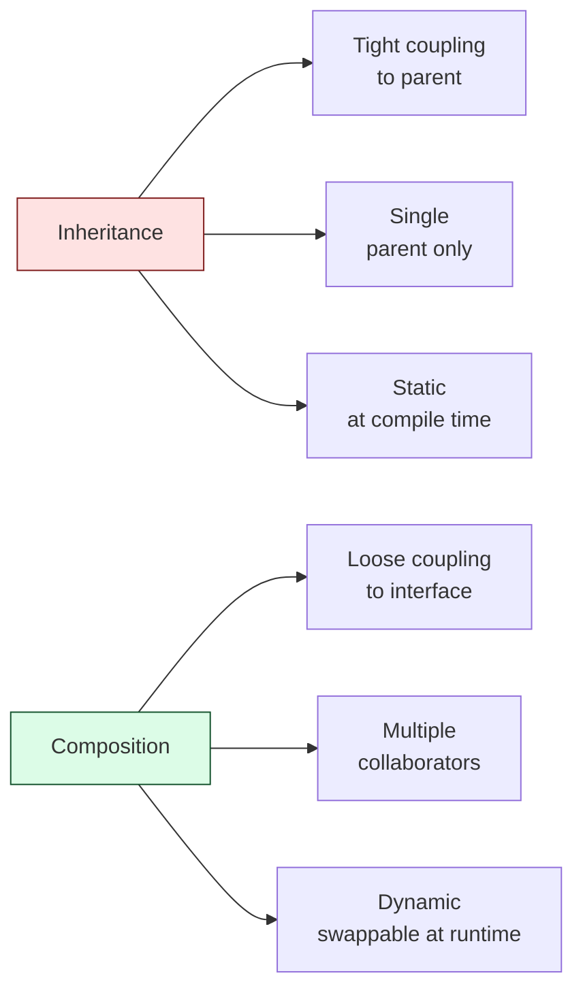
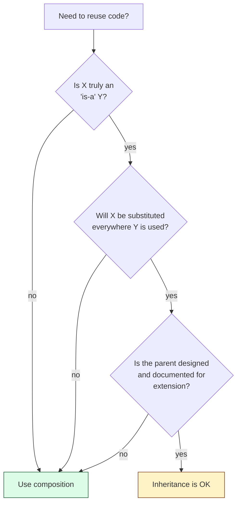

## The Two Tools

| **Mechanism** | **Reads as** | **Coupling** |
|--------------|--------------|--------------|
| **Inheritance** | "is-a" | tight — subclass depends on parent's implementation |
| **Composition** | "has-a" | loose — class depends only on the embedded interface |

---

## The Classic Trap

**Inheritance abuse:**

```java
public class Stack<T> extends ArrayList<T> {
    public void push(T item) { add(item); }
    public T pop() { return remove(size() - 1); }
}
```

This compiles, but `Stack` now exposes `add(int index, T)`, `remove(int)`, `set(int, T)` — every list method. A caller can violate stack semantics by inserting in the middle.

**Composition fix:**

```java
public class Stack<T> {
    private final List<T> data = new ArrayList<>();
    public void push(T item) { data.add(item); }
    public T pop() { return data.remove(data.size() - 1); }
}
```

Now the public surface is exactly `push` and `pop`. The `List` is an implementation detail.

---

## Why "Favor Composition Over Inheritance"



### 1. The Fragile Base Class Problem

A change in the parent can break subclasses in non-obvious ways:

```java
public class CountingList<T> extends ArrayList<T> {
    private int adds = 0;

    @Override
    public boolean add(T item) {
        adds++;
        return super.add(item);
    }

    @Override
    public boolean addAll(Collection<? extends T> c) {
        adds += c.size();
        return super.addAll(c);  // BUG: addAll internally calls add()
    }
}
```

If `ArrayList.addAll` is implemented as a loop calling `add`, the count is **doubled**. The subclass is correct in isolation but couples to the parent's implementation.

### 2. Multiple Inheritance / Hierarchy Explosion

You want a `LoggedRetryableCachedClient`. With inheritance you'd need a class for every combination. With composition you wrap:

```java
Client c = new LoggedClient(new RetryableClient(new CachedClient(real)));
```

(This is the **Decorator** pattern — composition in disguise.)

### 3. Runtime Flexibility

Composition lets you swap behavior at runtime:

```java
class PaymentService {
    private PricingStrategy pricing;          // can change at runtime
    void setPricing(PricingStrategy p) { this.pricing = p; }
}
```

Inheritance is fixed at compile time — once `class WeekendPricing extends BasePricing`, the relationship is permanent.

---

## When Inheritance *Is* Right

Use inheritance when **all three** are true:

1. The relationship is genuinely **is-a**, not "looks like".
2. The subclass is a **true subtype** — Liskov-substitutable for the parent.
3. The parent class was **designed for inheritance** (documented, with stable hooks).

Examples where inheritance fits:
- Abstract classes you control: `AbstractList`, `BaseHandler`
- Sealed/closed hierarchies: `Shape -> {Circle, Square}` where you enumerate every case
- Framework extension points: `extends Activity`, `extends ViewModel`

---

## Decision Heuristic



---

## Side-by-Side

| **Scenario** | **Inheritance** | **Composition** |
|-------------|----------------|-----------------|
| `Car` and `Engine` | ❌ a car *has* an engine | ✅ `Car { Engine engine; }` |
| `Square` and `Shape` | ✅ a square *is* a shape | – |
| `Stack` and `List` | ❌ a stack is *not* a list | ✅ `Stack { List data; }` |
| `Manager` and `Employee` | ✅ a manager *is* an employee | – |
| `Logger` adds logging to `Client` | ❌ logger is not a client | ✅ Decorator |

---

## Interview Tips

- When you reach for `extends`, ask yourself: would this still make sense if the parent's implementation changed completely?
- If you find yourself writing `super.method()` to "tweak" parent behavior, you probably want composition.
- Mention **delegation** (a fancy word for composition + forwarding methods) when the interviewer asks how to "share code" without inheritance.
