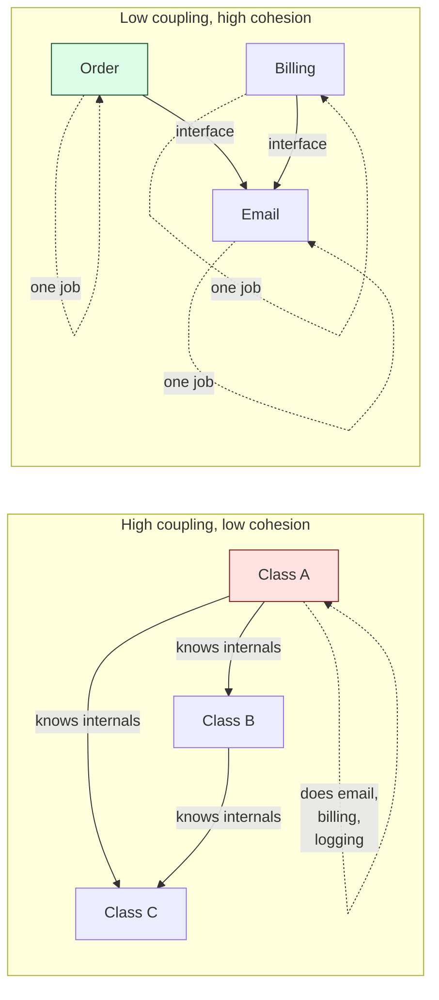

## The Goal

> **Low coupling. High cohesion.**

| **Term** | **Definition** | **Want** |
|---------|---------------|----------|
| **Coupling** | How much one module depends on another | **low** |
| **Cohesion** | How focused a single module is on one job | **high** |

A class with **high cohesion** does one thing. A system with **low coupling** lets you change one class without rippling changes across many.

---

## Cohesion (within a class)

### Low cohesion — bad

```java
public class UserManager {
    void createUser(User u) { ... }
    void sendWelcomeEmail(User u) { ... }
    void generateInvoice(User u) { ... }
    void exportToCsv(List<User> users) { ... }
    void compressLogFile(File f) { ... }
}
```

This class does five unrelated things. A change to email templating forces a redeploy of CSV export.

### High cohesion — good

```java
class UserService    { void createUser(User u); }
class EmailService   { void send(EmailTemplate t, User u); }
class InvoiceService { Invoice generate(User u); }
class UserExporter   { byte[] toCsv(List<User> users); }
class LogArchiver    { void compress(File f); }
```

Each class has one reason to change (Single Responsibility Principle).

### Cohesion levels (Yourdon-Constantine)

| **Level** | **Description** | **Quality** |
|----------|----------------|-------------|
| Functional | All elements contribute to one well-defined task | ✅ best |
| Sequential | Output of one element is input to the next | ✅ good |
| Communicational | Elements operate on the same data | 🟡 ok |
| Procedural | Elements follow a sequence but don't share data | 🟡 weak |
| Temporal | Elements happen at the same time (e.g., init) | 🟠 weak |
| Logical | Elements categorically similar but unrelated | ❌ bad |
| Coincidental | Random grouping (utility classes) | ❌ worst |

---

## Coupling (between classes)

### Tight coupling — bad

```java
class OrderService {
    private MySqlOrderRepository repo = new MySqlOrderRepository();
    private SmtpEmailClient email = new SmtpEmailClient("smtp.gmail.com");

    void place(Order o) {
        repo.insert(o);                // depends on MySQL
        email.send(o.customer.email);   // depends on SMTP, Gmail
    }
}
```

`OrderService` is glued to MySQL and Gmail. You can't unit-test it without a real DB and SMTP server.

### Loose coupling — good

```java
class OrderService {
    private final OrderRepository repo;        // interface
    private final EmailGateway email;          // interface

    OrderService(OrderRepository r, EmailGateway e) {
        this.repo = r;
        this.email = e;
    }
}
```

Now you can plug in `InMemoryOrderRepository` for tests, switch to Postgres in prod, or swap email providers — all without touching `OrderService`.

### Coupling levels (Stevens-Myers)

| **Level** | **Description** | **Quality** |
|----------|----------------|-------------|
| None | Modules don't communicate | ✅ best (when possible) |
| Data | Modules share simple parameters | ✅ good |
| Stamp | Modules share a structured value object | ✅ ok |
| Control | One module controls another's behavior via flags | 🟡 weak |
| External | Shared external format (file, protocol) | 🟠 weak |
| Common | Shared global/mutable state | ❌ bad |
| Content | One module accesses another's internals | ❌ worst |

---

## Visualizing the Two



---

## Practical Levers

### To reduce coupling
- **Depend on abstractions** (interfaces, not concrete classes) — DIP
- **Inject dependencies** rather than constructing them inside
- **Avoid global state** — singletons, statics, mutable module-level vars
- **Hide internals** — `private` by default, `public` deliberately

### To increase cohesion
- **Single Responsibility Principle** — one reason to change per class
- **Group by feature, not by layer** — `Order/{controller, service, repo}` beats `controllers/`, `services/`, `repos/`
- **Delete utility/helper classes** — they're cohesion graveyards. Move methods to the class that owns the data.

---

## Tension

You can't always have both maxed. Sometimes pulling something out of a class (raising cohesion) introduces a new dependency (raising coupling). The art is the balance:

> Tolerate slightly more coupling to keep classes single-purpose. **Cohesion comes first.**

---

## Interview Tips

- If asked "is this design good?" answer in terms of coupling and cohesion, not vague "clean code" praise.
- Smell test: can you describe a class's purpose in one sentence without using "and"? If not, cohesion is low.
- Smell test: can you unit-test the class without spinning up databases or networks? If not, coupling is high.
