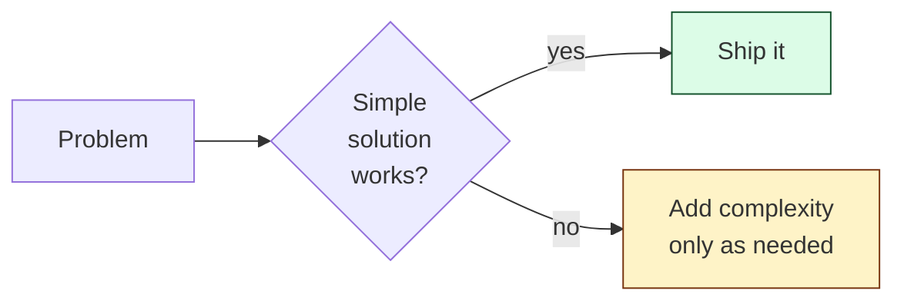
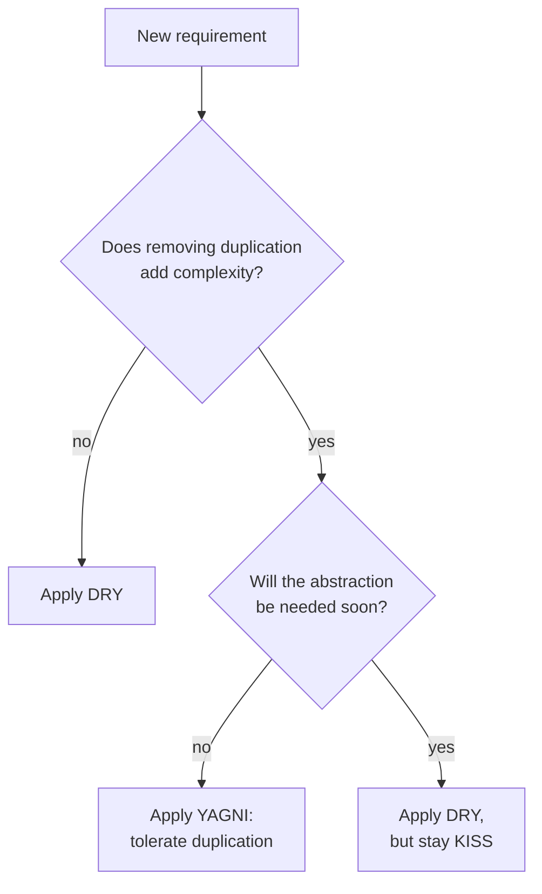

## The Three Rules

| **Acronym** | **Stands for** | **Core message** |
|------------|----------------|------------------|
| **DRY** | Don't Repeat Yourself | Each piece of knowledge should have one authoritative representation |
| **KISS** | Keep It Simple, Stupid | The simplest design that works is the right design |
| **YAGNI** | You Ain't Gonna Need It | Don't build for hypothetical future requirements |

These often pull in opposite directions — knowing *when* to apply each is the skill.

---

## DRY — Don't Repeat Yourself

**Bad:**

```java
double calculateUSPrice(Item i) { return i.price * 1.07; }   // 7% sales tax
double calculateInvoice(Item i) { return i.price * 1.07; }   // duplicated
```

**Good:**

```java
private static final double US_TAX = 0.07;
double withTax(Item i) { return i.price * (1 + US_TAX); }
```

If the tax rate changes, you fix it once.

### What DRY is *not*

DRY is about **knowledge**, not **lines of text**. Two methods that happen to look identical *today* but represent different concepts shouldn't be merged.

```java
// These look identical but represent different rules — DON'T merge them
double calculateLateFee(Loan l)  { return l.amount * 0.05; }
double calculateProcessingFee(Loan l) { return l.amount * 0.05; }
```

When the late fee changes to 6% but the processing fee stays at 5%, you'll be glad they were separate.

---

## KISS — Keep It Simple, Stupid

**The simplest thing that solves the problem is the right thing.**



### Anti-patterns KISS rejects

| **Anti-pattern** | **Symptom** |
|-----------------|-------------|
| Over-engineering | 5 layers of abstraction for a CRUD endpoint |
| Premature optimization | Bit-packing booleans before profiling |
| Cleverness for its own sake | One-line stream chain that nobody can read |
| Configurable everything | 40 config flags for things that never change |

### Example

**Over-engineered:**

```java
public interface UserNameStrategy { String generate(User u); }
public class FirstLastNameStrategy implements UserNameStrategy { ... }
public class UserNameContext {
    private UserNameStrategy strategy;
    public String getName(User u) { return strategy.generate(u); }
}
```

**KISS:**

```java
String fullName(User u) { return u.first + " " + u.last; }
```

Add the strategy *when* you have a second strategy, not before.

---

## YAGNI — You Ain't Gonna Need It

**Don't add features, parameters, or extension points speculating about the future.**

| **Speculation** | **Reality** |
|----------------|-------------|
| "We might need to support multiple databases someday" | You won't. And if you do, the abstraction you built today won't fit. |
| "What if we want to make this configurable?" | It will stay hardcoded for 4 years until somebody needs to change it, then they'll just change it. |
| "Let me add a hook so future-me can extend this" | Future-you won't remember the hook exists. |

### Why YAGNI is hard

It feels *responsible* to build for the future. But:

1. **Most predictions are wrong.** The future feature never gets built, or gets built differently.
2. **Speculation costs maintenance.** Every unused abstraction is code to read, test, and break.
3. **Real requirements are sharper.** When you actually need a feature, you'll know exactly what it should look like — better than today's guess.

---

## When the Three Conflict



A common conflict: you have two functions that share 80% of their logic. DRY says merge. But the merge requires a parameter, a flag, and an `if`. KISS and YAGNI say keep them separate until you have a *third* caller.

**Rule of three:** wait until something appears three times before extracting it.

---

## Interview Tips

- When asked "would you abstract this?" don't auto-answer yes. Say: "I'd wait for a second use case before abstracting — premature abstraction is hard to undo."
- Cite YAGNI when the interviewer pushes you to add features you don't need yet ("what if we wanted to support N currencies?" → "I'd add it when we onboard the second currency; today, hardcoding USD is fine").
- KISS is the default. Justify every layer of abstraction you add.
