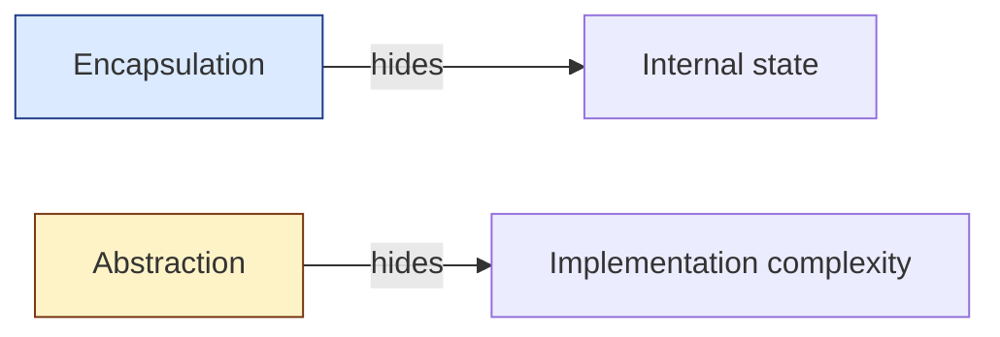

## The Four Pillars

| **Pillar** | **One-line Definition** | **Mechanism** |
|-----------|------------------------|---------------|
| **Encapsulation** | Bundle data and behavior; hide internals | `private` fields + `public` methods |
| **Inheritance** | Subclass reuses & specializes a parent | `extends`, `implements` |
| **Polymorphism** | One interface, many implementations | Method overriding, interfaces |
| **Abstraction** | Expose *what*, hide *how* | Abstract classes, interfaces |

---

## 1. Encapsulation

**Bundle state with behavior, and prevent external code from mucking with internals directly.**

```java
public class BankAccount {
    private double balance;          // hidden
    private final String accountId;

    public BankAccount(String id, double opening) {
        this.accountId = id;
        this.balance = opening;
    }

    public void deposit(double amount) {
        if (amount <= 0) throw new IllegalArgumentException();
        this.balance += amount;
    }

    public double getBalance() { return balance; }
}
```

The caller cannot do `account.balance = -1000` — they must go through `deposit()` which enforces the invariant `balance >= 0` (when combined with a withdraw method).

**Why it matters:** invariants live in one place. Change the rule once, not in every caller.

---

## 2. Inheritance

**A subclass reuses fields/methods of its parent and can specialize them.**

```java
public abstract class Vehicle {
    protected String licensePlate;
    public abstract double tollRate();
}

public class Car extends Vehicle {
    public double tollRate() { return 5.0; }
}

public class Truck extends Vehicle {
    private int axles;
    public double tollRate() { return 5.0 + axles * 2.0; }
}
```

**Caution:** prefer **composition over inheritance**. Inheritance creates strong coupling — a subclass depends on the parent's implementation, not just its interface.

---

## 3. Polymorphism

**The same call site behaves differently depending on the runtime type.**

```java
List<Vehicle> queue = List.of(new Car(), new Truck());
double total = queue.stream().mapToDouble(Vehicle::tollRate).sum();
```

Two flavors:

| **Flavor** | **Resolved at** | **Example** |
|-----------|-----------------|-------------|
| **Compile-time (overloading)** | compile | `add(int, int)` vs `add(String, String)` |
| **Runtime (overriding)** | runtime | `Vehicle::tollRate` dispatched to `Car` or `Truck` |

---

## 4. Abstraction

**Expose a stable contract; hide the noise behind it.**

```java
public interface PaymentGateway {
    PaymentResult charge(Money amount, Card card);
}

// Caller doesn't care which provider — Stripe, Razorpay, mock.
class CheckoutService {
    private final PaymentGateway gateway;
    void checkout(Order o) { gateway.charge(o.total(), o.card()); }
}
```

The `CheckoutService` is testable (swap a mock gateway) and replaceable (switch providers without touching checkout logic).

---

## Encapsulation vs Abstraction (commonly confused)



- **Encapsulation:** "you don't get to read/write `balance` directly."
- **Abstraction:** "you don't need to know *how* the payment happens, just call `charge()`."

---

## Class Relationships (cheat sheet)

| **Relationship** | **UML** | **Example** |
|-----------------|---------|-------------|
| Inheritance (is-a) | hollow triangle | `Car` is-a `Vehicle` |
| Composition (owns) | filled diamond | `Car` owns `Engine` (engine dies with car) |
| Aggregation (has) | hollow diamond | `Team` has `Player` (players outlive team) |
| Association (uses) | plain arrow | `Order` uses `Customer` |
| Dependency (uses temporarily) | dashed arrow | method param |

---

## Interview Tips

- Don't recite the four pillars — *demonstrate* them in your design.
- When asked "why this class?" answer in terms of single responsibility, not OOP buzzwords.
- Be ready to defend composition over inheritance with a concrete example.
