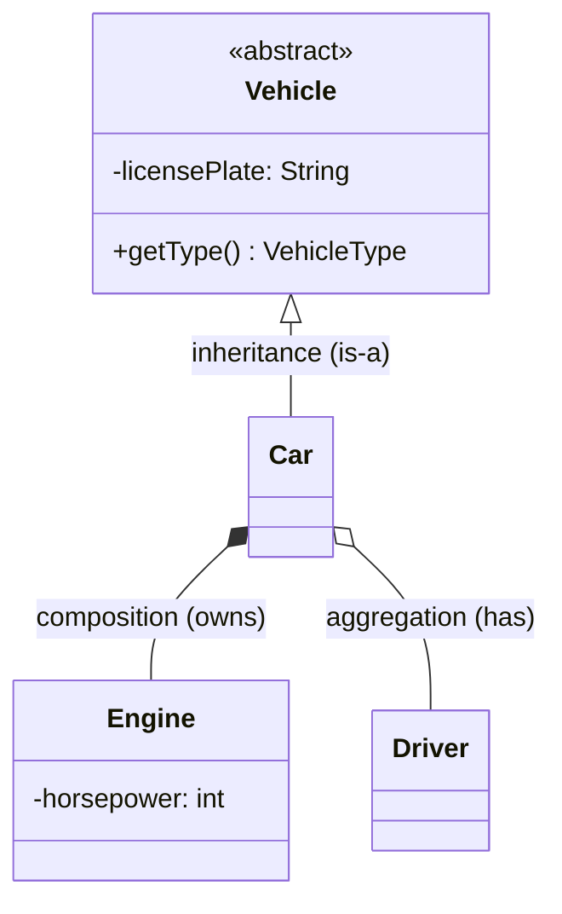
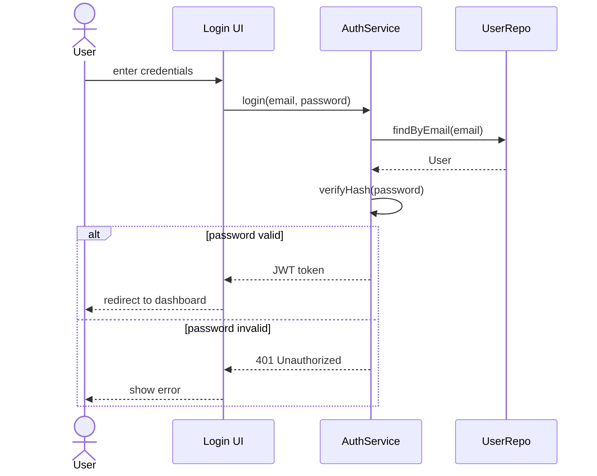
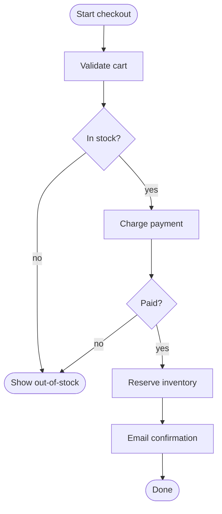
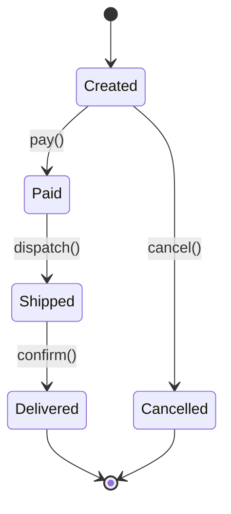

## Why UML in LLD?

In an LLD interview you have ~45 minutes and a whiteboard. UML is shorthand: it tells the interviewer *exactly* what kind of relationship you mean (inheritance vs composition vs association) without prose.

You only need three diagrams:

| **Diagram** | **Answers** | **When to draw** |
|------------|-------------|------------------|
| **Class** | What classes exist and how they relate | Always |
| **Sequence** | Who calls whom, in what order | When flow matters (login, checkout) |
| **Activity** | What is the control flow / decision tree | When the algorithm is the point |

---

## Class Diagram

### Notation

```
┌─────────────────────────────────────┐
│         <<interface>>               │   <- stereotype
│         PaymentGateway              │   <- name
├─────────────────────────────────────┤
│ + charge(amount: Money): Result     │   <- + public, - private, # protected
└─────────────────────────────────────┘
```

### Relationships



| **Symbol** | **Relationship** | **Lifetime** |
|-----------|------------------|--------------|
| `<\|--` | Inheritance | n/a |
| `*--` | Composition | child dies with parent |
| `o--` | Aggregation | child outlives parent |
| `-->` | Association (uses) | independent |
| `..>` | Dependency (transient use) | independent |

### Multiplicity

```
ParkingLot "1" *-- "1..*" ParkingFloor
```

Read as: one `ParkingLot` owns one-or-more `ParkingFloor`s.

---

## Sequence Diagram

Shows the **order** of messages between objects over time.



**When to use:**
- Walking through a happy-path flow
- Showing a failure branch (`alt` / `else`)
- Highlighting async calls (open arrow vs filled arrow)

---

## Activity Diagram

Shows control flow — branches, loops, parallel paths. Closer to a flowchart.



---

## State Diagram

Shows how a single entity transitions between states.



Useful when the problem is fundamentally state-machine shaped: orders, tickets, jobs, network connections.

---

## What to Skip in Interviews

You will *never* need:
- Component diagrams
- Deployment diagrams (that's HLD territory)
- Object diagrams
- Use-case diagrams

Stick to **class + sequence**, add **state** if the problem demands it.

---

## Interview Tips

- Draw the **class diagram first** — it's the skeleton everything else hangs off of.
- Keep methods on the diagram to the **public interface**; don't list every private helper.
- Use **stereotypes** (`<<interface>>`, `<<abstract>>`) — they save explanation time.
- If you draw a sequence diagram, **annotate failures** — interviewers love seeing you think about the unhappy path.
