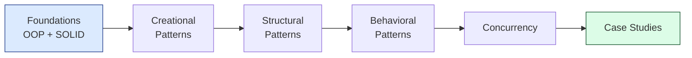

import { Cards, Card } from 'fumadocs-ui/components/card';

## What is Low-Level Design?

**Low-Level Design (LLD)** is the bridge between architecture and code. While **HLD** describes the components of a system and how they communicate, **LLD** describes how individual components are built — class structure, object relationships, data structures, algorithms, and concurrency.

In interviews, LLD rounds typically ask you to design the **classes and methods** for a focused problem (parking lot, elevator, splitwise, chat) in 45–60 minutes.

---

## HLD vs LLD

| **Aspect** | **HLD** | **LLD** |
|-----------|---------|---------|
| Focus | System architecture | Class/object design |
| Level | Services, databases, queues | Classes, methods, fields |
| Output | Block diagrams, data flow | Class diagrams, sequence diagrams |
| Tools | UML deployment, C4 | UML class, sequence, state |
| Scale | Distributed systems | Single service / module |
| Concerns | Scalability, availability | Extensibility, testability |

---

## Sections

<Cards>
  <Card title="Foundations" href="/lld/foundations/solid" description="OOP, SOLID, UML, design principles" />
  <Card title="Creational Patterns" href="/lld/patterns/creational/singleton" description="Singleton, Factory, Builder, ..." />
  <Card title="Structural Patterns" href="/lld/patterns/structural/adapter" description="Adapter, Decorator, Facade, ..." />
  <Card title="Behavioral Patterns" href="/lld/patterns/behavioral/strategy" description="Strategy, Observer, State, ..." />
  <Card title="Concurrency" href="/lld/concurrency/thread-safety" description="Thread safety, locks, pools" />
  <Card title="Case Studies" href="/lld/case-studies/parking-lot" description="Machine-coding problems" />
</Cards>

---

## Recommended Reading Order

---

## How to Approach an LLD Interview

1. **Clarify requirements** — functional and non-functional. Don't assume.
2. **Identify entities** — nouns become classes; verbs often become methods.
3. **Define relationships** — `is-a` (inheritance) vs `has-a` (composition).
4. **Pick patterns deliberately** — name the pattern you're using and *why*.
5. **Handle concurrency** — call out shared state, locks, atomicity.
6. **Discuss extensibility** — how would you add a new vehicle type / payment method?
7. **Edge cases** — invalid input, exhausted resources, partial failure.
