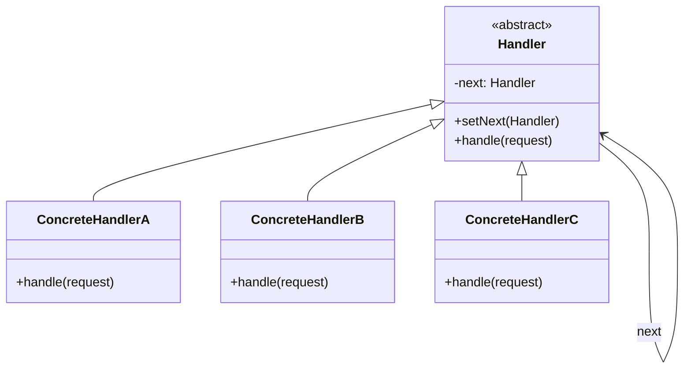

## Intent

> Avoid coupling the sender of a request to its receiver by giving multiple objects a chance to handle it. Pass the request along until one handles it.

Use when:
- Multiple handlers can process a request, and you don't want the sender to pick.
- The set of handlers should be configurable at runtime.
- You want to model a pipeline (logging, auth, rate limit, business logic).

---

## Real-world Analogy

Customer support: your ticket starts with a Tier 1 agent. If they can't help, it escalates to Tier 2. Tier 2 escalates to engineering. You don't decide who handles it — the chain does.

---

## Structure



---

## Example: HTTP Middleware Chain

```java
public abstract class Handler {
    private Handler next;

    public Handler setNext(Handler h) { this.next = h; return h; }

    public Response handle(Request req) {
        if (next != null) return next.handle(req);
        return Response.ok();
    }
}

class AuthHandler extends Handler {
    public Response handle(Request req) {
        if (req.token == null) return Response.unauthorized();
        return super.handle(req);   // forward
    }
}

class RateLimitHandler extends Handler {
    private final RateLimiter limiter = new RateLimiter(100);
    public Response handle(Request req) {
        if (!limiter.allow(req.clientId)) return Response.tooManyRequests();
        return super.handle(req);
    }
}

class LoggingHandler extends Handler {
    public Response handle(Request req) {
        System.out.println("[REQ] " + req.url);
        Response r = super.handle(req);
        System.out.println("[RES] " + r.status);
        return r;
    }
}

class BusinessHandler extends Handler {
    public Response handle(Request req) {
        return doWork(req);   // terminal — no super.handle()
    }
}

// Wire up
Handler chain = new LoggingHandler();
chain.setNext(new AuthHandler())
     .setNext(new RateLimitHandler())
     .setNext(new BusinessHandler());

Response r = chain.handle(request);
```

Each handler decides: process? forward? short-circuit?

---

## Variants

### Pass-through (every handler runs)

Every handler in the chain processes; none stops it. Useful for logging, metrics, observability.

### First-handler-wins

The first handler that *can* handle the request takes it; others never see it. Good for support tickets, dispatchers.

### Branching chain

Handler decides which sub-chain to forward to (rare; usually composite + chain).

---

## Example: Approval Workflow

```java
abstract class Approver {
    protected Approver next;
    public void setNext(Approver a) { this.next = a; }

    public abstract void approve(LeaveRequest r);
}

class Manager extends Approver {
    public void approve(LeaveRequest r) {
        if (r.days <= 5) System.out.println("Manager approved");
        else next.approve(r);
    }
}

class Director extends Approver {
    public void approve(LeaveRequest r) {
        if (r.days <= 15) System.out.println("Director approved");
        else next.approve(r);
    }
}

class CEO extends Approver {
    public void approve(LeaveRequest r) {
        System.out.println("CEO approved");
    }
}

// Wire
Manager m = new Manager();
Director d = new Director();
m.setNext(d);
d.setNext(new CEO());

m.approve(new LeaveRequest(20));   // CEO
m.approve(new LeaveRequest(3));    // Manager
```

---

## Real-world Examples

| **Use case** | **Chain** |
|-------------|-----------|
| Servlet filters / Express middleware | Each filter sees and forwards |
| Logging frameworks | Appenders / handlers |
| Java exception handling | `catch` blocks try in order |
| Event bubbling in DOM | Element → parent → ancestor |
| Tax calculators | State → federal → local |
| Validation chains | Field validators in sequence |

---

## Chain of Responsibility vs Decorator

Both wrap and forward. The difference:

| **Pattern** | **Goal** | **Termination** |
|------------|---------|-----------------|
| **Chain** | One handler eventually handles, others pass | Handler can short-circuit |
| **Decorator** | Every wrapper adds behavior; the inner core always runs | Always reaches the wrapped object |

A chain may stop early (auth fails → 401, no more handlers run). A decorator stack always runs end-to-end.

---

## Trade-offs

✅ **Pros:**
- Decouples senders from handlers
- Chain composition is runtime-configurable
- Single Responsibility per handler
- Easy to add or reorder handlers

❌ **Cons:**
- Request may go unhandled if no terminal handler exists
- Hard to debug — no static call graph
- Implicit ordering — easy to mess up
- Performance: each request walks the chain

---

## Interview Tips

- Reach for chain when the interviewer describes **middleware**, **escalation**, or **pipelines** with multiple handlers.
- Distinguish from decorator by termination behavior.
- Mention concrete examples interviewers know: servlet filters, Express middleware, exception handlers.
