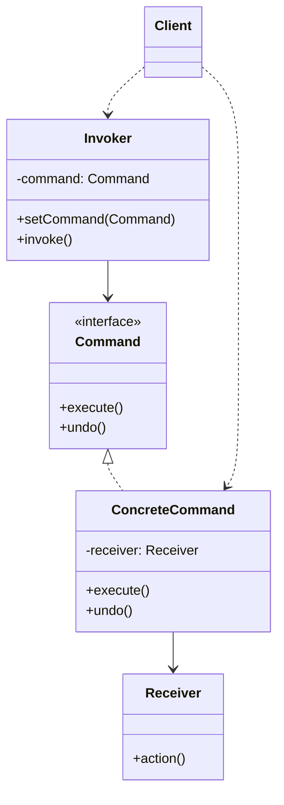

## Intent

> Turn an action into a **first-class object** with `execute()` (and often `undo()`), so it can be queued, logged, scheduled, replayed, or undone.

Use when:
- You need undo/redo.
- You need to queue or schedule operations.
- You want to log every action for audit / replay.
- The receiver of the action shouldn't be hard-coded into the caller.

---

## Structure



---

## Example: Text Editor with Undo

```java
public interface Command {
    void execute();
    void undo();
}

public class Editor {
    private StringBuilder content = new StringBuilder();
    public void insert(int pos, String text) { content.insert(pos, text); }
    public void delete(int pos, int len) { content.delete(pos, pos + len); }
    public String getText() { return content.toString(); }
}

public class InsertCommand implements Command {
    private final Editor editor;
    private final int pos;
    private final String text;

    public InsertCommand(Editor e, int pos, String text) {
        this.editor = e; this.pos = pos; this.text = text;
    }

    public void execute() { editor.insert(pos, text); }
    public void undo()    { editor.delete(pos, text.length()); }
}

public class DeleteCommand implements Command {
    private final Editor editor;
    private final int pos, len;
    private String deletedText;   // saved for undo

    public DeleteCommand(Editor e, int pos, int len) {
        this.editor = e; this.pos = pos; this.len = len;
    }

    public void execute() {
        deletedText = editor.getText().substring(pos, pos + len);
        editor.delete(pos, len);
    }
    public void undo() { editor.insert(pos, deletedText); }
}

public class History {
    private final Deque<Command> done = new ArrayDeque<>();
    private final Deque<Command> undone = new ArrayDeque<>();

    public void execute(Command c) {
        c.execute();
        done.push(c);
        undone.clear();   // new action invalidates redo stack
    }

    public void undo() {
        if (done.isEmpty()) return;
        Command c = done.pop();
        c.undo();
        undone.push(c);
    }

    public void redo() {
        if (undone.isEmpty()) return;
        Command c = undone.pop();
        c.execute();
        done.push(c);
    }
}
```

### Usage

```java
Editor editor = new Editor();
History history = new History();

history.execute(new InsertCommand(editor, 0, "Hello "));
history.execute(new InsertCommand(editor, 6, "World"));
// content: "Hello World"

history.undo();   // "Hello "
history.undo();   // ""
history.redo();   // "Hello "
```

---

## Other Use Cases

### Macro / composite command

```java
public class MacroCommand implements Command {
    private final List<Command> commands;
    public MacroCommand(List<Command> cs) { this.commands = cs; }

    public void execute() { commands.forEach(Command::execute); }
    public void undo() {
        // Undo in reverse order
        for (int i = commands.size() - 1; i >= 0; i--) commands.get(i).undo();
    }
}
```

### Queueing / async execution

```java
ExecutorService executor = Executors.newFixedThreadPool(4);
executor.submit(() -> command.execute());   // run on background thread
```

### Logging / replay

Persist the command list. To replay (e.g., recover after a crash), re-execute in order. This is the foundation of **event sourcing** — see [Event Sourcing](/sd/design-patterns/event-sourcing).

---

## Command vs Strategy

Both encapsulate behavior in an object. The difference is **purpose**:

| **Pattern** | **Question it answers** |
|------------|------------------------|
| **Command** | "What action should be performed?" — and stored, queued, replayed |
| **Strategy** | "How should this algorithm be performed?" — interchangeable |

A command bundles *receiver + action + args*. A strategy is just an algorithm.

---

## Real-world Examples

| **Use case** | **Commands** |
|-------------|--------------|
| Editor undo/redo | `Insert`, `Delete`, `Format` |
| `Runnable` / `Callable` | Generic command for executors |
| Spring `MessageHandler` | Each handler processes one message type |
| GUI buttons | Each button bound to a `Command` |
| Database transactions | Each statement as a command, with rollback log |
| Queue-based job systems | Job = command, worker executes |

---

## Trade-offs

✅ **Pros:**
- Decouples invoker from receiver
- Enables undo/redo, logging, queuing, scheduling
- Commands are testable in isolation
- Composable into macros

❌ **Cons:**
- Many small classes (one per action)
- Storing state for undo can be expensive (large diffs)
- Memory: history grows unbounded without trimming
- More indirection than a direct method call

---

## Interview Tips

- Reach for command when the interviewer mentions **undo**, **redo**, **macro**, **scheduled tasks**, or **audit log**.
- Show the undo strategy explicitly — store enough state to reverse.
- Mention macros as composition (Composite + Command) to show pattern interaction.
