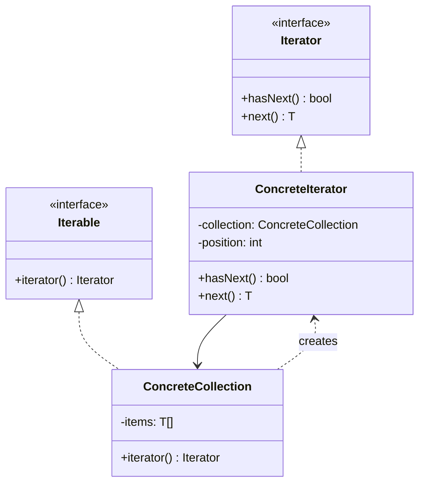

## Intent

> Walk a collection's elements one at a time without revealing how the collection stores them (array, list, tree, hash table, stream).

Use when:
- You want to iterate over a custom collection.
- Multiple traversal strategies (forward, reverse, depth-first, breadth-first) are needed.
- The collection's internals shouldn't leak to callers.

---

## Structure



---

## Java's Built-in Iterator

```java
public interface Iterator<T> {
    boolean hasNext();
    T next();
    default void remove() { throw new UnsupportedOperationException(); }
}

public interface Iterable<T> {
    Iterator<T> iterator();
}
```

Implementing `Iterable<T>` enables the for-each loop:

```java
for (String s : myCollection) { /* ... */ }
// is sugar for
Iterator<String> it = myCollection.iterator();
while (it.hasNext()) {
    String s = it.next();
}
```

---

## Example: Custom Tree Iterator

```java
public class TreeNode<T> {
    T value;
    TreeNode<T> left, right;
}

public class BinaryTree<T> implements Iterable<T> {
    private TreeNode<T> root;

    @Override
    public Iterator<T> iterator() {
        return new InOrderIterator<>(root);
    }

    public Iterator<T> reverseIterator() {
        return new ReverseInOrderIterator<>(root);
    }

    private static class InOrderIterator<T> implements Iterator<T> {
        private final Deque<TreeNode<T>> stack = new ArrayDeque<>();

        InOrderIterator(TreeNode<T> root) { pushLeft(root); }

        private void pushLeft(TreeNode<T> n) {
            while (n != null) { stack.push(n); n = n.left; }
        }

        public boolean hasNext() { return !stack.isEmpty(); }

        public T next() {
            TreeNode<T> n = stack.pop();
            pushLeft(n.right);
            return n.value;
        }
    }
}
```

The caller iterates a tree as if it were a list. Different traversal orders are different iterators.

---

## External vs Internal Iterators

| **Type** | **Who controls iteration?** | **Example** |
|---------|----------------------------|-------------|
| **External** | Caller — explicit `next()` | `Iterator` |
| **Internal** | Collection — passes element to a callback | `forEach`, streams |

```java
// External
for (String s : list) System.out.println(s);

// Internal
list.forEach(System.out::println);
```

Internal iterators are simpler when all you want is to apply a function. External iterators give more control (skip, peek, multiple loops).

---

## Java Streams as Iterators

Modern Java prefers streams for processing pipelines:

```java
List<Integer> doubled = list.stream()
    .filter(x -> x > 0)
    .map(x -> x * 2)
    .collect(Collectors.toList());
```

Streams are essentially iterators with built-in operations. Spliterator (the underlying primitive) supports parallel iteration.

---

## Fail-Fast vs Fail-Safe

When the collection is modified during iteration:

| **Type** | **Behavior** | **Examples** |
|---------|--------------|--------------|
| **Fail-fast** | Throws `ConcurrentModificationException` | `ArrayList`, `HashMap` iterators |
| **Fail-safe** | Iterates over a snapshot or copy | `CopyOnWriteArrayList`, `ConcurrentHashMap` |

Fail-fast is the default in Java collections. It catches bugs early (a thread mutating while you iterate). Fail-safe is for concurrent scenarios where you accept a slightly stale view.

---

## Real-world Examples

| **API** | **Iterator** |
|--------|--------------|
| `java.util.Iterator` | Standard iteration |
| `Spliterator` | Parallel iteration |
| Database `ResultSet` | Iterates query results |
| `Stream` | Lazy iteration with operations |
| Tree traversals | DFS, BFS as separate iterators |
| `Files.walk(path)` | Iterate directory tree |

---

## Trade-offs

✅ **Pros:**
- Decouples traversal logic from collection representation
- Multiple traversal types per collection
- Same interface for arrays, lists, trees, streams
- Simplifies for-each integration

❌ **Cons:**
- Stateful — iterators aren't safe to share across threads (use snapshots)
- One-shot — can't rewind a basic iterator
- Boilerplate compared to internal iteration / streams
- Concurrent modification needs explicit handling

---

## Interview Tips

- If asked to design a custom collection, **make it `Iterable`** — that one method enables all the for-each goodies.
- Mention multiple iterators per collection (in-order, pre-order, reverse) as a strength of the pattern.
- Distinguish fail-fast from fail-safe when the interviewer probes thread safety.
