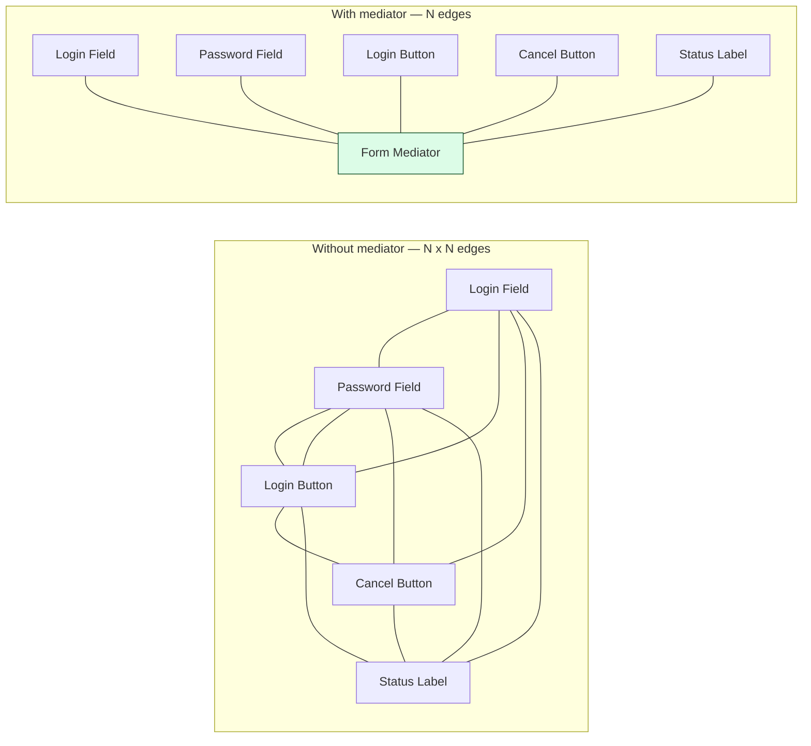
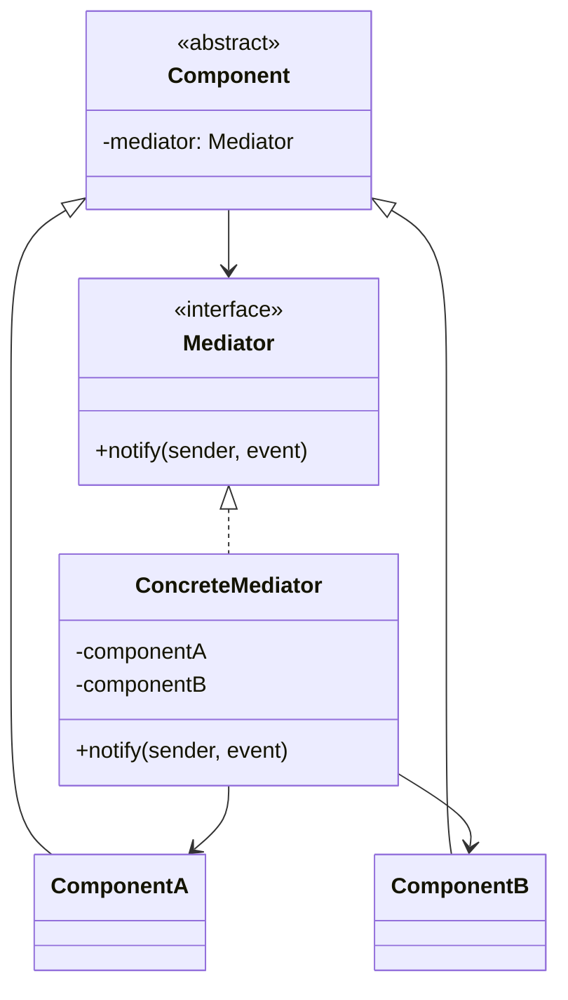

## Intent

> Replace many-to-many connections between peers with a single hub (the **mediator**) so peers only know the mediator, not each other.

Use when:
- A set of related objects communicate in complex ways.
- Reusing one of them is hard because it depends on many others.
- You want to centralize control logic.

---

## The Problem It Solves



Each peer talks **only** to the mediator. The mediator decides who else needs to know.

---

## Structure



---

## Example: Login Form

```java
public interface FormMediator {
    void notify(Component sender, String event);
}

public abstract class Component {
    protected FormMediator mediator;
    public void setMediator(FormMediator m) { this.mediator = m; }
}

class TextField extends Component {
    private String text = "";
    public void setText(String t) {
        this.text = t;
        mediator.notify(this, "textChanged");
    }
    public String getText() { return text; }
}

class Button extends Component {
    private boolean enabled = true;
    public void setEnabled(boolean e) { this.enabled = e; }
    public void click() {
        if (enabled) mediator.notify(this, "click");
    }
}

class Label extends Component {
    public void setText(String t) { /* render */ }
}

public class LoginForm implements FormMediator {
    private final TextField username = new TextField();
    private final TextField password = new TextField();
    private final Button loginBtn = new Button();
    private final Button cancelBtn = new Button();
    private final Label status = new Label();

    public LoginForm() {
        for (Component c : List.of(username, password, loginBtn, cancelBtn, status)) {
            c.setMediator(this);
        }
        loginBtn.setEnabled(false);   // initial state
    }

    @Override
    public void notify(Component sender, String event) {
        if (sender == username || sender == password) {
            // Enable login when both filled
            boolean both = !username.getText().isEmpty() && !password.getText().isEmpty();
            loginBtn.setEnabled(both);
        } else if (sender == loginBtn && event.equals("click")) {
            attemptLogin();
        } else if (sender == cancelBtn && event.equals("click")) {
            username.setText("");
            password.setText("");
            status.setText("");
        }
    }

    private void attemptLogin() { /* ... */ }
}
```

`TextField` doesn't know about `Button`. `Button` doesn't know about `TextField`. They both notify the mediator.

---

## Mediator vs Observer

Both decouple senders from receivers, but differently:

| **Pattern** | **Communication style** |
|------------|------------------------|
| **Observer** | One subject → many observers (broadcast) |
| **Mediator** | Many peers ↔ many peers (coordination) |

Observer is for **events** that anyone might subscribe to. Mediator is for **logic** that coordinates a known set of peers.

---

## Mediator vs Facade

| **Pattern** | **Direction** |
|------------|---------------|
| **Facade** | Outside → simplified entry to a subsystem (one-way) |
| **Mediator** | Inside-only — peers coordinate via the hub (bidirectional) |

A facade is the front door. A mediator is the office manager.

---

## Real-world Examples

| **Use case** | **Mediator** |
|-------------|--------------|
| Air traffic control | ATC tower coordinates planes (planes don't talk to each other) |
| Chat rooms | Chat room mediates between users |
| Form validation | Form coordinates fields |
| `java.util.Timer` | Mediates between tasks |
| Service discovery | Registry mediates between services |
| Event bus / message broker | Pub/sub broker |

---

## Trade-offs

✅ **Pros:**
- Eliminates many-to-many coupling
- Centralizes complex logic — easier to reason about
- Peers become reusable in different contexts

❌ **Cons:**
- The mediator can grow into a god class as logic accumulates
- Single point of failure (in some interpretations)
- Hides the actual flow — debugging means tracing through the mediator

---

## Interview Tips

- Use mediator when the interviewer describes **N components that all need to coordinate** (form widgets, chat users, services).
- Watch for the god-class anti-pattern: split mediators by concern (login mediator vs chat mediator) rather than one for everything.
- Distinguish from observer: mediator coordinates *logic*, observer broadcasts *events*.
