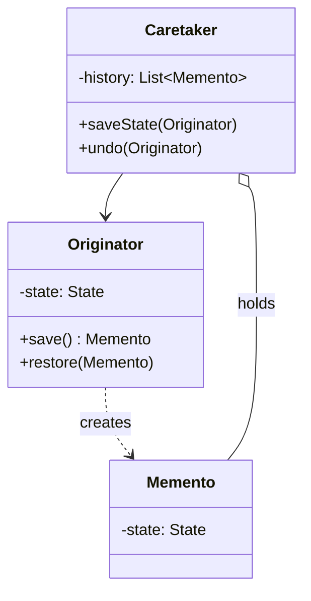

## Intent

> Save a snapshot of an object's state to an opaque token (the **memento**) and use it later to restore that state — without exposing the internals.

Use when:
- You need undo/redo.
- You need to checkpoint state for rollback (transactions, save games).
- You want to externalize state without breaking encapsulation.

---

## Three Roles

| **Role** | **Responsibility** |
|---------|-------------------|
| **Originator** | The object whose state needs saving. Creates and restores from mementos. |
| **Memento** | An opaque token holding a snapshot. Only originator can read it. |
| **Caretaker** | Holds mementos. Doesn't peek inside them. Knows when to save/restore. |

---

## Structure



---

## Example: Editor with Undo

```java
public class Editor {
    private String content = "";

    public void type(String text) { content += text; }
    public String getContent() { return content; }

    // Originator creates a memento
    public Memento save() { return new Memento(content); }

    // Originator restores from a memento
    public void restore(Memento m) { this.content = m.state; }

    // Memento — internal class so only Editor can construct & read it
    public static final class Memento {
        private final String state;
        private Memento(String state) { this.state = state; }
    }
}

public class History {
    private final Deque<Editor.Memento> stack = new ArrayDeque<>();

    public void save(Editor editor) { stack.push(editor.save()); }

    public void undo(Editor editor) {
        if (!stack.isEmpty()) editor.restore(stack.pop());
    }
}
```

### Usage

```java
Editor editor = new Editor();
History history = new History();

editor.type("Hello ");
history.save(editor);

editor.type("World");
history.save(editor);

editor.type("!");
System.out.println(editor.getContent());   // Hello World!

history.undo(editor);
System.out.println(editor.getContent());   // Hello World

history.undo(editor);
System.out.println(editor.getContent());   // Hello 
```

The `History` (caretaker) holds mementos but cannot inspect or modify them. The `Memento` is opaque to anyone but the `Editor`.

---

## Why Encapsulation Matters

A naive approach exposes a public `getState()` / `setState()` on the originator. Then any caller can muck with internal state:

```java
// Bad — leaks internals
String state = editor.getInternalState();   // public
externalSystem.tamper(state);
editor.setInternalState(tamperedState);
```

With memento, the snapshot is sealed:

```java
Editor.Memento m = editor.save();
// no public methods on Memento — caller can hold it but not modify
editor.restore(m);
```

---

## Memento vs Command Undo

Both support undo, with different trade-offs:

| **Pattern** | **Stores** | **Pro** | **Con** |
|------------|-----------|---------|---------|
| **Memento** | Full snapshot of state | Trivial restore (just copy) | Memory: every snapshot is full state |
| **Command undo** | Inverse operation | Memory: only the diff | Complex undo logic per command |

For small state, memento wins on simplicity. For large state with small changes, command undo wins on memory.

Hybrid: memento for occasional checkpoints + command for fine-grained between checkpoints.

---

## Memory Optimization

### Incremental mementos

Instead of full state, store the diff from the previous memento:

```java
class IncrementalMemento {
    final int position;
    final char insertedOrDeletedChar;
    // reconstruct by replaying
}
```

### Limit history depth

```java
class History {
    private final Deque<Memento> stack = new ArrayDeque<>();
    private final int maxSize = 50;

    public void save(Memento m) {
        stack.push(m);
        while (stack.size() > maxSize) stack.removeLast();
    }
}
```

---

## Real-world Examples

| **Use case** | **Memento** |
|-------------|-------------|
| Text editor undo | Document state snapshot |
| Game save points | Player state at checkpoint |
| Database transactions | Pre-commit snapshot for rollback |
| Form drafts | Auto-saved form state |
| `Caretaker` in OS process snapshots | Process state for fault tolerance |
| Browser back button | Previous page state |

---

## Combining with Command

Often used together:

```java
class TypeCommand implements Command {
    private final Editor editor;
    private final String text;
    private Editor.Memento before;

    public void execute() {
        before = editor.save();
        editor.type(text);
    }

    public void undo() { editor.restore(before); }
}
```

Each command stores a memento for its own undo.

---

## Trade-offs

✅ **Pros:**
- Preserves encapsulation
- Simple restore — just copy state back
- Caretaker is decoupled from internal state

❌ **Cons:**
- Memory: each snapshot is a full copy (mitigate with diffs / limits)
- Caretaker controls lifetime — bug there leaks memory
- Deep cloning of complex state is tricky (same as prototype)

---

## Interview Tips

- Reach for memento when the interviewer asks for **undo**, **save points**, or **rollback**.
- Make the memento's fields private and use a nested class so only the originator can build/read it.
- Compare to command undo — show you understand the memory vs simplicity tradeoff.
