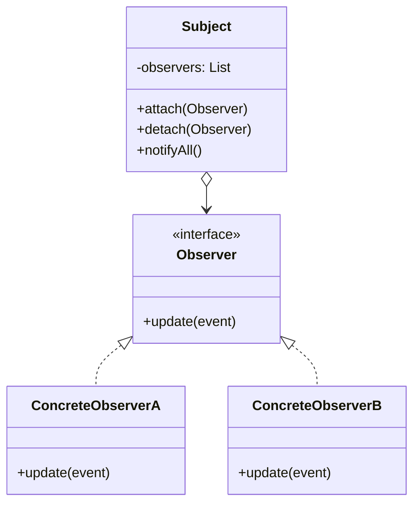

## Intent

> Let an object (the **subject**) broadcast changes to interested parties (**observers**) without knowing who they are.

Use when:
- One object's state change has many downstream effects.
- The number/type of dependents may grow over time.
- You want to decouple the producer from the consumers.

---

## Real-world Analogy

A newsletter. The publisher doesn't know who's subscribed; subscribers come and go. When a new issue is published, everyone on the list gets a copy automatically.

---

## Structure



---

## Example: Stock Price Updates

```java
public interface PriceObserver {
    void onPriceChanged(String symbol, double newPrice);
}

public class StockTicker {
    private final Map<String, Double> prices = new HashMap<>();
    private final List<PriceObserver> observers = new CopyOnWriteArrayList<>();

    public void subscribe(PriceObserver o)   { observers.add(o); }
    public void unsubscribe(PriceObserver o) { observers.remove(o); }

    public void updatePrice(String symbol, double price) {
        prices.put(symbol, price);
        for (PriceObserver o : observers) {
            o.onPriceChanged(symbol, price);
        }
    }
}

class ChartUpdater implements PriceObserver {
    public void onPriceChanged(String s, double p) { /* redraw chart */ }
}

class AlertBot implements PriceObserver {
    public void onPriceChanged(String s, double p) {
        if (p > threshold) sendAlert(s, p);
    }
}

// Wiring
StockTicker ticker = new StockTicker();
ticker.subscribe(new ChartUpdater());
ticker.subscribe(new AlertBot());

ticker.updatePrice("AAPL", 175.50);   // both observers notified
```

The `StockTicker` doesn't know about charts or bots. New observer types come and go without touching the ticker.

---

## Push vs Pull

| **Style** | **Mechanism** | **Pro** | **Con** |
|----------|---------------|---------|---------|
| **Push** | Subject sends data: `update(event)` | Observer doesn't query | Couples subject to what observers want |
| **Pull** | Subject sends signal: `update()`, observer queries subject | Subject stays simple | Observer must hold a reference to subject |

```java
// Push
interface Observer { void update(StockEvent e); }

// Pull
interface Observer { void update(); }
class ChartUpdater implements Observer {
    private StockTicker ticker;
    public void update() { redrawWith(ticker.getPrices()); }
}
```

Push is simpler when observers all want the same data. Pull is more flexible.

---

## Threading & Memory Hazards

### Concurrent modification

If an observer's callback subscribes/unsubscribes during notification, you'll get `ConcurrentModificationException`. Use `CopyOnWriteArrayList` (above) or copy the list before iterating.

### Memory leaks

If `Subject` holds strong references to observers and observers don't unsubscribe, they're kept alive forever. Common in Android, Swing, mobile.

**Fix options:**
- Document an explicit `unsubscribe()` requirement.
- Use `WeakReference` for observers.
- Tie subscription to a lifecycle (e.g., `LiveData` observers in Android scoped to a Lifecycle).

### Synchronous notification

By default, observers run on the subject's thread, in registration order. A slow observer blocks all others. Consider:
- Async dispatch via an executor
- Event bus / message queue (out of process)

---

## Java Built-in Support

```java
// PropertyChangeSupport — built into JavaBeans
private final PropertyChangeSupport pcs = new PropertyChangeSupport(this);
public void addPropertyChangeListener(PropertyChangeListener l) { pcs.addPropertyChangeListener(l); }

void setPrice(double p) {
    double old = this.price;
    this.price = p;
    pcs.firePropertyChange("price", old, p);
}
```

Note: `java.util.Observable` and `Observer` are **deprecated since Java 9** — don't use them. Use `Flow.Publisher`/`Subscriber` (reactive streams) for modern async observers.

---

## Real-world Examples

| **Use case** | **Subject** | **Observers** |
|-------------|-------------|---------------|
| GUI events | Button | Click handlers |
| MVC | Model | Views |
| Pub/sub | Topic | Subscribers |
| Spring `ApplicationEvent` | Publisher | `@EventListener` methods |
| RxJava / Reactor | `Observable` / `Flux` | `Subscriber` |
| `addEventListener` (DOM) | DOM element | Listener functions |

---

## Trade-offs

✅ **Pros:**
- Subject doesn't know about observers — open/closed
- Add/remove observers at runtime
- Many-to-one relationships (multiple subjects, one observer) work too

❌ **Cons:**
- Order of notification is implicit and easy to depend on accidentally
- Memory leaks if observers don't unsubscribe
- Cascading updates can be hard to trace
- Slow observer blocks chain (without async)

---

## Interview Tips

- Use observer when the interviewer says "notify when X happens" or "multiple things should react to ...".
- Mention `CopyOnWriteArrayList` to handle concurrent modification.
- For large-scale, mention upgrade paths: event bus → message queue → kafka.
