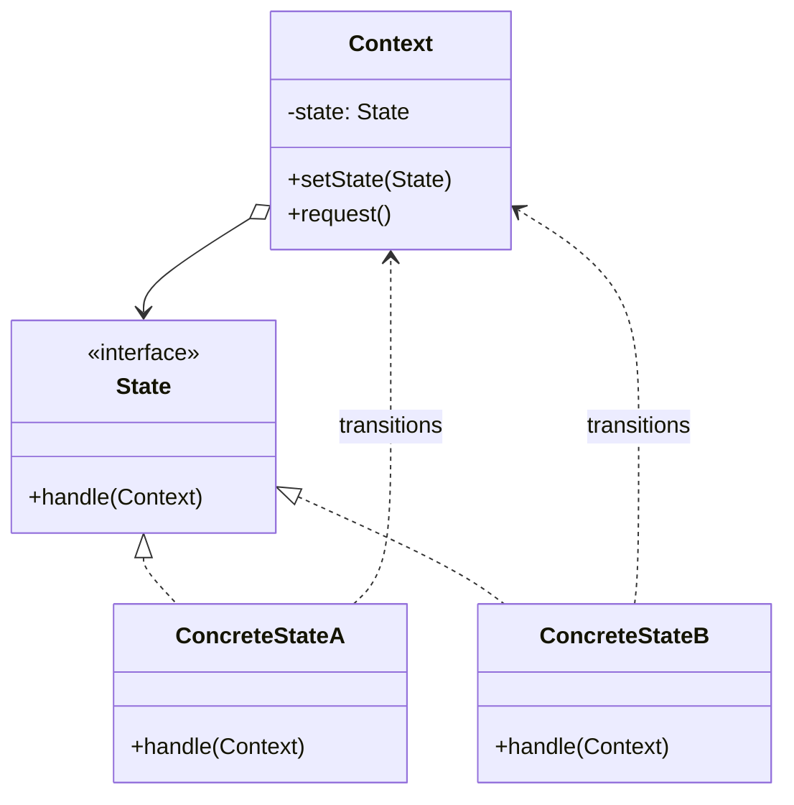
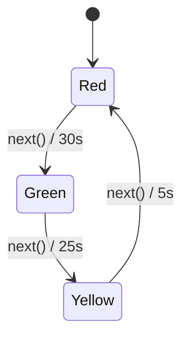

## Intent

> Replace `if (state == X) ... else if (state == Y) ...` cascades by giving each state its **own class** with state-specific behavior.

Use when:
- An object behaves very differently depending on a small set of states.
- State transitions follow well-defined rules.
- You're tired of giant `switch` statements scattered across many methods.

---

## The Smell It Replaces

```java
public class TrafficLight {
    enum Color { RED, YELLOW, GREEN }
    private Color color = Color.RED;

    public void next() {
        switch (color) {
            case RED:    color = Color.GREEN; break;
            case GREEN:  color = Color.YELLOW; break;
            case YELLOW: color = Color.RED; break;
        }
    }

    public int waitSeconds() {
        switch (color) {
            case RED:    return 30;
            case YELLOW: return 5;
            case GREEN:  return 25;
        }
        throw new IllegalStateException();
    }
}
```

Every method is a switch. Add a new state (BLINKING_RED) and you must edit every method.

---

## State Pattern Solution

```java
public interface TrafficLightState {
    TrafficLightState next();
    int waitSeconds();
}

public class RedState implements TrafficLightState {
    public TrafficLightState next() { return new GreenState(); }
    public int waitSeconds() { return 30; }
}
public class GreenState implements TrafficLightState {
    public TrafficLightState next() { return new YellowState(); }
    public int waitSeconds() { return 25; }
}
public class YellowState implements TrafficLightState {
    public TrafficLightState next() { return new RedState(); }
    public int waitSeconds() { return 5; }
}

public class TrafficLight {
    private TrafficLightState state = new RedState();

    public void next() { state = state.next(); }
    public int waitSeconds() { return state.waitSeconds(); }
}
```

Adding `BlinkingRed` = one new class, no edits to existing classes.

---

## Structure



---

## State Diagram



---

## Example: TCP Connection

```java
public interface ConnectionState {
    void open(Connection c);
    void close(Connection c);
    void send(Connection c, byte[] data);
}

class ClosedState implements ConnectionState {
    public void open(Connection c) {
        System.out.println("Opening...");
        c.setState(new OpenState());
    }
    public void close(Connection c) { /* already closed */ }
    public void send(Connection c, byte[] data) {
        throw new IllegalStateException("Cannot send: connection closed");
    }
}

class OpenState implements ConnectionState {
    public void open(Connection c) { /* already open */ }
    public void close(Connection c) {
        System.out.println("Closing...");
        c.setState(new ClosedState());
    }
    public void send(Connection c, byte[] data) {
        System.out.println("Sending " + data.length + " bytes");
    }
}

public class Connection {
    private ConnectionState state = new ClosedState();
    public void setState(ConnectionState s) { this.state = s; }

    public void open()  { state.open(this); }
    public void close() { state.close(this); }
    public void send(byte[] d) { state.send(this, d); }
}
```

The `Connection` doesn't have a single `if` checking which state it's in. Each state object knows what's legal in its world.

---

## State vs Strategy

These are structurally identical (a context delegating to an interface). The difference is **who decides the change**:

| **Pattern** | **Who picks the next behavior?** |
|------------|----------------------------------|
| **Strategy** | Caller picks once, doesn't change |
| **State** | Object self-transitions based on internal events |

A strategy is set externally and stays. A state mutates as the object's lifecycle progresses.

---

## State Transitions: Where to Put Them?

| **Approach** | **Pro** | **Con** |
|-------------|---------|---------|
| State objects decide transitions | States are self-contained | States must know about each other |
| Context decides transitions (with table) | States stay simple | Context grows |

Both are common. Hybrid: states return the next state; context applies it.

---

## Stateless States

If state classes have no per-instance data, they can be **singletons** to avoid allocation churn:

```java
public final class RedState implements TrafficLightState {
    public static final RedState INSTANCE = new RedState();
    private RedState() {}
    public TrafficLightState next() { return GreenState.INSTANCE; }
    public int waitSeconds() { return 30; }
}
```

---

## Real-world Examples

| **Use case** | **States** |
|-------------|-----------|
| Order lifecycle | Pending → Paid → Shipped → Delivered |
| TCP connection | Closed → Listen → SynRcvd → Established → ... |
| Game character | Idle → Walking → Running → Jumping → Falling |
| Document workflow | Draft → InReview → Approved → Published |
| Player media | Stopped → Playing → Paused |
| `Thread.State` (Java) | New, Runnable, Blocked, Waiting, Terminated |

---

## Trade-offs

✅ **Pros:**
- Eliminates state-checking conditionals
- Each state's logic is isolated and testable
- Adding a state doesn't touch existing states (open/closed)
- Behavior tracks state automatically

❌ **Cons:**
- More classes — overkill for 2-state cases
- Transitions are spread across state classes (or centralized but rigid)
- Shared data needs thoughtful placement (context vs state)

---

## Interview Tips

- Reach for state when the interviewer describes a workflow with a small set of clearly-named stages.
- Draw the state diagram first — interviewers love seeing the transitions visualized.
- Mention LSP: each state must honor the same contract (don't have one state throw on a method others handle).
