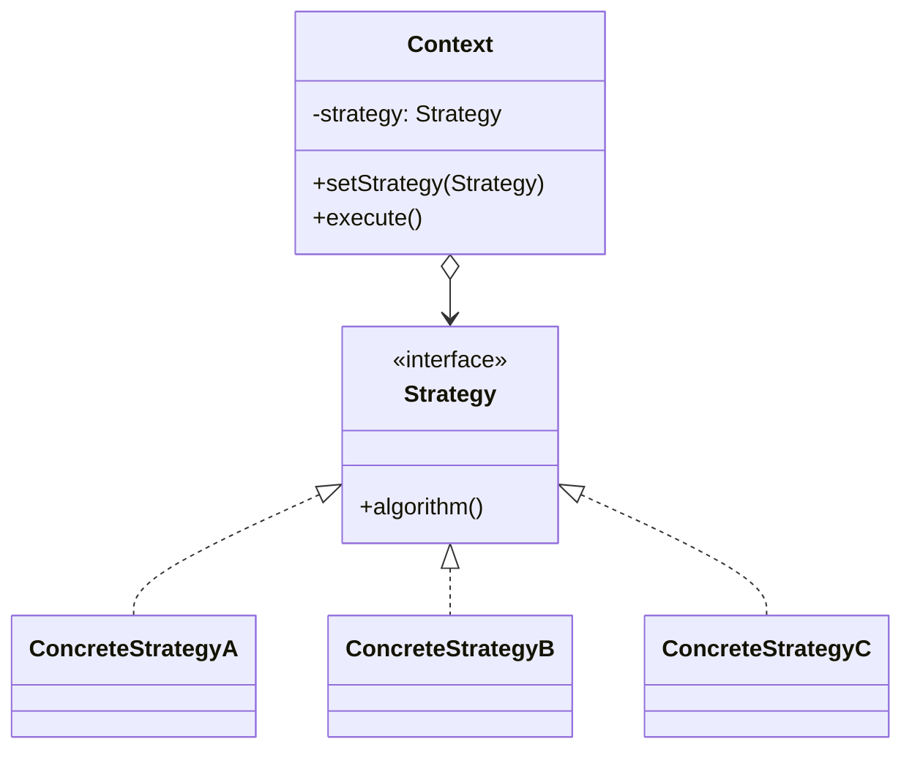

## Intent

> Pull a varying algorithm out into a separate class hierarchy so the **caller picks** which version to use.

Use when:
- A class has multiple variants of an algorithm (sorting, pricing, routing).
- The variants are selected at runtime by config, user input, or A/B test.
- You want to avoid `if/else` or `switch` cascades on a strategy code.

---

## The Smell It Replaces

```java
public double calculatePrice(Order o, String pricingMode) {
    if (pricingMode.equals("standard")) {
        return o.subtotal() + o.tax();
    } else if (pricingMode.equals("discount")) {
        return o.subtotal() * 0.9 + o.tax();
    } else if (pricingMode.equals("premium")) {
        return o.subtotal() * 1.2 + o.tax();
    }
    throw new IllegalArgumentException();
}
```

Adding a new mode means editing this method (open/closed violation).

---

## Strategy Solution

```java
public interface PricingStrategy {
    double calculate(Order o);
}

class StandardPricing implements PricingStrategy {
    public double calculate(Order o) { return o.subtotal() + o.tax(); }
}
class DiscountPricing implements PricingStrategy {
    public double calculate(Order o) { return o.subtotal() * 0.9 + o.tax(); }
}
class PremiumPricing implements PricingStrategy {
    public double calculate(Order o) { return o.subtotal() * 1.2 + o.tax(); }
}

public class Checkout {
    private PricingStrategy pricing;

    public void setPricing(PricingStrategy p) { this.pricing = p; }

    public double total(Order o) { return pricing.calculate(o); }
}
```

Adding a new pricing mode = a new class. No edits to existing code.

---

## Structure



---

## Example: Sort Strategy

```java
public interface SortStrategy<T> {
    List<T> sort(List<T> input);
}

class QuickSort<T extends Comparable<T>> implements SortStrategy<T> {
    public List<T> sort(List<T> input) { /* ... */ }
}

class MergeSort<T extends Comparable<T>> implements SortStrategy<T> {
    public List<T> sort(List<T> input) { /* ... */ }
}

// Pick strategy by data size
SortStrategy<Integer> strategy = data.size() < 100
    ? new InsertionSort<>()
    : new QuickSort<>();

List<Integer> sorted = strategy.sort(data);
```

---

## Strategy with Lambdas (Modern Java)

When the strategy is a single method, you don't need a class:

```java
class Checkout {
    private Function<Order, Double> pricing;

    public void setPricing(Function<Order, Double> p) { this.pricing = p; }
    public double total(Order o) { return pricing.apply(o); }
}

// Usage
checkout.setPricing(o -> o.subtotal() + o.tax());
checkout.setPricing(o -> o.subtotal() * 0.9 + o.tax());
```

`Function`, `Predicate`, `Consumer`, `Supplier` are built-in lambda strategies.

---

## Strategy vs State vs Template Method

These three are easy to confuse — they all involve swappable behavior:

| **Pattern** | **Who decides?** | **What's it about?** |
|------------|------------------|---------------------|
| **Strategy** | Caller picks before calling | Interchangeable algorithms |
| **State** | The object's own state changes itself | Lifecycle / state machines |
| **Template method** | Base class fixes the skeleton, subclass fills in steps | Inheritance-based |

Strategy: client controls. State: object self-modifies. Template: parent class controls.

---

## Real-world Examples

| **Use case** | **Strategies** |
|-------------|----------------|
| `Comparator` in Java | Different sort orders |
| Compression algorithms | gzip, zstd, snappy |
| Routing in Maps | shortest, fastest, scenic |
| Authentication | OAuth, SAML, password |
| Tax calculation | Per-region rules |
| Discount engine | Coupon, loyalty, bulk, promo |

---

## Trade-offs

✅ **Pros:**
- Open/closed: add new strategies without touching the context
- Strategies are isolated and individually testable
- Eliminates conditional cascades
- Runtime swappable

❌ **Cons:**
- More classes — even trivial strategies become a class each (lambdas help)
- Caller must know which strategy to pick
- Strategies must share a common interface — sometimes forced

---

## Interview Tips

- Reach for strategy when you see `if/else` or `switch` cascades on a *kind* parameter.
- Mention lambdas as a lighter-weight alternative when the interface has one method.
- Distinguish from state: state objects swap themselves; strategies are picked from outside.
