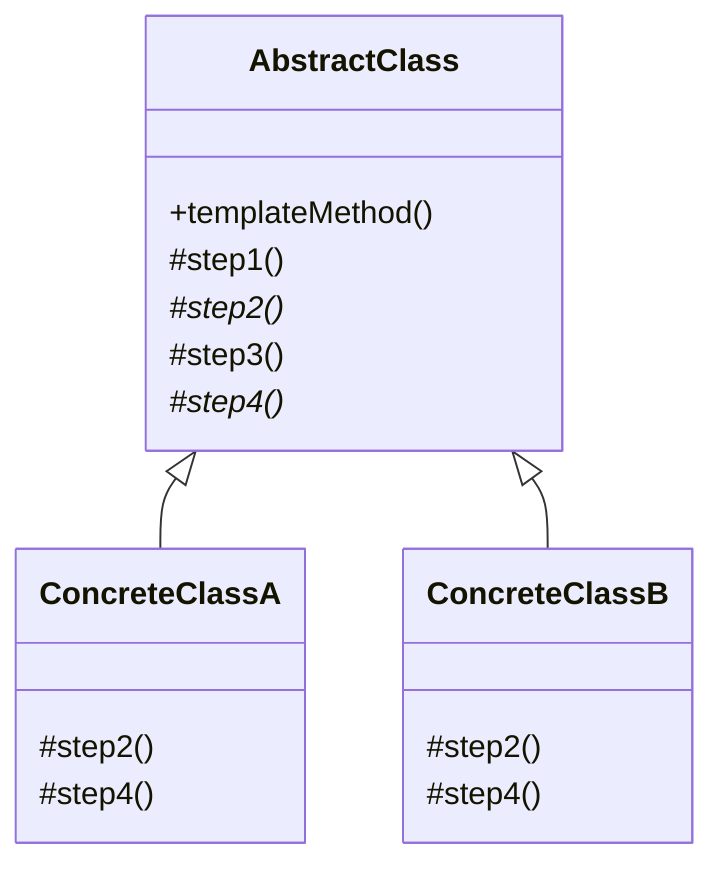
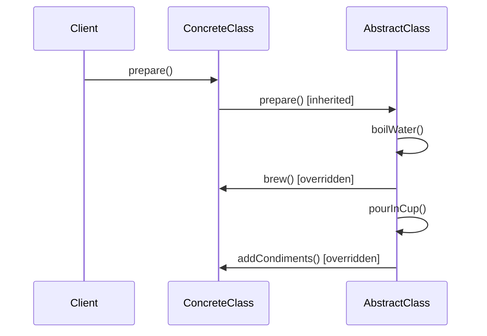

## Intent

> Fix the algorithm's **structure** in a parent class, but let subclasses customize **specific steps** without changing the overall flow.

Use when:
- Multiple classes follow the same overall algorithm but differ in details.
- You want to enforce a consistent sequence of steps.
- You see duplicated structure across classes that differ only in a few methods.

---

## Real-world Analogy

A coffee shop's process:
1. Boil water
2. Brew (coffee uses grounds; tea uses leaves)
3. Pour in cup
4. Add condiments (coffee: milk, sugar; tea: lemon, honey)

Steps 1 and 3 are identical. Steps 2 and 4 differ. Template method puts the sequence in the parent and lets subclasses define the variable steps.

---

## Structure



`*` = abstract; subclass must implement.

---

## Example: Beverage

```java
public abstract class Beverage {
    // Template method — final so subclasses can't reorder
    public final void prepare() {
        boilWater();
        brew();
        pourInCup();
        addCondiments();
    }

    private void boilWater() { System.out.println("Boiling water"); }
    private void pourInCup() { System.out.println("Pouring into cup"); }

    protected abstract void brew();
    protected abstract void addCondiments();
}

public class Coffee extends Beverage {
    protected void brew() { System.out.println("Dripping coffee through filter"); }
    protected void addCondiments() { System.out.println("Adding sugar and milk"); }
}

public class Tea extends Beverage {
    protected void brew() { System.out.println("Steeping tea"); }
    protected void addCondiments() { System.out.println("Adding lemon"); }
}

// Usage
new Coffee().prepare();
new Tea().prepare();
```

The order is fixed. Each beverage subclass only fills in `brew()` and `addCondiments()`.

---

## Hooks

A **hook** is a method with a default (often empty) implementation that subclasses *may* override:

```java
public abstract class Beverage {
    public final void prepare() {
        boilWater();
        brew();
        pourInCup();
        if (customerWantsCondiments()) {
            addCondiments();
        }
    }

    // Hook — default true, override to change
    protected boolean customerWantsCondiments() { return true; }

    protected abstract void brew();
    protected abstract void addCondiments();
}

public class BlackCoffee extends Coffee {
    @Override
    protected boolean customerWantsCondiments() { return false; }
}
```

Hooks let subclasses optionally tweak the algorithm without forcing them to.

---

## The Hollywood Principle

> **"Don't call us, we'll call you."**

Subclasses don't call the parent's algorithm — the parent calls *into* the subclass at hook points. This **inverts control** and is what distinguishes template method from "inherit and call super":



---

## Example: Test Framework

JUnit's `@Before` / `@Test` / `@After` is template method:

```java
public abstract class TestCase {
    public void run() {
        setUp();
        try {
            runTest();
        } finally {
            tearDown();
        }
    }

    protected void setUp() {}                  // hook
    protected void tearDown() {}                // hook
    protected abstract void runTest();          // required
}

public class MyTest extends TestCase {
    @Override
    protected void setUp() { /* prepare DB */ }
    @Override
    protected void runTest() { /* assertions */ }
}
```

---

## Template Method vs Strategy

Both let an algorithm vary, but very differently:

| **Pattern** | **Mechanism** | **Variation point** |
|------------|---------------|---------------------|
| **Template method** | Inheritance | Subclass overrides specific steps |
| **Strategy** | Composition | Caller injects whole algorithm |

Template fixes the skeleton, varies pieces. Strategy varies the whole thing.

---

## Real-world Examples

| **API** | **Template method** |
|--------|---------------------|
| `HttpServlet.service()` | Calls `doGet()`, `doPost()` etc., subclass implements |
| `AbstractList`, `AbstractMap` | Skeletons; subclass overrides a few methods |
| Spring's `JdbcTemplate.query()` | Boilerplate; you supply mapper |
| JUnit `TestCase` | run = setUp + test + tearDown |
| Android `Activity.onCreate()` | Lifecycle hooks |

---

## Trade-offs

✅ **Pros:**
- Eliminates duplicated algorithm structure
- Enforces a consistent sequence of steps
- Subclasses customize cheaply (override 1–2 methods)
- Hooks make hooks optional

❌ **Cons:**
- Inheritance: subclass coupled to parent's structure
- Adding a step changes parent and all subclasses
- Hierarchy becomes rigid; runtime swap requires composition
- Easy to inadvertently expose private state via `protected` hooks

---

## Interview Tips

- Reach for template method when the interviewer says "we have N flows that all do X, Y, Z but step Y differs."
- Make the template method `final` so subclasses can't reorder steps.
- Use abstract methods for **required** steps, hooks (with default) for **optional** ones.
- Compare to strategy: template = inheritance, strategy = composition.
