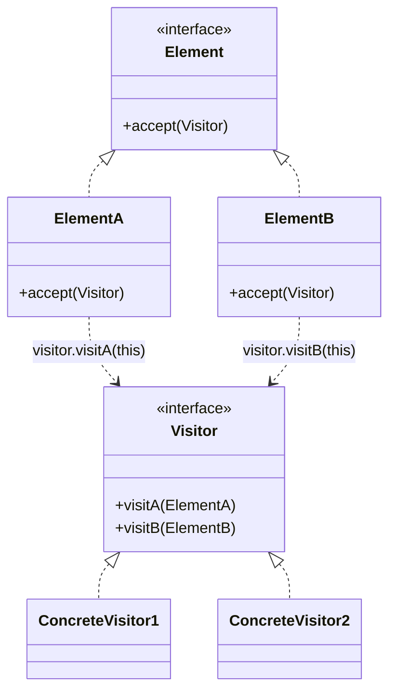
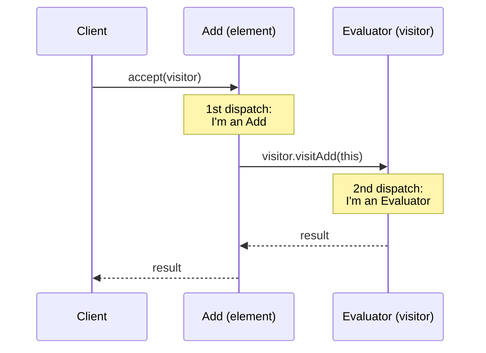

## Intent

> Add new **operations** over a class hierarchy without modifying the classes themselves. The trick: each element accepts a visitor and dispatches based on its concrete type (**double dispatch**).

Use when:
- The object hierarchy is stable but you keep adding operations.
- Operations span the whole hierarchy (e.g., serialize, print, validate, compute size).
- Putting these operations in the classes themselves would bloat them with unrelated concerns.

---

## The Problem It Solves

You have an expression tree (`Number`, `Add`, `Mul`). You want to:
- Evaluate
- Pretty-print
- Compute depth
- Compile to bytecode
- Type-check

Adding all five methods to every class clutters them. Visitor pulls each algorithm into its own class.

---

## Structure



---

## Example: Expression Tree

### Element hierarchy

```java
public interface Expr {
    <R> R accept(ExprVisitor<R> visitor);
}

public class Num implements Expr {
    public final int value;
    public Num(int v) { this.value = v; }
    public <R> R accept(ExprVisitor<R> v) { return v.visitNum(this); }
}

public class Add implements Expr {
    public final Expr left, right;
    public Add(Expr l, Expr r) { this.left = l; this.right = r; }
    public <R> R accept(ExprVisitor<R> v) { return v.visitAdd(this); }
}

public class Mul implements Expr {
    public final Expr left, right;
    public Mul(Expr l, Expr r) { this.left = l; this.right = r; }
    public <R> R accept(ExprVisitor<R> v) { return v.visitMul(this); }
}
```

### Visitor interface

```java
public interface ExprVisitor<R> {
    R visitNum(Num n);
    R visitAdd(Add a);
    R visitMul(Mul m);
}
```

### Concrete visitors

```java
public class Evaluator implements ExprVisitor<Integer> {
    public Integer visitNum(Num n) { return n.value; }
    public Integer visitAdd(Add a) { return a.left.accept(this) + a.right.accept(this); }
    public Integer visitMul(Mul m) { return m.left.accept(this) * m.right.accept(this); }
}

public class Printer implements ExprVisitor<String> {
    public String visitNum(Num n) { return Integer.toString(n.value); }
    public String visitAdd(Add a) { return "(" + a.left.accept(this) + " + " + a.right.accept(this) + ")"; }
    public String visitMul(Mul m) { return "(" + a.left.accept(this) + " * " + a.right.accept(this) + ")"; }
}

public class DepthCounter implements ExprVisitor<Integer> {
    public Integer visitNum(Num n) { return 1; }
    public Integer visitAdd(Add a) { return 1 + Math.max(a.left.accept(this), a.right.accept(this)); }
    public Integer visitMul(Mul m) { return 1 + Math.max(m.left.accept(this), m.right.accept(this)); }
}
```

### Usage

```java
Expr e = new Mul(new Add(new Num(2), new Num(3)), new Num(4));

System.out.println(e.accept(new Evaluator()));       // 20
System.out.println(e.accept(new Printer()));         // ((2 + 3) * 4)
System.out.println(e.accept(new DepthCounter()));    // 3
```

To add a new operation (`Compiler`, `TypeChecker`), write a new visitor — no changes to `Expr`/`Num`/`Add`/`Mul`.

---

## Double Dispatch

Java methods dispatch on the receiver only — single dispatch. To dispatch on **both** the visitor and the element, you need two virtual calls:

```java
e.accept(visitor)            // 1st dispatch: which Expr subtype?
   -> visitor.visitNum(n)    // 2nd dispatch: which Visitor subtype?
```

That's why `accept()` exists — it's the bridge from "which element type?" to "which visitor method?"



---

## The Trade-off

Visitor makes adding **operations** easy but adding **element types** hard:

| | **Add a new element type** | **Add a new operation** |
|---|---------------------------|------------------------|
| Without visitor (methods on elements) | Easy — just one new class | Hard — edit every class |
| With visitor | Hard — every visitor needs a new method | Easy — one new visitor class |

Pick visitor when the hierarchy is **stable** but operations grow. Don't pick visitor for hierarchies that change a lot.

---

## Real-world Examples

| **Use case** | **Visitors** |
|-------------|--------------|
| Compiler ASTs | Type checker, optimizer, code generator |
| File system | Disk usage, search, permission audit |
| XML / JSON DOM | Validators, transformers, pretty-printers |
| `javax.lang.model` | Java annotation processors |
| Roslyn (.NET compiler) | Syntax tree visitors |

---

## Modern Alternatives

In modern Java, **sealed interfaces + pattern matching** can replace visitor:

```java
public sealed interface Expr permits Num, Add, Mul {}

int evaluate(Expr e) {
    return switch (e) {
        case Num n -> n.value;
        case Add a -> evaluate(a.left) + evaluate(a.right);
        case Mul m -> evaluate(m.left) * evaluate(m.right);
    };
}
```

The compiler enforces exhaustiveness without the visitor boilerplate. Use this when targeting Java 21+.

---

## Trade-offs

✅ **Pros:**
- Add new operations without modifying element classes
- Each operation lives in one focused class
- Visitor can carry state across visits (accumulators)

❌ **Cons:**
- Adding element types is painful (touches every visitor)
- Boilerplate: `accept` + N visit methods per visitor
- Visitor needs access to element internals (often forces public fields)
- Less natural than methods-on-classes for newcomers

---

## Interview Tips

- Use visitor when the interviewer says "the data is stable but we keep adding analyses / outputs / reports."
- Mention double dispatch by name — interviewers like the term.
- For Java 21+, mention sealed types + switch patterns as the modern alternative.
