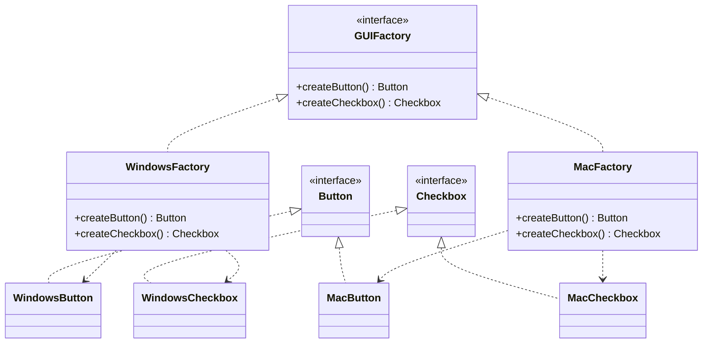

## Intent

> Create **families** of related objects together, ensuring they are compatible with each other.

The classic motivating example: a UI toolkit with consistent look-and-feel. If you pick a Mac theme, every widget — button, scrollbar, menu — should be Mac-styled. Mixing a Mac button with a Windows scrollbar is a bug.

---

## Factory Method vs Abstract Factory

| **Aspect** | **Factory Method** | **Abstract Factory** |
|-----------|-------------------|---------------------|
| Scale | One product | Family of products |
| Mechanism | Subclass overrides one method | One factory class with multiple methods |
| When to add a new variant | New subclass | New concrete factory class |

If you need exactly *one* product → factory method. If you need a *suite* of related products → abstract factory.

---

## Structure



---

## Code

```java
// Product interfaces
public interface Button   { void render(); void click(); }
public interface Checkbox { void render(); void toggle(); }

// Concrete products — Windows family
class WindowsButton   implements Button   { public void render() {/*...*/} public void click() {} }
class WindowsCheckbox implements Checkbox { public void render() {/*...*/} public void toggle() {} }

// Concrete products — Mac family
class MacButton   implements Button   { public void render() {/*...*/} public void click() {} }
class MacCheckbox implements Checkbox { public void render() {/*...*/} public void toggle() {} }

// Abstract factory
public interface GUIFactory {
    Button createButton();
    Checkbox createCheckbox();
}

class WindowsFactory implements GUIFactory {
    public Button   createButton()   { return new WindowsButton(); }
    public Checkbox createCheckbox() { return new WindowsCheckbox(); }
}

class MacFactory implements GUIFactory {
    public Button   createButton()   { return new MacButton(); }
    public Checkbox createCheckbox() { return new MacCheckbox(); }
}
```

### Caller

```java
public class Application {
    private final Button button;
    private final Checkbox checkbox;

    public Application(GUIFactory factory) {
        this.button = factory.createButton();
        this.checkbox = factory.createCheckbox();
    }
}

// Wire up at startup
GUIFactory factory = isMac() ? new MacFactory() : new WindowsFactory();
Application app = new Application(factory);
```

The `Application` doesn't import any concrete `MacButton` or `WindowsButton` — it works with whatever family is injected.

---

## When to Use

| **Scenario** | **Why it fits** |
|-------------|-----------------|
| UI themes | Family = button + scrollbar + menu, all matching |
| Cross-database queries | Family = Connection + Statement + ResultSet, per vendor |
| Cross-platform file system | Family = Path + Watcher + Permissions, per OS |
| Game enemies | Family = orc + orc-archer + orc-shaman per faction |

---

## Real-world Examples

- **JDBC**: Each vendor's driver is an abstract factory producing `Connection`, `Statement`, `ResultSet`.
- **`javax.xml.parsers.DocumentBuilderFactory`**: returns `DocumentBuilder` and related parsers.
- **AWT/Swing `LookAndFeel`**: produces UI components matching the theme.

---

## Trade-offs

✅ **Pros:**
- Guarantees compatibility within a family
- Caller code is decoupled from concrete classes
- Swap whole families at runtime

❌ **Cons:**
- Adding a new **product type** (e.g., `Slider`) requires changing the factory interface and *every* concrete factory
- More boilerplate than factory method
- Easy to over-apply when factory method would suffice

---

## Interview Tips

- Use abstract factory when the interviewer's problem mentions **"two themes"**, **"two databases"**, **"two file formats"**, or any cross-cutting variation.
- If they say "we want consistent X across the app," that's a family — abstract factory.
- Volunteer the trade-off: easy to add a new family, hard to add a new product type.
