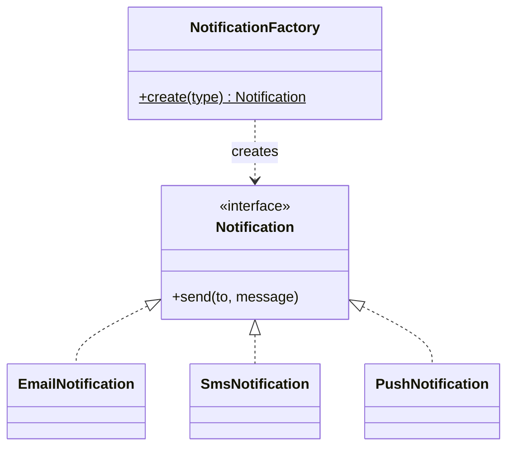
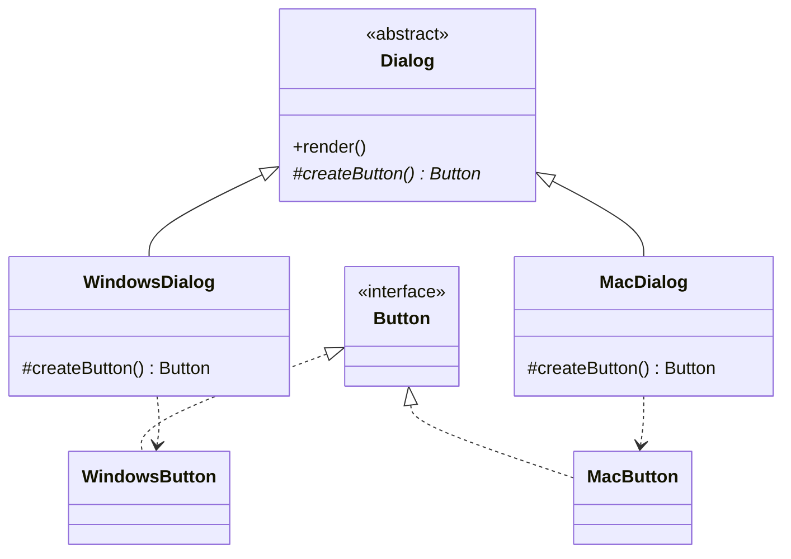
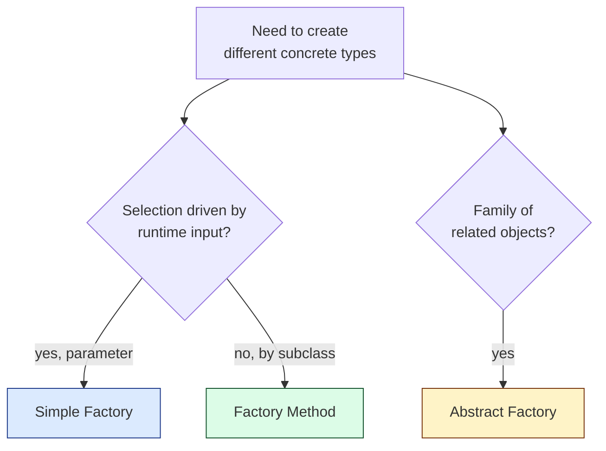

## Intent

> Encapsulate object creation behind a method, so callers don't depend on concrete classes.

Use when:
- The class to instantiate is decided by runtime data (input string, config, type code).
- You want to **decouple construction from use** so adding a new type doesn't change every caller.

---

## Two Variants

The "Factory" name covers two related-but-distinct patterns:

| **Pattern** | **What it returns** | **Selected by** |
|------------|--------------------|-----------------| 
| **Simple Factory** (idiom, not GoF) | One class with a static method that returns a product | A parameter (string, enum) |
| **Factory Method** (GoF) | An abstract method overridden by subclasses | The subclass type |

Most interviews say "factory" and mean the simple factory. Know both.

---

## Simple Factory

```java
public enum NotificationType { EMAIL, SMS, PUSH }

public interface Notification {
    void send(String to, String message);
}

public class NotificationFactory {
    public static Notification create(NotificationType type) {
        switch (type) {
            case EMAIL: return new EmailNotification();
            case SMS:   return new SmsNotification();
            case PUSH:  return new PushNotification();
            default: throw new IllegalArgumentException("Unknown: " + type);
        }
    }
}

// Usage
Notification n = NotificationFactory.create(NotificationType.EMAIL);
n.send("alice@example.com", "Welcome!");
```

The caller doesn't import `EmailNotification`. Adding `WhatsappNotification` is one new case in the factory.

### Class diagram



---

## Factory Method (GoF)

The decision of which class to instantiate is deferred to **subclasses**, not a parameter.

```java
public abstract class Dialog {
    // Template method
    public void render() {
        Button button = createButton();   // factory method
        button.draw();
    }

    protected abstract Button createButton();
}

public class WindowsDialog extends Dialog {
    @Override
    protected Button createButton() { return new WindowsButton(); }
}

public class MacDialog extends Dialog {
    @Override
    protected Button createButton() { return new MacButton(); }
}
```



The `Dialog` base class drives the algorithm; the subclass plugs in the right `Button`.

---

## When to Use Which



---

## Comparison

| **Factory variant** | **Adds new type means...** | **Coupling** |
|--------------------|---------------------------|--------------|
| Simple factory | Edit the `switch` statement | Centralized |
| Factory method | Add a new subclass | Distributed |
| Abstract factory | Add a new factory subclass + product family | Distributed |

Simple factory violates Open/Closed (you edit existing code). Factory method satisfies it (add a new subclass).

---

## Real-world Examples

| **Library** | **Factory** |
|------------|-------------|
| `Calendar.getInstance()` | Returns locale-appropriate calendar |
| `NumberFormat.getInstance()` | Locale-appropriate number format |
| `LoggerFactory.getLogger()` | SLF4J logger wired to the active backend |
| `Connection.createStatement()` | JDBC statement matching the driver |
| `ThreadFactory` | Customize thread creation in pools |

---

## Anti-patterns

- **God factory** — one class that creates 50 unrelated types. Split by domain.
- **Factory of one** — if you only have one product, you don't need a factory; just call `new`.
- **Reflective factory** — `Class.forName(name).newInstance()` defeats compile-time safety. Use a registered map of suppliers instead.

---

## Interview Tips

- Distinguish simple factory from factory method when asked.
- Justify with "the caller shouldn't know about concrete subclasses" — that's the *real* reason, not "encapsulation" buzzword.
- Mention that **dependency injection** is often a better answer for "where do objects come from?" in modern code.
