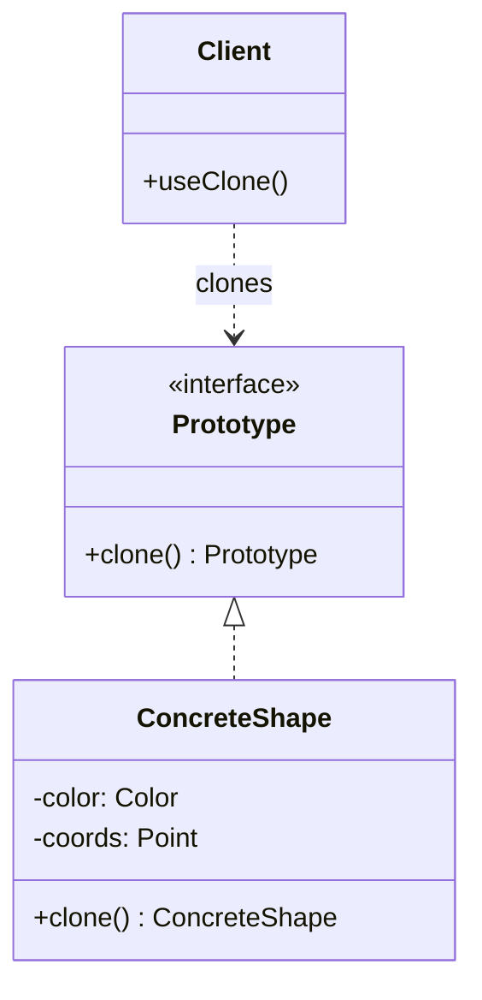
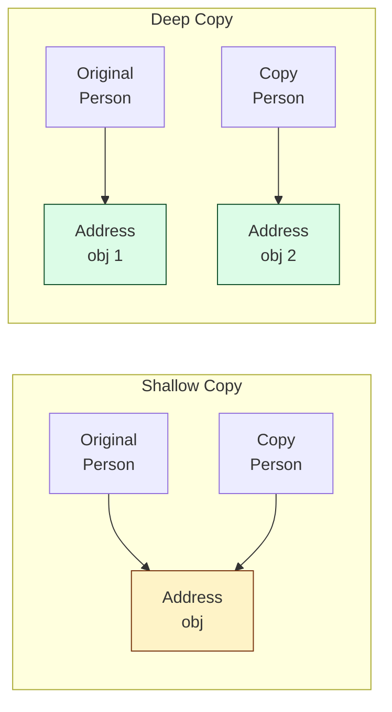

## Intent

> Specify the kinds of objects to create using a **prototypical instance**, and create new objects by **copying** this prototype.

Use when:
- Object creation is expensive (deserialization, network call, heavy computation).
- The exact class isn't known until runtime — you have a registry of prototypes.
- You want to avoid a parallel hierarchy of factory classes.

---

## Structure



---

## Implementation

```java
public abstract class Shape implements Cloneable {
    protected int x, y;
    protected String color;

    public Shape() {}

    public Shape(Shape source) {
        if (source != null) {
            this.x = source.x;
            this.y = source.y;
            this.color = source.color;
        }
    }

    public abstract Shape clone();
}

public class Circle extends Shape {
    private int radius;

    public Circle() {}

    public Circle(Circle source) {
        super(source);
        this.radius = source.radius;
    }

    @Override
    public Shape clone() { return new Circle(this); }
}

public class Rectangle extends Shape {
    private int width, height;

    public Rectangle() {}

    public Rectangle(Rectangle source) {
        super(source);
        this.width = source.width;
        this.height = source.height;
    }

    @Override
    public Shape clone() { return new Rectangle(this); }
}
```

### Usage

```java
Circle blueprint = new Circle();
blueprint.color = "red";
blueprint.radius = 10;

Circle copy1 = (Circle) blueprint.clone();   // new red circle, radius 10
copy1.color = "blue";                        // does not affect blueprint
```

---

## Prototype Registry

When the type isn't known until runtime, store prototypes in a registry:

```java
public class ShapeRegistry {
    private final Map<String, Shape> prototypes = new HashMap<>();

    public void register(String key, Shape prototype) {
        prototypes.put(key, prototype);
    }

    public Shape create(String key) {
        Shape proto = prototypes.get(key);
        return proto == null ? null : proto.clone();
    }
}

// Setup
ShapeRegistry registry = new ShapeRegistry();
registry.register("redCircle", redCircle);
registry.register("blueSquare", blueSquare);

// Usage
Shape s1 = registry.create("redCircle");   // clone of red circle
Shape s2 = registry.create("redCircle");   // independent clone
```

---

## Shallow vs Deep Copy



| **Copy type** | **Reference fields** | **Independence** |
|--------------|---------------------|------------------|
| Shallow | shared with original | mutating the shared field affects both |
| Deep | duplicated | fully independent |

For mutable nested objects, you almost always want a **deep copy**. The example above is deep: `super(source)` copies primitives, and each subclass copies its own fields.

---

## Java's `Cloneable` is Cursed

Java has a `Cloneable` interface and `Object.clone()`. **Don't use them.** Reasons:

1. `Cloneable` is a marker interface that doesn't declare `clone()`.
2. `Object.clone()` is `protected` and throws a checked exception.
3. Default `clone()` is shallow — you have to override and recurse manually.
4. It bypasses constructors, breaking invariants.

**Prefer a copy constructor** (the example above) or a static `copyOf()` method.

---

## Real-world Examples

| **Use case** | **Why prototype** |
|-------------|------------------|
| Game objects (enemies, items) | Cloning a configured prototype is cheaper than re-reading config |
| GUI components | Drag-and-drop creates clones of palette items |
| Document templates | New document = clone of template |
| Heavy ML model state | Clone trained model state for parallel inference |
| Compiler AST nodes | Clone subtrees during transformations |

---

## Trade-offs

✅ **Pros:**
- Avoids expensive re-construction
- No factory hierarchy needed for variable types
- Adds new types at runtime via registry

❌ **Cons:**
- Deep cloning of complex graphs is hard (cycles, shared refs)
- Easy to get shallow-vs-deep wrong
- Doesn't compose well with `final` fields if using `Object.clone()`

---

## Interview Tips

- Distinguish shallow from deep copy explicitly — interviewers test for this.
- Mention copy constructor as the modern Java idiom over `Cloneable`.
- Use prototype + registry when the interviewer says "we have N pre-configured templates and need to spawn instances of any of them."
