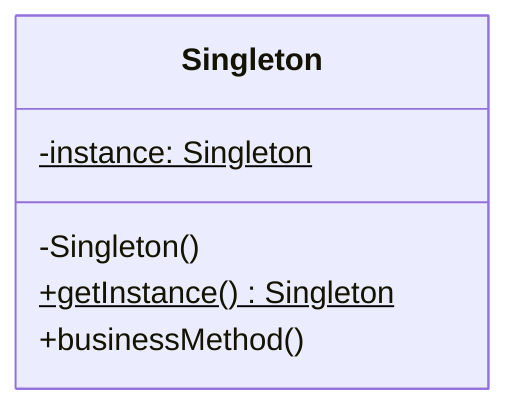

## Intent

> Guarantee that **at most one instance** of a class exists in the JVM, and expose a global point of access.

Use when the object models something inherently *single*: a connection pool, a configuration registry, a hardware controller, a logger writing to one file.

---

## Structure



`$` denotes static.

---

## Implementations (in order of preference)

### 1. Enum (Joshua Bloch's recommendation)

```java
public enum ConfigRegistry {
    INSTANCE;

    private final Map<String, String> data = new ConcurrentHashMap<>();

    public String get(String key) { return data.get(key); }
    public void set(String k, String v) { data.put(k, v); }
}

// Usage
ConfigRegistry.INSTANCE.get("db.url");
```

**Why best:** thread-safe by JVM guarantee, serialization-safe, reflection-safe. The JVM enforces single instance.

### 2. Eager initialization

```java
public class Logger {
    private static final Logger INSTANCE = new Logger();
    private Logger() {}
    public static Logger getInstance() { return INSTANCE; }
}
```

**Use when:** instance is cheap to create and always needed.

### 3. Double-checked locking (lazy)

```java
public class ConnectionPool {
    private static volatile ConnectionPool instance;   // volatile is critical

    private ConnectionPool() { /* expensive init */ }

    public static ConnectionPool getInstance() {
        if (instance == null) {
            synchronized (ConnectionPool.class) {
                if (instance == null) {
                    instance = new ConnectionPool();
                }
            }
        }
        return instance;
    }
}
```

**Use when:** instance is expensive to create and may not be needed.
**Watch out:** without `volatile`, the JVM can reorder writes and another thread can see a half-constructed object.

### 4. Initialization-on-demand holder

```java
public class Cache {
    private Cache() {}

    private static class Holder {
        static final Cache INSTANCE = new Cache();
    }

    public static Cache getInstance() { return Holder.INSTANCE; }
}
```

**Why elegant:** the JVM lazy-loads the inner class only when `getInstance()` is called, and class initialization is thread-safe by language spec. No `synchronized`, no `volatile`.

---

## Anti-pattern: the broken double-check

```java
// BUG: missing volatile
private static ConnectionPool instance;

public static ConnectionPool getInstance() {
    if (instance == null) {
        synchronized (...) {
            if (instance == null) instance = new ConnectionPool();
        }
    }
    return instance;
}
```

Without `volatile`, the assignment `instance = new ConnectionPool()` can be split into:
1. allocate memory
2. assign reference (instance is now non-null)
3. run constructor

A second thread can hit step 2 and use a half-constructed object. **Always use `volatile` with double-checked locking, or use the holder idiom.**

---

## When to *avoid* Singleton

| **Concern** | **Why it's a problem** |
|------------|----------------------|
| Hidden global state | Methods that look pure depend on the singleton |
| Untestable | Can't substitute a mock — `getInstance()` always returns the real one |
| Hides dependencies | Caller's signature doesn't reveal what it uses |
| Concurrency hazards | Single instance shared across threads |
| Multiple JVMs | A singleton is per-JVM; in a clustered service, you have N |

**Better alternative for most cases:** dependency injection. Create one instance at app startup and inject it where needed. You get the "one instance" property without the global access pain.

```java
// Worse: singleton
class Service { void f() { Logger.getInstance().log("hi"); } }

// Better: injection
class Service {
    private final Logger logger;
    Service(Logger logger) { this.logger = logger; }
    void f() { logger.log("hi"); }
}
```

---

## Real-world Examples

| **Use case** | **Why singleton fits** |
|-------------|----------------------|
| `Runtime.getRuntime()` | One JVM runtime per process |
| Database connection pool | Shared, expensive resource |
| Application configuration | Single source of truth |
| Hardware drivers (printer, GPU) | Physical singleton |
| Spring beans (default scope) | Framework manages single instance |

---

## Interview Tips

- Lead with **enum** — it's the textbook-correct answer in modern Java.
- If asked about thread safety, mention `volatile` + double-checked locking, *or* the holder idiom.
- Acknowledge the testability tradeoff. The interviewer will respect that you know it's not free.
- Be ready for: "what about reflection / serialization / cloning attacks?" — enum handles all three; manual implementations need explicit defenses.
