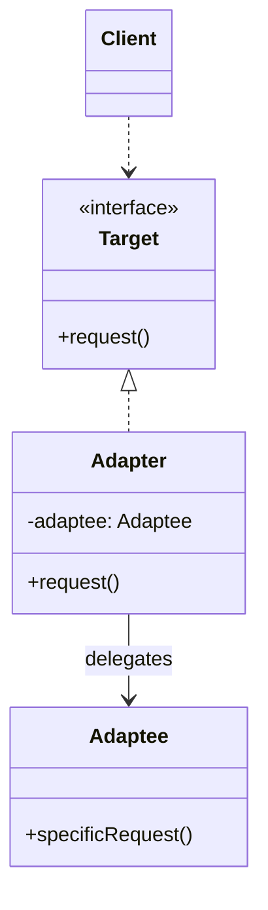
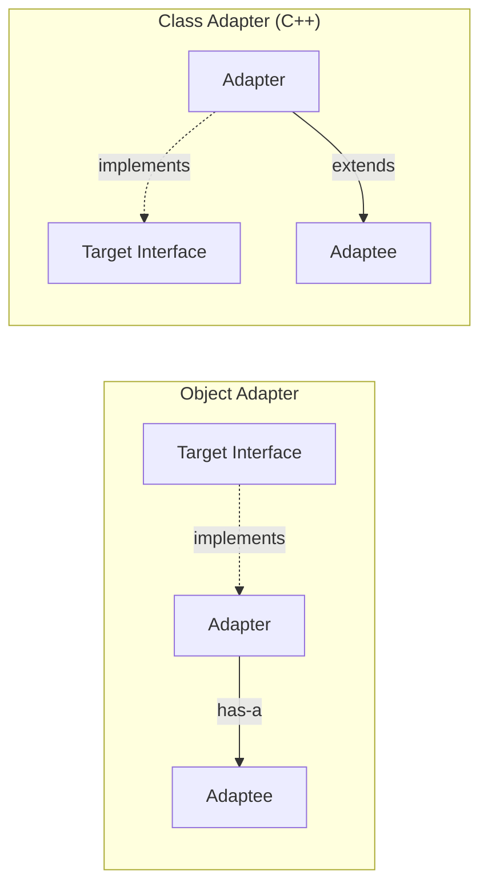

## Intent

> Make incompatible interfaces work together by wrapping one in a class that exposes the expected interface.

Use when:
- You have legacy code or a third-party library with a different API.
- You can't change the existing class (no source, or many callers depend on it).
- You want to integrate without rewriting either side.

---

## Real-world Analogy

A power adapter — your laptop has a US plug, the wall has an EU socket. You don't rewire the laptop or the building; you put a small adapter between them.

---

## Structure



---

## Example: Adapting a Legacy Payment API

The new system expects:

```java
public interface PaymentProcessor {
    PaymentResult charge(Money amount, Card card);
}
```

The legacy library only offers:

```java
public class LegacyPayments {
    // returns 0 = ok, 1 = declined, 2 = error
    public int makePayment(double dollars, String cardNumber, String cvv) { /* ... */ }
}
```

Wrap it:

```java
public class LegacyPaymentAdapter implements PaymentProcessor {
    private final LegacyPayments legacy;

    public LegacyPaymentAdapter(LegacyPayments legacy) {
        this.legacy = legacy;
    }

    @Override
    public PaymentResult charge(Money amount, Card card) {
        int code = legacy.makePayment(
            amount.toDollars(),
            card.number(),
            card.cvv()
        );
        return switch (code) {
            case 0  -> PaymentResult.success();
            case 1  -> PaymentResult.declined("Card declined");
            default -> PaymentResult.error("Gateway error");
        };
    }
}
```

The rest of the codebase only sees `PaymentProcessor`. The legacy mess is contained.

---

## Object Adapter vs Class Adapter

| **Variant** | **Mechanism** | **Pros** | **Cons** |
|------------|---------------|----------|----------|
| **Object adapter** | Composition (holds a reference to adaptee) | Works in any language, can adapt subclasses too | One extra indirection |
| **Class adapter** | Multiple inheritance (extends both target and adaptee) | Slightly faster, can override adaptee methods | Requires multiple inheritance (not Java) |

Java only supports object adapters. C++ supports both.



---

## Adapter vs Facade vs Decorator

These are easy to confuse. The difference is *intent*:

| **Pattern** | **Intent** | **Interface** |
|------------|-----------|---------------|
| **Adapter** | Make existing interface match an expected one | Different from adaptee |
| **Facade** | Simplify a complex subsystem | New, simpler |
| **Decorator** | Add behavior dynamically | Same as wrapped object |

---

## Two-way Adapter

Sometimes you need both directions: legacy code calling new code, and new code calling legacy. Implement both interfaces:

```java
public class TwoWayAdapter implements NewApi, LegacyApi {
    // delegates each interface to the right backend
}
```

Use sparingly — it's a strong signal that the migration should just finish.

---

## Real-world Examples

| **Use case** | **What's adapted** |
|-------------|-------------------|
| `Arrays.asList(arr)` | Java array → `List` |
| `InputStreamReader` | Byte stream → character stream |
| JDBC drivers | Vendor-specific protocol → JDBC interface |
| Wrapper around a third-party SDK | SDK API → your domain interface |
| `java.io.PrintStream` adapting `OutputStream` | Raw bytes → formatted text |

---

## Trade-offs

✅ **Pros:**
- Integrate legacy / third-party code without modifying it
- Single Responsibility — adapter handles only translation
- Open/Closed — add new adaptees without changing existing code

❌ **Cons:**
- Indirection — readers must look at the adapter to see what's happening
- Can mask design problems (a forest of adapters is a smell)
- One adapter per adaptee × per target interface gets multiplicative

---

## Interview Tips

- Mention adapter when the interviewer introduces a "legacy system we can't change" or "third-party library."
- Distinguish adapter from facade: adapter changes the *shape* of an interface; facade simplifies a *set* of interfaces.
- Acknowledge that overuse is a smell — adapters should be a bridge during migration, not a permanent layer.
