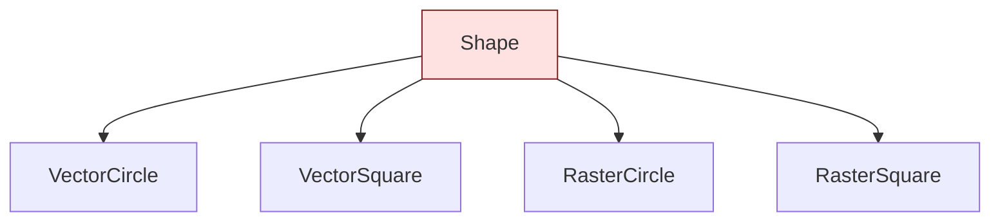
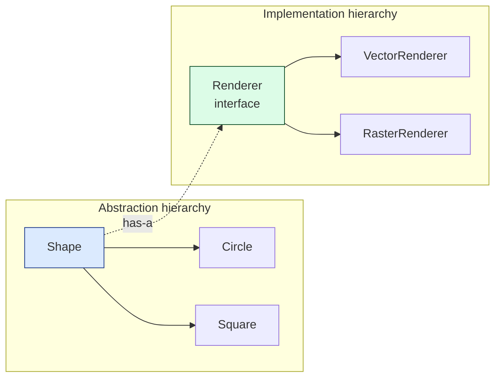
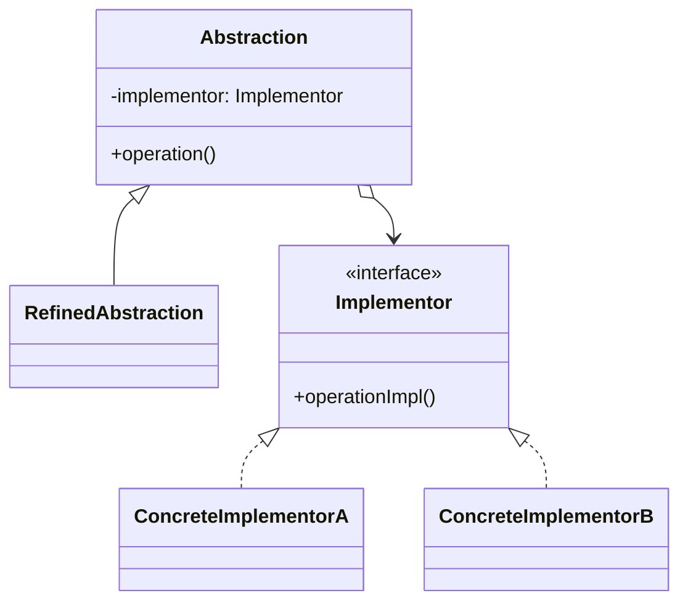

## Intent

> Separate **what** an object does (abstraction) from **how** it does it (implementation), connecting them through composition rather than inheritance.

Use when:
- You have two orthogonal dimensions of variation (e.g., shape × renderer, message × channel).
- Combining them via inheritance would create a Cartesian-product class explosion.

---

## The Class Explosion Problem

Imagine you have shapes (`Circle`, `Square`) and rendering APIs (`Vector`, `Raster`). Naive inheritance:



Add a new shape (Triangle): need 2 new classes. Add a new renderer (SVG): need 3 more classes. **N × M classes** for two dimensions.

### Bridge fix

Pull "renderer" out as a separate hierarchy and inject it:



**N + M classes** instead of N × M.

---

## Structure



---

## Example: Notifications across Channels

You have message **types** (urgent, info, marketing) and **channels** (email, SMS, push). Naive: 9 classes. With bridge:

```java
// Implementor — the channel
public interface Channel {
    void send(String to, String subject, String body);
}

class EmailChannel implements Channel { public void send(...) { /* SMTP */ } }
class SmsChannel   implements Channel { public void send(...) { /* Twilio */ } }
class PushChannel  implements Channel { public void send(...) { /* APNS */ } }

// Abstraction — the message type
public abstract class Notification {
    protected final Channel channel;        // bridge

    protected Notification(Channel channel) { this.channel = channel; }

    public abstract void notify(User user, String content);
}

class UrgentNotification extends Notification {
    public UrgentNotification(Channel c) { super(c); }
    public void notify(User u, String content) {
        channel.send(u.contact(), "🚨 URGENT", content);
        // also escalate, retry, etc.
    }
}

class InfoNotification extends Notification {
    public InfoNotification(Channel c) { super(c); }
    public void notify(User u, String content) {
        channel.send(u.contact(), "FYI", content);
    }
}
```

### Usage

```java
Notification urgent = new UrgentNotification(new SmsChannel());
urgent.notify(user, "Server down");

Notification info = new InfoNotification(new EmailChannel());
info.notify(user, "Weekly report attached");
```

Adding a new channel (Slack): one class. Adding a new notification type (marketing): one class. Both dimensions vary independently.

---

## Bridge vs Strategy

These look similar — both inject behavior. The difference is in **what's varying**:

| **Pattern** | **Intent** | **Hierarchies** |
|------------|-----------|-----------------|
| **Bridge** | Decouple two whole hierarchies that vary independently | Two |
| **Strategy** | Swap one algorithm for a single class | One (the algorithm) |

If the abstraction side is also a class hierarchy with its own variations, it's bridge. If only the algorithm varies, it's strategy.

---

## Bridge vs Adapter

| **Pattern** | **Designed in** | **Goal** |
|------------|----------------|----------|
| **Bridge** | Up front, by design | Anticipate two-axis variation |
| **Adapter** | Retroactively | Glue together incompatible existing code |

---

## Real-world Examples

| **Use case** | **Abstraction** | **Implementation** |
|-------------|----------------|-------------------|
| JDBC | `Connection`, `Statement` (vendor-neutral) | Vendor-specific driver |
| AWT / Swing | `Component` | Native peer (Windows / X11 / Mac) |
| Logging | `Logger` API | Backend (logback, log4j, JUL) |
| Browser engines | DOM API | Layout engine |
| Cross-platform GUI | App logic | Native UI toolkit |

---

## Trade-offs

✅ **Pros:**
- Two hierarchies vary independently — N + M, not N × M
- Implementation can change at runtime
- Hides implementation details from clients

❌ **Cons:**
- Up-front design cost — hard to introduce later
- Indirection makes simple cases more complex than needed
- Easy to confuse with strategy / adapter

---

## Interview Tips

- Use bridge when the interviewer hints at **two independent dimensions of variation**: "support multiple X and multiple Y."
- Sketch the N × M class explosion first; then show how bridge collapses it to N + M. Visual punch.
- Distinguish from strategy: bridge has two sides that *both* vary. Strategy has one.
