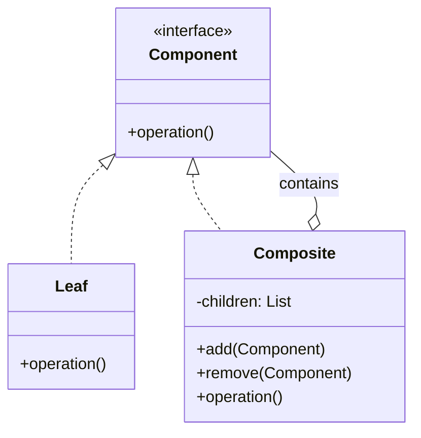
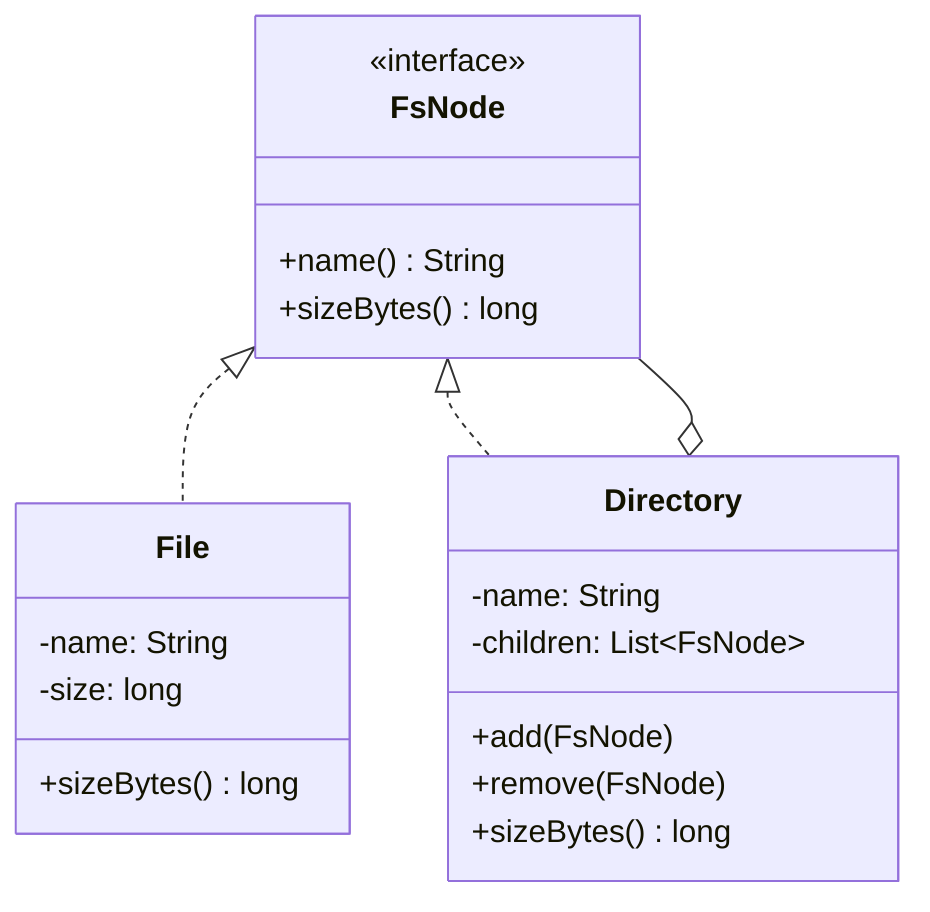

## Intent

> Compose objects into **tree** structures, and let clients work with leaves and branches the same way.

Use when:
- Your data forms a part-whole hierarchy (file system, GUI tree, org chart, expression tree).
- You want clients to ignore the difference between a leaf and a group.

---

## Real-world Analogy

A folder. It contains files (leaves) and other folders (composites). When you ask for the size of a folder, you get the sum of everything inside, regardless of whether each child is a file or another folder. Clients say "give me the size" without caring which it is.

---

## Structure



---

## Example: File System

```java
public interface FsNode {
    String name();
    long sizeBytes();
}

public class File implements FsNode {
    private final String name;
    private final long size;

    public File(String name, long size) {
        this.name = name;
        this.size = size;
    }

    public String name() { return name; }
    public long sizeBytes() { return size; }
}

public class Directory implements FsNode {
    private final String name;
    private final List<FsNode> children = new ArrayList<>();

    public Directory(String name) { this.name = name; }

    public void add(FsNode node) { children.add(node); }
    public void remove(FsNode node) { children.remove(node); }

    public String name() { return name; }

    @Override
    public long sizeBytes() {
        return children.stream().mapToLong(FsNode::sizeBytes).sum();   // recursion!
    }
}
```

### Usage

```java
Directory root = new Directory("/");
root.add(new File("readme.md", 1024));

Directory src = new Directory("src");
src.add(new File("Main.java", 4096));
src.add(new File("Utils.java", 2048));

root.add(src);

System.out.println(root.sizeBytes());   // 7168 — handles arbitrary depth
```

The caller treats `File` and `Directory` identically through `FsNode.sizeBytes()`. The recursion lives inside `Directory`.

---

## Class Diagram



---

## Other Examples

### GUI Tree

```java
interface UIComponent { void render(); }
class Label implements UIComponent { public void render() { /*...*/ } }
class Panel implements UIComponent {
    List<UIComponent> children;
    public void render() { children.forEach(UIComponent::render); }
}
```

### Expression Tree

```java
interface Expr { int eval(); }
class Num implements Expr { int v; public int eval() { return v; } }
class Add implements Expr {
    Expr left, right;
    public int eval() { return left.eval() + right.eval(); }
}
class Mul implements Expr {
    Expr left, right;
    public int eval() { return left.eval() * right.eval(); }
}

// (2 + 3) * 4
Expr e = new Mul(new Add(new Num(2), new Num(3)), new Num(4));
e.eval();  // 20
```

### Org Chart

```java
interface Employee { double totalSalary(); }
class IndividualContributor implements Employee {
    double salary;
    public double totalSalary() { return salary; }
}
class Manager implements Employee {
    double salary;
    List<Employee> reports;
    public double totalSalary() {
        return salary + reports.stream().mapToDouble(Employee::totalSalary).sum();
    }
}
```

---

## The Add/Remove Trade-off

The classic question: should `add()` / `remove()` live on the **`Component` interface** (uniform but unsafe) or only on **`Composite`** (type-safe but non-uniform)?

| **Approach** | **Pro** | **Con** |
|-------------|---------|---------|
| On `Component` | Caller doesn't need to downcast | `Leaf.add()` either no-ops, throws, or awkwardly succeeds |
| On `Composite` only | Type-safe — `Leaf` has no add | Caller may need to check type and cast |

GoF prefers transparency (on `Component`); modern Java tends toward safety (on `Composite`). Your call.

---

## Real-world Examples

| **Use case** | **Composite** |
|-------------|---------------|
| File system | `File` / `Directory` |
| GUI tree | `Component` / `Container` |
| HTML / XML DOM | `Text` / `Element` |
| Org chart | `Employee` / `Manager` |
| Math expressions | `Number` / `BinaryOp` |
| Menu hierarchy | `MenuItem` / `Menu` |

---

## Trade-offs

✅ **Pros:**
- Uniform treatment of leaves and composites — clients are simpler
- Easy to add new node types (open/closed)
- Recursion is contained inside composites

❌ **Cons:**
- Can be hard to constrain children types (e.g., a `MathExpr` shouldn't accept arbitrary children)
- Add/remove on `Component` weakens type safety
- Deep trees have stack overhead during recursion

---

## Interview Tips

- Use composite when the interviewer's domain is naturally tree-shaped: files, GUI, expressions, hierarchies.
- Mention the recursion is inside `Composite` — the leaf is trivial.
- Bring up the add/remove placement question proactively; it shows you've thought about API design.
