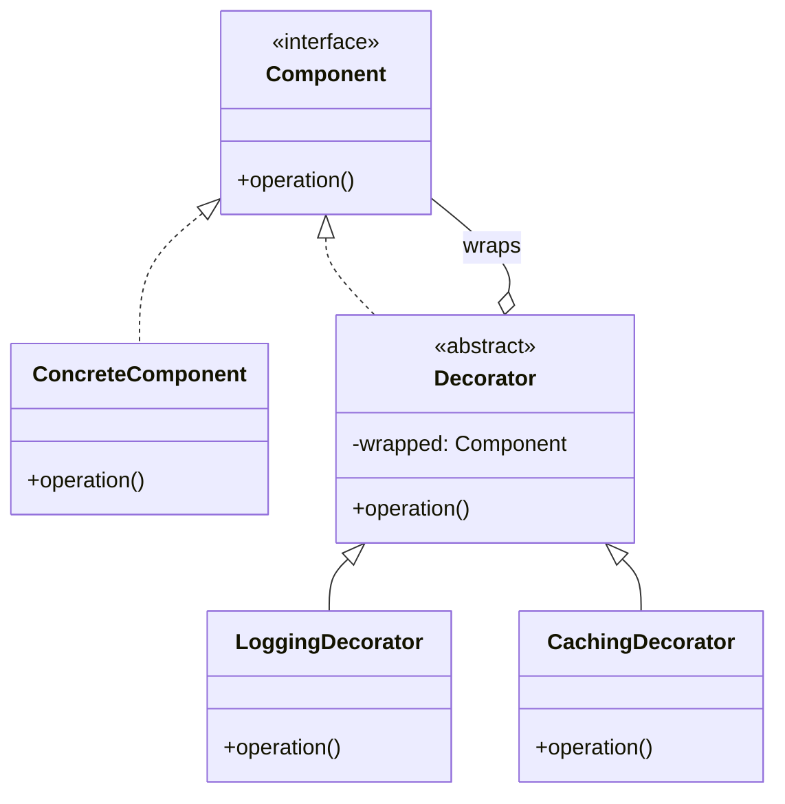
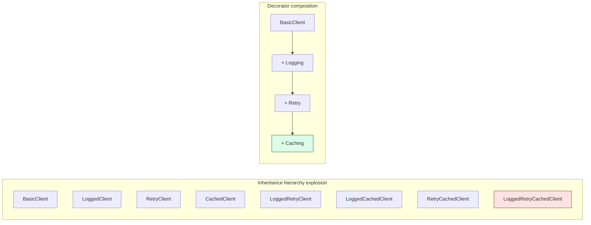

## Intent

> Add behavior to a single object **at runtime**, without affecting other objects of the same class — a flexible alternative to subclassing.

Use when:
- You need to add cross-cutting features (logging, caching, retry, auth) to an object.
- The combinations are too many for a class hierarchy ("LoggedRetryableCachedClient" × N variants).
- You want to layer behaviors at runtime.

---

## Real-world Analogy

Coffee at a café: start with espresso, add milk, add sugar, add caramel. Each addition is a decorator that wraps the drink, adding cost and ingredients without changing the underlying espresso.

---

## Structure



---

## Example: HTTP Client with Layered Behaviors

```java
public interface HttpClient {
    Response send(Request req);
}

public class BasicHttpClient implements HttpClient {
    public Response send(Request req) {
        // actually open a socket, etc.
        return doSend(req);
    }
}

// Base decorator
public abstract class HttpClientDecorator implements HttpClient {
    protected final HttpClient wrapped;
    protected HttpClientDecorator(HttpClient w) { this.wrapped = w; }
    public Response send(Request req) { return wrapped.send(req); }
}

// Concrete decorators
public class LoggingHttpClient extends HttpClientDecorator {
    public LoggingHttpClient(HttpClient w) { super(w); }
    public Response send(Request req) {
        System.out.println("[REQ] " + req.url);
        Response r = super.send(req);
        System.out.println("[RES] " + r.status);
        return r;
    }
}

public class RetryingHttpClient extends HttpClientDecorator {
    private final int maxAttempts;
    public RetryingHttpClient(HttpClient w, int n) { super(w); this.maxAttempts = n; }
    public Response send(Request req) {
        for (int i = 1; i <= maxAttempts; i++) {
            try { return super.send(req); }
            catch (TransientException e) {
                if (i == maxAttempts) throw e;
            }
        }
        throw new IllegalStateException();
    }
}

public class CachingHttpClient extends HttpClientDecorator {
    private final Cache<String, Response> cache = new Cache<>();
    public CachingHttpClient(HttpClient w) { super(w); }
    public Response send(Request req) {
        return cache.computeIfAbsent(req.url, () -> super.send(req));
    }
}
```

### Composing

```java
HttpClient client =
    new LoggingHttpClient(
        new RetryingHttpClient(
            new CachingHttpClient(
                new BasicHttpClient()),
            3));

client.send(req);
// Order of behavior:
//   logging -> retry -> cache -> network
```

The order matters: caching outside retry would cache failed responses. Logging outermost lets you see retries happen.

---

## Decorator vs Inheritance



With N behaviors, inheritance needs 2^N classes. Decorators need N + 1.

---

## Decorator vs Proxy vs Adapter

| **Pattern** | **Intent** | **Interface change?** |
|------------|-----------|----------------------|
| **Decorator** | Add behavior | Same as wrapped |
| **Proxy** | Control access (lazy, remote, security) | Same as wrapped |
| **Adapter** | Make incompatible interfaces work | **Different** from wrapped |

The structural code is similar; the *intent* distinguishes them.

---

## Real-world Examples

| **API** | **Decorators** |
|--------|----------------|
| `java.io` streams | `BufferedInputStream(new FileInputStream(...))` |
| `Collections.synchronizedList()` | Wraps any list with synchronization |
| `Collections.unmodifiableList()` | Wraps any list to prevent mutation |
| Servlet filters | Each filter wraps the next |
| Spring `@Transactional`, `@Cacheable` | AOP-generated decorators |

---

## Trade-offs

✅ **Pros:**
- Mix and match behaviors at runtime
- Single Responsibility per decorator
- Open/Closed: add new behaviors without changing existing classes
- Avoids subclass explosion

❌ **Cons:**
- Many small classes — code is fragmented across files
- Identity is tricky — `decoratedClient.equals(rawClient)` is usually false
- Order of wrapping matters and is easy to get wrong
- Stack traces become deep

---

## Interview Tips

- Reach for decorator when the interviewer mentions cross-cutting concerns: logging, caching, retry, auth, metrics, validation.
- Mention `java.io` streams as the canonical example interviewers expect.
- Acknowledge order matters and give an example (cache vs retry).
