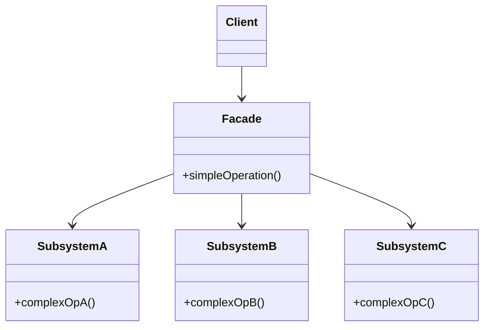

## Intent

> Hide the complexity of a subsystem behind a single, narrow API.

Use when:
- A subsystem has many classes and the typical use case touches several of them.
- You want to reduce coupling between callers and the subsystem internals.
- You're integrating a complex library and most callers only need a fraction of it.

---

## Real-world Analogy

A car's ignition: turn the key (one action), and behind the scenes — the starter motor engages, the fuel pump primes, the spark plugs fire, the alternator kicks in. The driver doesn't care about any of that. The key is the facade.

---

## Structure



---

## Example: Order Placement

Without facade — caller orchestrates everything:

```java
class WebController {
    void placeOrder(OrderRequest req) {
        Inventory inv = new Inventory();
        if (!inv.reserve(req.items)) throw new OutOfStockException();

        Pricing pricing = new Pricing();
        Money total = pricing.calculate(req.items, req.coupon);

        Payment pay = new Payment();
        if (!pay.charge(req.card, total)) {
            inv.release(req.items);
            throw new PaymentFailedException();
        }

        Shipping ship = new Shipping();
        ship.schedule(req.address, req.items);

        Email email = new Email();
        email.send(req.userEmail, "Order confirmed!");
    }
}
```

The controller knows about 5 subsystems and the order in which to call them.

### With facade

```java
public class OrderFacade {
    private final Inventory inventory;
    private final Pricing pricing;
    private final Payment payment;
    private final Shipping shipping;
    private final Email email;

    public OrderFacade(Inventory i, Pricing p, Payment pay, Shipping s, Email e) {
        this.inventory = i; this.pricing = p; this.payment = pay;
        this.shipping = s; this.email = e;
    }

    public OrderResult placeOrder(OrderRequest req) {
        if (!inventory.reserve(req.items)) return OrderResult.outOfStock();

        Money total = pricing.calculate(req.items, req.coupon);

        if (!payment.charge(req.card, total)) {
            inventory.release(req.items);
            return OrderResult.paymentFailed();
        }

        shipping.schedule(req.address, req.items);
        email.send(req.userEmail, "Order confirmed!");

        return OrderResult.success();
    }
}

// Caller
class WebController {
    private final OrderFacade orders;
    void placeOrder(OrderRequest req) { orders.placeOrder(req); }
}
```

Now the caller depends on **one** thing. Adding a fraud-check step happens inside the facade; no caller changes.

---

## Facade vs Mediator vs Adapter

| **Pattern** | **Intent** | **Number of subsystems** |
|------------|-----------|--------------------------|
| **Facade** | Simplify interface to a subsystem | One subsystem (usually) |
| **Mediator** | Coordinate communication between peers | Many peers, all known |
| **Adapter** | Make one interface match another | One thing being adapted |

A facade is mostly outbound (hides callees from callers). A mediator is bidirectional (peers don't know each other; they all talk to the mediator).

---

## When *not* to Use Facade

- The subsystem is already simple — adding a layer adds noise without simplification.
- Callers actually need fine-grained access — a facade locks them out of useful operations.
- You're building a "god object" — if the facade has 50 methods, it's not really a facade anymore.

---

## Real-world Examples

| **Use case** | **What it hides** |
|-------------|-------------------|
| `JdbcTemplate` (Spring) | JDBC's connection / statement / result set boilerplate |
| `RestTemplate`, `WebClient` | HTTP client setup, headers, deserialization |
| Logging frameworks (`SLF4J`) | Multiple backends behind one API |
| `java.util.logging.Logger` | File handles, formatters, levels |
| Stripe SDK `Charge.create(...)` | API auth, retries, JSON serialization |

---

## Trade-offs

✅ **Pros:**
- Decouples callers from subsystem internals
- Simplifies the common case
- Single place for cross-cutting concerns (logging, transactions)

❌ **Cons:**
- Can become a god class if it grows unchecked
- Hides power — advanced users may need to bypass it
- Risk of leaky abstraction when subsystem details escape through return types

---

## Interview Tips

- Mention facade when the interviewer says "provide a clean API to ..." or "simplify usage of ...".
- Distinguish from mediator: facade hides a subsystem from outside; mediator coordinates among inside peers.
- If asked "should this be one facade or multiple?" — split by use case (`OrderFacade`, `RefundFacade`) rather than one mega-class.
