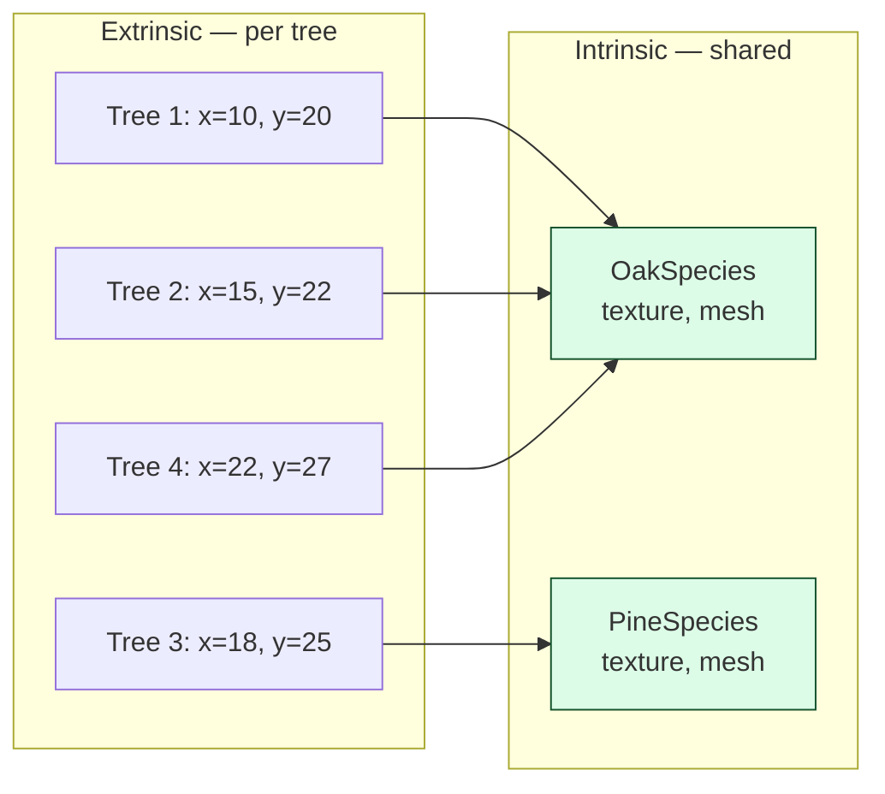
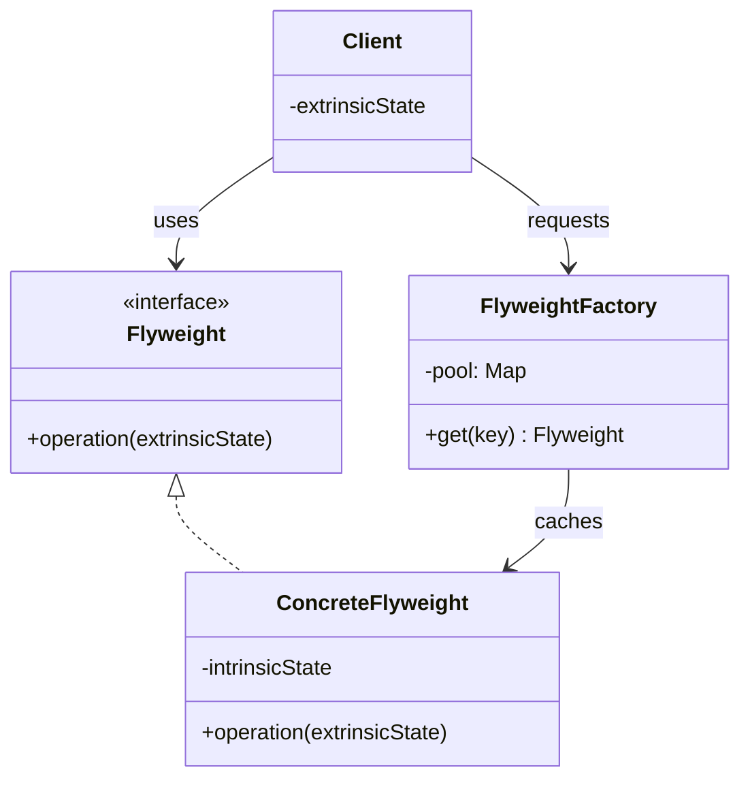

## Intent

> Reduce memory footprint by **sharing** the parts of an object that don't change between instances.

Use when:
- You have a huge number of similar objects.
- Most of each object's state is identical between instances.
- Memory is tight (mobile, embedded, big data).

---

## Intrinsic vs Extrinsic State

The trick is splitting state into two buckets:

| **State** | **Description** | **Example (forest of trees)** |
|----------|-----------------|------------------------------|
| **Intrinsic** | Shared, immutable, lives in the flyweight | Tree species: name, texture, mesh |
| **Extrinsic** | Per-instance, passed in by caller | Position (x, y), height, age |



The forest renders 1 million trees, but holds only ~10 species objects in memory.

---

## Structure



---

## Example: Forest with Millions of Trees

```java
// Flyweight — shared, immutable
public class TreeSpecies {
    private final String name;
    private final byte[] texture;     // big!
    private final Mesh mesh;

    public TreeSpecies(String name, byte[] texture, Mesh mesh) {
        this.name = name;
        this.texture = texture;
        this.mesh = mesh;
    }

    public void render(Canvas c, int x, int y, double height) {
        c.draw(mesh, texture, x, y, height);
    }
}

// Factory — interns flyweights
public class TreeSpeciesFactory {
    private final Map<String, TreeSpecies> pool = new HashMap<>();

    public TreeSpecies get(String name, byte[] texture, Mesh mesh) {
        return pool.computeIfAbsent(name, k -> new TreeSpecies(name, texture, mesh));
    }
}

// Per-instance object — small
public class Tree {
    private final int x, y;
    private final double height;
    private final TreeSpecies species;     // shared reference

    public Tree(int x, int y, double height, TreeSpecies species) {
        this.x = x; this.y = y; this.height = height; this.species = species;
    }

    public void render(Canvas c) {
        species.render(c, x, y, height);   // pass extrinsic state in
    }
}

// Forest
public class Forest {
    private final List<Tree> trees = new ArrayList<>();
    private final TreeSpeciesFactory factory = new TreeSpeciesFactory();

    public void plant(int x, int y, double height, String type, byte[] tex, Mesh mesh) {
        TreeSpecies species = factory.get(type, tex, mesh);
        trees.add(new Tree(x, y, height, species));
    }
}
```

A million trees with 4 species: 1 million small `Tree` objects (a few bytes each) + 4 large `TreeSpecies` objects. Without flyweight, each tree would carry its own copy of the 1 MB texture — terabytes of waste.

---

## Real-world Examples

### Java's `Integer.valueOf()`

```java
Integer a = Integer.valueOf(127);
Integer b = Integer.valueOf(127);
System.out.println(a == b);   // true — flyweight cache for -128..127

Integer c = Integer.valueOf(200);
Integer d = Integer.valueOf(200);
System.out.println(c == d);   // false — outside cache range
```

### `String.intern()`

Calling `intern()` on a string returns a canonical reference from a JVM-wide pool. Two interned strings with the same content share memory.

### Other examples

| **Use case** | **Intrinsic** | **Extrinsic** |
|-------------|--------------|---------------|
| Text editors | Glyph (font + char) | Position |
| Game sprites | Sprite sheet | Position, rotation |
| Chess board | Piece type | Square coordinates |
| HTML rendering | DOM element type | Attributes, position |

---

## Flyweight vs Singleton

| | **Flyweight** | **Singleton** |
|---|--------------|---------------|
| Number of instances | Many (one per intrinsic value) | Exactly one |
| Goal | Memory savings | Single global access |
| State | Immutable intrinsic | Stateful, often mutable |

A flyweight factory may have hundreds of cached instances. A singleton has exactly one.

---

## Cautions

- **Flyweights must be immutable.** If thread A mutates a shared flyweight, thread B's data corrupts. Make all flyweight fields `final`.
- **Don't apply prematurely.** Flyweight only pays off when you have *many* objects with *much* shared state. For 100 objects, the factory overhead can outweigh the savings.
- **Hashcode/equality matter.** The factory's pool keys on identity of intrinsic state — get this right or you'll create duplicates.

---

## Trade-offs

✅ **Pros:**
- Massive memory reduction for large object populations
- Faster construction (cache hits skip allocation)
- Encourages immutability of shared parts

❌ **Cons:**
- Splitting intrinsic vs extrinsic complicates the API
- Caller has to pass extrinsic state explicitly
- Threading: shared state must be immutable
- Adds factory indirection

---

## Interview Tips

- Flag flyweight when the interviewer mentions **"millions of"**, **"memory-constrained"**, or **"each X has the same Y"**.
- Use the forest / tree species example — it's instantly understood.
- Mention `Integer.valueOf` cache as a familiar real-world example.
